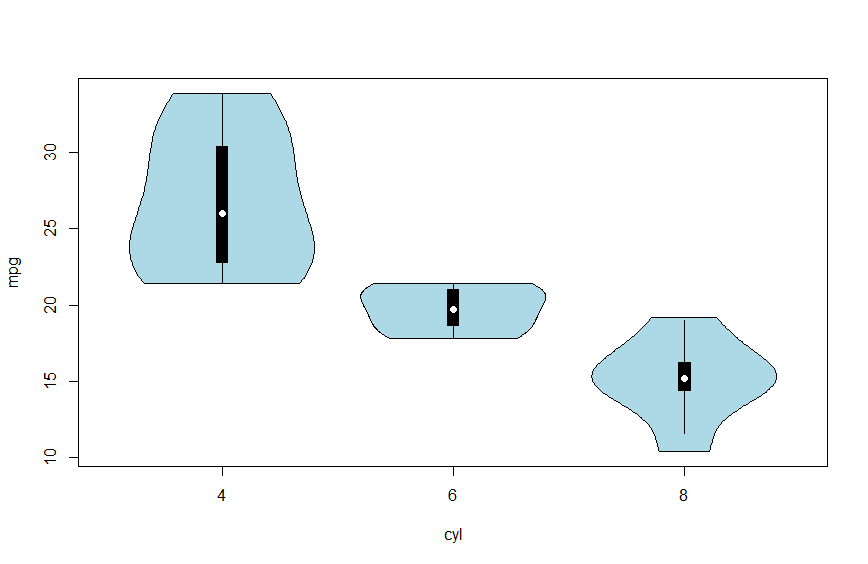

# 01. R 설치

## 1.1 R이란?

R은 오픈소스 프로그램으로 다양한 통계분석, 데이터 마이닝, 그래프 작성 등을 위한 프로그래밍 언어입니다. 기존의 통계분석용 프로그램 중 대표적인 것으로 SAS, SPSS 등이 있고, 보조적인 프로그램으로 Excel 등을 들 수 있습니다. 비용이나 다양성 등을 고려하였을 때 R이 가장 우수하다고 볼 수 있습니다. 현재 많은 대학들이 R을 기반으로 데이터 분석 및 통계분석 수업을 진행하고 있으며, 최근에는 Python과 함께 데이터 과학 분야의 양대 언어로 자리잡았습니다.

R은 R Foundation이 지속적으로 관리하며 정기적으로 새 버전을 배포합니다. R은 보통 매년 4월에 새로운 주(minor) 버전을, 그 사이사이에 패치 버전을 배포합니다. 이 메뉴얼은 Base R(R 4.1 이상)을 기준으로 합니다.

R의 장점은 다음과 같습니다.

* R은 오픈소스로서 무료입니다.
* 프로그래밍 언어로서 사용자의 실력에 따라 매우 복잡한 분석도 쉽게 자동화하여 수행할 수 있습니다.
* 다양한 최신 통계분석 기법, 데이터 마이닝 기법, 그래프 작성 기법 등이 사용자들에 의해 제공됩니다.
* 전 세계적으로 사용자들이 다양한 예제를 공유합니다. (영문 예제 다수)

## 1.2 R 설치

1. R을 다운받기 위해 웹브라우저로 **www.r-project.org** 에 접속합니다. (또는 검색엔진에서 "R project" 또는 "CRAN"으로 검색)
2. 홈페이지의 "Getting Started" 문단 또는 왼쪽 메뉴의 **[Download] → [CRAN]** 링크를 클릭합니다.
3. CRAN 미러(mirror) 목록 페이지로 이동합니다. 목록 맨 위의 **0-Cloud**(전 세계 CDN으로 자동 연결되는 미러, Posit 후원)를 선택하면 접속 위치와 관계없이 대체로 빠르고 안정적입니다.
4. 이동한 CRAN 사이트 화면에서 사용 중인 운영체제에 맞게 **[Download R for Windows]**, **[Download R for macOS]**, **[Download R for Linux]** 중 하나를 클릭합니다. (아래는 Windows 기준으로 설명합니다.)
5. **[base]**를 클릭합니다.
6. **[Download R-4.x.x for Windows]**를 클릭하여 PC에 다운로드 받습니다. (4.x.x는 그 시점의 최신 버전 번호입니다.)
7. 다운받은 파일을 실행시켜 프로그램을 설치합니다. (계속 [다음]을 눌러 설치 진행)
8. R 설치가 끝난 후 바탕화면에 생성된 아이콘을 더블 클릭하면 R이 실행됩니다.
9. R이 시작되면 R Console이라는 창이 열리고, 그 창에 `>` 가 나타나는데 R의 프롬프트입니다.
10. `>` 기호 다음에 필요한 명령문을 입력하고 Enter 키를 치면 입력된 명령문이 실행됩니다.
11. 명령문이 실행되면 그 실행결과가 바로 다음 줄에 출력됩니다.

```r
32*27
#> [1] 864
```

> 💡 설치 참고: Windows용 설치 파일은 UCRT(Universal C Runtime)를 필요로 하며, Windows 10 이상에는 기본 포함되어 있어 별도 조치가 필요 없습니다. macOS는 Apple Silicon(M1 이상)용 `arm64` 설치 파일과 Intel Mac용 `x86_64` 설치 파일이 각각 제공되므로, 사용 중인 Mac의 CPU 종류에 맞는 파일을 내려받아야 합니다.

## 1.3 R의 특징

* R은 명령어를 1줄씩 처리하고 그 결과를 바로 보여주는 인터프리터 언어입니다.
* R의 콘솔창에 `>` 기호(greater than sign, 부등호 기호)는 명령 프롬프트입니다. `>` 뒤에 원하는 명령어를 입력하고 Enter를 치면 명령어가 실행됩니다.
* R은 대소문자를 구별합니다. 명령어를 입력할 때 대소문자를 명확히 파악하고 입력하여야 합니다.
* R 콘솔창에서 키보드의 상향(↑)을 누르면 이전에 실행했던 명령어를 순서대로 다시 불러올 수 있습니다.
* `#`은 주석 기호(메모 유사)입니다. 즉 맨 앞에 `#`이 있으면 그 줄은 실행하지 않습니다.
* 명령어를 입력할 때 오타가 많이 나고, 긴 명령어를 입력하거나 명령어를 재사용할 때는 R 콘솔창이 불편합니다. 따라서 주로 RStudio의 스크립트 창에서 명령어를 입력하고 [Ctrl + Enter]를 눌러 콘솔 창에 보내 명령어를 실행합니다.
* R은 `|>` 파이프 연산자(R 4.1+), `\(x)` 람다 축약 문법(R 4.1+) 등 최신 문법을 계속 흡수하며 발전하고 있습니다.

## 1.4 RStudio 설치

RStudio는 2022년부터 개발사 이름이 **Posit**으로 바뀌었지만, IDE 이름 자체는 여전히 "RStudio"입니다. 

1. 웹브라우저로 **posit.co** 에 접속합니다. (또는 검색엔진에서 "Posit RStudio Desktop download"로 검색)
2. 상단 메뉴에서 **[Download RStudio]**를 클릭하거나, **[Open Source] → [Download rstudio]**를 클릭합니다.
3. RStudio Desktop 다운로드 페이지(posit.co/download/rstudio-desktop)로 이동합니다. 이 페이지는 R이 먼저 설치되어 있어야 함을 안내합니다(RStudio는 Posit 제품이지만 R 자체는 Posit이 아닌 R Foundation이 배포하는 별개 프로그램입니다). R을 아직 설치하지 않았다면 앞선 "R 설치" 절차를 먼저 진행합니다.
4. 페이지를 아래로 내리면 접속한 운영체제를 자동으로 인식해 **[DOWNLOAD RSTUDIO DESKTOP FOR WINDOWS/MAC/LINUX]** 형태의 버튼이 표시됩니다. 이를 클릭하여 PC에 다운로드 받습니다.
5. 다운받은 파일을 실행시켜 프로그램을 설치합니다. 계속해서 [다음]을 눌러 설치를 진행하면 됩니다.
6. RStudio 아이콘이 바탕화면에 없으면 다음과 같이 하여 아이콘을 바탕화면에 만듭니다. [시작] → [모든 프로그램] → [RStudio] → [RStudio]를 마우스 오른쪽 단추로 클릭한 후 [보내기] → [바탕화면에 바로가기 만들기]를 클릭하여 바탕화면에 RStudio 아이콘을 만듭니다.
7. 바탕화면의 RStudio 아이콘을 더블클릭하여 실행시킵니다.
8. RStudio를 실행한 후 [File] → [New File] → [RScript]를 클릭하면 스크립트 창이 생성되면서, 총 4개의 창이 화면에 보입니다. 스크립트 창, 콘솔 창, 워크스페이스 창, 파일 등을 볼 수 있는 창입니다.

    * 스크립트 창 : R 명령어를 입력하는 창입니다. 명령어에 커서를 두거나 명령어들을 선택하고 [Ctrl + Enter]를 누르면 콘솔 창에서 명령어가 실행됩니다. 스크립트 창의 장점은 명령어를 저장하고 불러올 수 있다는 점입니다.
    * 콘솔 창 : 명령어가 실행되고 그 결과를 보여주는 창입니다. R의 콘솔 창과 거의 동일합니다.
    * 워크스페이스 창 : 작업 중에 할당된 변수와 데이터를 보여주는 창입니다.
    * 마지막 창은 파일, 그래프, 패키지, 도움말 등을 볼 수 있는 창입니다.

9. 스크립트 창에서 `32*79` 라고 입력하고 [Ctrl + Enter]를 누르면 아래 콘솔 창에서 명령어가 실행되고, 그 결과 값인 2528이 출력되는 것을 볼 수 있습니다.

> 💡 참고: Posit은 RStudio 외에 VS Code 기반의 차세대 IDE **Positron**(R·Python 동시 지원)도 함께 배포하고 있습니다. 이 매뉴얼은 입문자에게 가장 널리 쓰이는 RStudio를 기준으로 설명하지만, 관심이 있다면 posit.co/products/ide/positron 에서 살펴볼 수 있습니다.

### RStudio에서 프로젝트 만들기

RStudio에서 프로젝트를 만들면 하나의 폴더에서 코드와 데이터들을 체계적으로 관리할 수 있어 편리합니다. 새 프로젝트를 만드는 절차는 다음과 같습니다.

1. (프로젝트 만들기) 메뉴 [File] → [New Project] 클릭 → [New Directory] → [New Project] → [Directory name]에 프로젝트 이름 입력(예, rbasic) → 그 아래에 폴더 위치 지정(예, 바탕화면) → [Create Project] 클릭
2. (스크립트 파일 만들기) 메뉴 [File] → [New File] → [R Script] 클릭
3. (스크립트에서 명령어 실행) 스크립트 창에서 `32*27` 을 입력하고 [Ctrl + Enter] 입력
4. (스크립트 저장) 메뉴 [File] → [Save] → `rbasic1.R` 로 저장
5. 프로젝트 이름으로 만들어진 폴더에 스크립트 파일들이 저장됩니다. 이 폴더에 데이터를 넣어두면 R에서 데이터를 불러올 때 편리합니다. 일종의 작업 디렉터리입니다.

## 1.5 R package 설치 및 사용

R 패키지는 목적에 맞게 R 함수, 데이터 등을 모아 놓은 것입니다. 현재 CRAN에만 2만 개가 넘는 패키지가 등록되어 있습니다. 이 중에서 유용하고 중요한 패키지들을 골라내어 사용법을 익히는 것이 필요합니다.

패키지는 기본적으로 CRAN에 등록되어 있는 것을 다운 받아 설치합니다. 패키지를 설치하고 사용하는 방법은 다음 절차를 따릅니다.

1. 패키지 설치하기 `install.packages("패키지명")`
2. 패키지 로드하기 `library(패키지명)`
3. 함수 사용하기

> 🔎 참고: 이 매뉴얼은 Base R 전용 스코프이므로, 아래 예제는 ggplot2 같은 tidyverse 계열 패키지 대신 Base 그래픽 시스템을 그대로 확장하는 **vioplot** 패키지로 보여드립니다. 

```r
install.packages("vioplot")   # vioplot 패키지 설치
```

```r
library(vioplot)              # vioplot 패키지 로드
vioplot(mpg ~ cyl, data = mtcars, col = "lightblue")  # 실린더 수별 연비 분포를 바이올린 플롯으로 출력
```



2개 이상의 패키지를 한 번의 명령으로 설치할 수도 있습니다.

```r
install.packages(c("vioplot", "corrplot"))
```

CRAN이 아닌 GitHub로부터 패키지를 다운 받아 설치하고자 한다면 **devtools** 패키지가 먼저 설치되어 있어야 합니다. 다만 GitHub 설치는 대부분 컴파일된 바이너리가 아니라 원본 소스 코드를 내려받아 그 자리에서 컴파일하는 방식이라서, Windows에서는 컴파일 도구 모음인 **Rtools**가 미리 설치되어 있어야 합니다.

> ⚠️ Rtools 준비: [https://cran.r-project.org/bin/windows/Rtools/](https://cran.r-project.org/bin/windows/Rtools/) 에서 사용 중인 R 버전에 맞는 Rtools를 내려받아 기본 경로에 설치합니다. (R 4.5~4.6 계열은 **Rtools45**입니다.) 설치 후 아래 명령이 `TRUE`를 반환하면 준비가 끝난 것입니다.
> ```r
> pkgbuild::find_rtools()
> ```
> Rtools 없이 시도하면 설치가 아예 실패하거나, 의존 패키지 중 하나가 깨진 채로 설치되어 나중에 "LoadLibrary failure" 같은 오류로 나타날 수 있습니다.

GitHub의 `cran` 조직(organization)은 CRAN에 등록된 모든 패키지를 자동으로 미러링하므로, 개발 중인 최신(devel) 버전을 미리 써보고 싶을 때 다음과 같이 설치할 수 있습니다. `xts`는 R에서 시계열(time series)을 다룰 때 사실상 표준으로 쓰이는 패키지로, `quantmod`·`PerformanceAnalytics` 등 여러 금융·계량분석 패키지가 이를 기반으로 합니다.

```r
install.packages("devtools")
devtools::install_github("cran/xts")
```

> 💡 참고: 최신 개발 버전이 꼭 필요한 것이 아니라면 GitHub을 거칠 필요 없이 `install.packages("xts")`로 CRAN의 안정판(컴파일 불필요)을 받는 편이 더 간단하고 안전합니다. GitHub 설치는 CRAN에 아직 반영되지 않은 수정 사항이 필요할 때만 선택적으로 사용하는 것을 권장합니다.

RStudio 오른쪽 아래 패키지(Packages) 창의 [Install] 버튼으로도 패키지를 설치할 수 있지만, 이 방식은 CRAN(또는 로컬 압축 파일)만 지원하며 **GitHub 저장소는 지원하지 않으므로**, GitHub 설치는 위처럼 콘솔 명령으로만 가능합니다.

> 💡 참고: 패키지 수가 많아지면 의존성 해결 속도가 느려질 수 있습니다. Posit에서 만든 **pak** 패키지(`install.packages("pak")` 후 `pak::pkg_install("패키지명")`)는 병렬 다운로드와 더 안전한 의존성 해결을 지원해 `install.packages()`의 최신 대안으로 떠오르고 있습니다. Base R 함수는 아니지만 알아두면 유용합니다.

## 1.6 R package 관리

### 설치된 패키지 보기

```r
installed.packages()
```

출력이 매우 길고 넓은 행렬이므로, 실무에서는 필요한 열만 뽑아보는 경우가 많습니다.

```r
installed.packages()[, c("Package", "Version")]
```

RStudio에서는 패키지 창에서 설치된 패키지들을 목록으로 확인할 수 있습니다.

### 패키지가 설치된 폴더 보기

```r
.libPaths()
```

### 로드된 패키지 보기

```r
search()
```

`library()`로 패키지를 불러오면 `search()` 목록의 `.GlobalEnv` 바로 다음 자리에 해당 패키지가 추가되어 나타납니다.

### 패키지 언로드 하기 (메모리에서 내리기)

```r
detach(package:vioplot, unload = TRUE)
```

### 설치된 패키지 제거하기

```r
remove.packages("vioplot")
```

### 패키지 업데이트하기

```r
# 모든 패키지 업데이트
update.packages()

# 특정 패키지 업데이트
update.packages(oldPkgs = c("vioplot", "corrplot"))
```
