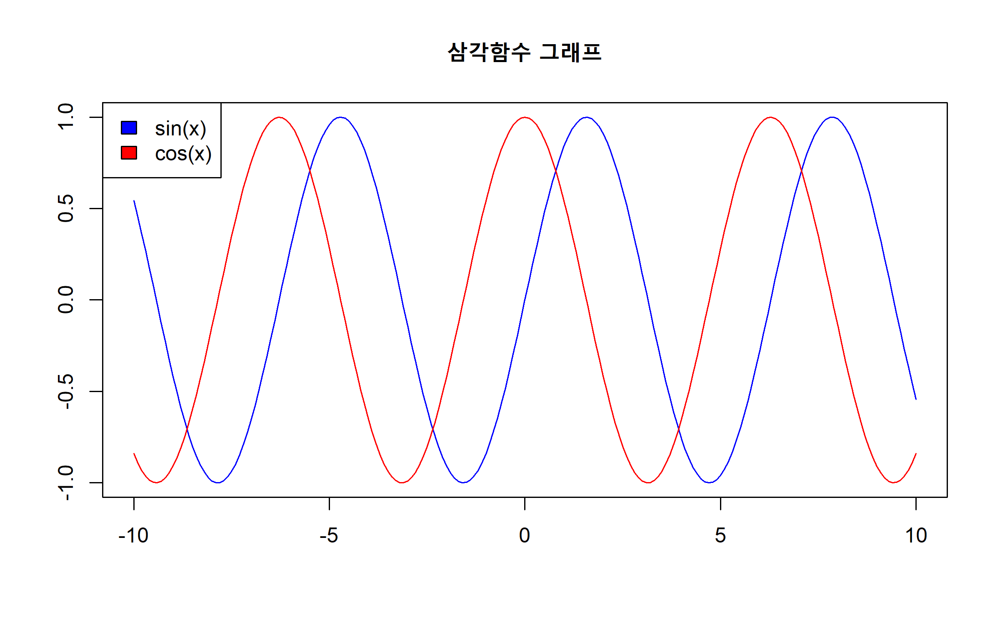

# 05. 수학 함수

## 5.1 반올림·절삭

### abs()

`abs(x)`는 x의 절대값을 반환합니다.

```r
abs(-123)
#> [1] 123
```

### ceiling()

`ceiling(x)`는 x보다 크거나 같은 수 중 가장 작은 정수를 반환합니다.

```r
ceiling(2.5)
#> [1] 3

ceiling(-2.5)
#> [1] -2
```

### floor()

`floor(x)`는 x보다 작거나 같은 수 중 가장 큰 정수를 반환합니다.

```r
floor(2.5)
#> [1] 2

floor(-2.5)
#> [1] -3
```

### trunc()

`trunc(x)`는 x의 소수점 이하를 버리고 정수 부분만 반환합니다. `floor()`·`ceiling()`과 달리 부호에 상관없이 항상 0 방향으로 잘라낸다는 점이 다릅니다.

```r
trunc(2.5)
#> [1] 2

trunc(-2.5)
#> [1] -2
```

### round()

`round(x, digits = n)`는 x를 소수점 n+1번째 자리에서 반올림하여 소수점 n번째 자리까지 반환합니다. digits가 음수이면 10의 거듭제곱 자리(10, 100, ...)에서 반올림합니다. digits 인자의 기본값은 0입니다.

R의 반올림 함수는 국제표준(IEEE 754:2008, ISO/IEC/IEEE 60559:2011)을 따르므로 Excel의 반올림 함수와는 결과가 다를 수 있습니다. 예를 들어 Excel의 `=ROUND(2.5, 0)`은 3을 돌려주지만, R의 `round(2.5, digits = 0)`은 2를 돌려줍니다.

이는 국제표준이 제시한 5가지 반올림 모드 중 **짝수로 반올림(round to nearest, ties to even)**을 기본값으로 채택했기 때문입니다. '은행원의 반올림', '오사오입'이라고도 불리는 이 방식은 원래 값이 두 표현 가능한 숫자의 정중앙에 걸쳐 있을 때, 가수부 마지막 자리가 짝수인 쪽으로 반올림하여 반올림 오차의 기댓값을 0으로 만드는 효과가 있습니다(예: 52.5 → 52, 51.5 → 52).

```r
round(.5 + -3:4)
#> [1] -2 -2  0  0  2  2  4  4

round(2.2579, digits = 2)
#> [1] 2.26

round(2578.23, digits = -2)
#> [1] 2600
```

> **실전 팁**: 통계 보고서에서 소수점 자리를 일정하게 맞춰 인쇄하고 싶다면 `round()`보다 아래의 `signif()`나 `format(x, nsmall = n)`이 더 적합할 때가 많습니다. `round()`는 "소수점 몇째 자리까지"를, `signif()`는 "유효숫자 몇 자리인지"를 기준으로 삼는다는 차이가 있습니다.


### signif()

`signif(x, digits = n)`는 지정한 유효숫자(significant digits) n자리가 되도록 반올림합니다. digits의 기본값은 6입니다. 자릿수가 크게 다른 숫자들을 나란히 놓고 비교할 때 유용합니다.

```r
signif(3.141593, digits = 3)
#> [1] 3.14

signif(23.593, digits = 3)
#> [1] 23.6
```

## 5.2 지수·로그

### sqrt()

`sqrt(x)`는 x의 제곱근을 반환합니다.

```r
sqrt(9)
#> [1] 3
```

> **참고**: 음수의 제곱근은 실수 범위에서 정의되지 않으므로 `sqrt(-9)`는 `NaN`을 반환하며 경고가 발생합니다. 복소수 제곱근이 필요하면 5.6절의 복소수 함수를 참고하여 `sqrt(as.complex(-9))`처럼 입력을 복소수로 변환해야 합니다.

### 로그함수

* `log(x)`는 밑이 e인 x의 자연로그값을 반환합니다.
* `log10(x)`은 밑이 10인 x의 상용로그값을 반환합니다.
* `log2(x)`는 밑이 2인 x의 이진로그값을 반환합니다.
* `log(x, base)`는 밑이 base인 x의 로그값을 반환합니다.
* `log1p(x)`는 밑이 e인 (x+1)의 자연로그값을 반환합니다. x가 0에 매우 가까울 때 `log(1 + x)`를 직접 계산하면 부동소수점 오차가 커지는데, `log1p()`는 이를 보정한 값을 돌려줍니다.

```r
log(3)
#> [1] 1.098612

log10(3)
#> [1] 0.4771213

log2(3)
#> [1] 1.584963

log(3, 5)
#> [1] 0.6826062

log(0)
#> [1] -Inf

log1p(0)
#> [1] 0
```

### exp()

* `exp(x)`는 상수 e를 x만큼 거듭제곱한 값을 반환합니다.
* `expm1(x)`는 e^x에서 1을 뺀 값을 반환합니다. `log1p()`와 짝을 이루는 함수로, x가 0에 가까울 때의 정밀도를 보정합니다.

```r
exp(3)
#> [1] 20.08554

exp(log(3))
#> [1] 3

expm1(3)
#> [1] 19.08554
```

## 5.3 삼각함수

R의 삼각함수는 모두 **라디안(radian)** 단위를 입력으로 받습니다. 각도(degree)를 쓰고 있다면 `각도 * pi / 180`으로 먼저 변환해야 합니다.

* `sin(x)`, `cos(x)`, `tan(x)`는 x 라디안의 사인·코사인·탄젠트 값을 반환합니다.
* `asin(x)`, `acos(x)`, `atan(x)`는 역삼각함수입니다.
* `atan2(y, x)`는 두 인자의 부호를 함께 고려해 사분면을 구분한 아크탄젠트 값을 반환합니다. `atan(y/x)`와 달리 x가 0이거나 음수여도 올바른 각도를 계산합니다.
* `cospi(x)`, `sinpi(x)`, `tanpi(x)`는 `pi * x`에 대한 삼각함수입니다. 입력이 pi의 배수일 때(`sin(pi)`처럼) 부동소수점 오차 없이 정밀하게 계산하기 위해 사용합니다.

```r
sin(pi)         # 이론상 0이지만 부동소수점 오차로 매우 작은 값이 나옴
#> [1] 1.224647e-16

sin(1)
#> [1] 0.841471

sinpi(3)        # sin(3*pi), cospi/sinpi는 이런 오차 없이 정확히 0을 반환
#> [1] 0

asin(1)
#> [1] 1.570796
```

```r
# atan2(y, x): 두 점 사이의 방향각(라디안)을 사분면까지 정확히 구분
atan2(1, 1)    # 1사분면
#> [1] 0.7853982

atan2(1, -1)   # 2사분면
#> [1] 2.356194
```

```r
# 사인·코사인 곡선
x <- seq(-10, 10, 0.1)
plot(x, sin(x), type = "l", col = "blue",
     ylab = "", xlab = "", main = "삼각함수 그래프")
lines(x, cos(x), type = "l", col = "red")
legend("topleft", c("sin(x)", "cos(x)"), fill = c("blue", "red"))
```




### 쌍곡선 함수

원 대신 쌍곡선을 기준으로 정의되는 삼각함수로, 신경망의 활성화 함수(`tanh`)나 지수적으로 증가·감소하는 현상을 다룰 때 등장합니다.

* `sinh(x)`, `cosh(x)`, `tanh(x)`는 쌍곡사인·쌍곡코사인·쌍곡탄젠트 값을 반환합니다.
* `asinh(x)`, `acosh(x)`, `atanh(x)`는 그 역함수입니다.

```r
sinh(1)
#> [1] 1.175201

cosh(1)
#> [1] 1.543081

tanh(1)
#> [1] 0.7615942

asinh(1)
#> [1] 0.8813736

acosh(2)
#> [1] 1.316958

atanh(0.5)
#> [1] 0.5493061
```

쌍곡선 함수는 정의상 `exp()`의 조합으로 표현됩니다. 예를 들면 `cosh(x) = (exp(x)+exp(-x))/2`입니다.


## 5.4 누적함수

벡터의 값을 앞에서부터 차례로 누적해 가면서 계산해야 할 때 씁니다.

* `cumsum(x)`는 x 벡터의 누적 합 벡터를 반환합니다.
* `cumprod(x)`는 x 벡터의 누적 곱 벡터를 반환합니다.
* `cummax(x)`는 x 벡터를 앞에서부터 훑어가며 그 시점까지의 누적 최댓값을 반환합니다.
* `cummin(x)`는 같은 방식으로 누적 최솟값을 반환합니다.

```r
cumsum(1:10)
#>  [1]  1  3  6 10 15 21 28 36 45 55

cumprod(1:9)
#> [1]      1      2      6     24    120    720   5040  40320 362880

(x <- c(3:1, 2:0, 4:2))
#> [1] 3 2 1 2 1 0 4 3 2

cummax(x)
#> [1] 3 3 3 3 3 3 4 4 4

cummin(x)
#> [1] 3 2 1 1 1 0 0 0 0
```

> **참고**: `(x <- c(3:1, 2:0, 4:2))`에서 바깥의 괄호 `()`는 괄호 안의 표현식을 계산한 후 그 결과를 화면에 출력합니다.


## 5.5 합·곱·계승

### sum()

`sum(x, na.rm = FALSE)`는 x 벡터의 합계를 반환합니다. `na.rm = TRUE`로 지정하면 결측값을 제외하고 계산합니다.

```r
sum(1:5)
#> [1] 15

sum(1:5, NA)
#> [1] NA

sum(1:5, NA, na.rm = TRUE)
#> [1] 15
```

### diff()

`diff(x, lag = 1, differences = 1)`는 벡터의 이웃한 원소끼리 차이를 계산합니다. `lag`는 몇 칸 떨어진 값끼리 뺄지, `differences`는 그 차분을 몇 번 반복할지를 지정합니다.

```r
x <- c(1, 5, 10, 16, 23)
diff(x)                  # 5-1, 10-5, 16-10, 23-16
#> [1] 4 5 6 7

diff(x, lag = 2)          # 10-1, 16-5, 23-10
#> [1]  9 11 13

diff(x, differences = 2)  # diff(diff(x))
#> [1] 1 1 1
```

### prod()

`prod(x, na.rm = FALSE)`는 x 벡터의 원소를 모두 곱한 값을 반환합니다.

```r
prod(2, 3, 5)
#> [1] 30

prod(c(2, 3, 5, NA), na.rm = TRUE)
#> [1] 30

prod(1:5)
#> [1] 120
```

### gamma(), factorial()

감마함수(gamma function)는 오일러(Leonhard Euler)가 정수에만 정의되는 계승(n!)을 실수·복소수까지 확장하기 위해 제안한 함수입니다.

* `gamma(x)`는 (x-1)의 계승값을 반환합니다. 즉 `gamma(x)`는 `factorial(x-1)`과 같습니다.
* `factorial(x)`는 x의 계승값을 반환합니다.

```r
gamma(6)
#> [1] 120

factorial(5)
#> [1] 120

gamma(5.32)
#> [1] 39.29455

factorial(4.32)
#> [1] 39.29455
```

> **실전 주의**: `factorial()`은 배정밀도 실수(double)로 계산되므로 `factorial(170)`까지는 값을 반환하지만, `factorial(171)`부터는 표현 가능한 범위를 넘어서 `Inf`가 됩니다. 큰 수의 계승이 필요한 경우(예: 조합론 문제) 아래에서 소개하는 로그 스케일 함수(`lgamma()`, `lfactorial()`)로 우회하거나 `gmp`, `Rmpfr` 같은 임의정밀도 패키지를 검토해야 합니다.

```r
factorial(170)
#> [1] 7.257416e+306

factorial(171)
#> [1] Inf
```

계승·감마값에 자연로그를 취한 함수들은 이런 오버플로 문제를 피하면서 큰 수를 다룰 수 있게 해 줍니다.

* `lgamma(x)`는 `log(gamma(x))`와 같습니다.
* `lfactorial(x)`는 `log(factorial(x))`와 같습니다.
* `digamma(x)`, `trigamma(x)`는 각각 `lgamma()`의 1차·2차 도함수(로그감마함수의 미분)이며, `psigamma(x, deriv = n)`은 이를 n차 도함수까지 일반화한 함수입니다.

```r
lgamma(6)
#> [1] 4.787492

log(gamma(6))
#> [1] 4.787492

lfactorial(5)
#> [1] 4.787492

digamma(1)
#> [1] -0.5772157

trigamma(1)
#> [1] 1.644934
```

### beta()

베타함수(beta function)는 감마함수를 만든 오일러가 그보다 먼저 정의한 함수로, 이항계수의 일반화로 볼 수 있습니다.

```r
beta(2, 5)
#> [1] 0.03333333
```

### choose()

`choose(n, k)`는 n개 중 순서에 상관없이 k개를 뽑는 경우의 수(조합, $n!/((n-k)!k!)$)를 반환합니다.

```r
choose(5, 2)
#> [1] 10

# 로또 확률: 45개 중 순서에 상관없이 6개를 뽑는 경우의 수
choose(45, 6)
#> [1] 8145060
```

`choose()`는 경우의 수(숫자 하나)만 알려 줄 뿐, 실제로 어떤 조합들이 있는지는 보여주지 않습니다. 각 조합의 목록 자체가 필요하면 `combn(n, k)`를 사용합니다.

```r
# 1~4 중 2개를 뽑는 모든 조합을 열로 나열
combn(4, 2)
#>      [,1] [,2] [,3] [,4] [,5] [,6]
#> [1,]    1    1    1    2    2    3
#> [2,]    2    3    4    3    4    4
```


## 5.6 복소수 함수

실수 범위에서는 $x^2 = -1$의 해가 존재하지 않습니다. 그런데 신호 처리나 푸리에 변환에서는 이런 방정식의 해, 즉 허수 단위 $i$를 포함하는 수가 계산 과정에서 자연스럽게 등장합니다.

R은 `2 + 3i`처럼 숫자 뒤에 `i`를 붙이는 표기로 복소수를 직접 다룰 수 있습니다. 아래에서 `Re()`는 실수부, `Im()`은 허수부를 꺼내 옵니다.

복소수는 "실수부 + 허수부 × i" 형태의 수이며, R은 이를 별도의 자료형(`complex`)으로 지원하여 사칙연산과 아래 함수들을 그대로 적용할 수 있게 해 줍니다.

* `Re(x)`는 복소수 x의 실수부를 반환합니다.
* `Im(x)`는 복소수 x의 허수부를 반환합니다.
* `Mod(x)`는 복소수 x의 절댓값(modulus, 원점으로부터의 거리)을 반환합니다.
* `Arg(x)`는 복소수 x의 편각(argument, 라디안)을 반환합니다.
* `Conj(x)`는 복소수 x의 켤레복소수(허수부의 부호만 바꾼 복소수)를 반환합니다.
* `complex(real, imaginary)`는 실수부와 허수부를 지정해 복소수를 직접 생성합니다.

```r
z <- 2 + 3i
Re(z)
#> [1] 2

Im(z)
#> [1] 3

Mod(z)
#> [1] 3.605551

Arg(z)
#> [1] 0.9827937

Conj(z)
#> [1] 2-3i
```

```r
# complex()로 직접 생성 — 위의 z와 동일한 값
complex(real = 2, imaginary = 3)
#> [1] 2+3i

is.complex(z)
#> [1] TRUE

# 켤레복소수를 곱하면 항상 실수가 되고, 그 값은 Mod()의 제곱과 같음
z * Conj(z)
#> [1] 13+0i

Mod(z)^2
#> [1] 13
```

음수의 제곱근을 복소수로 구할 때 `sqrt(as.complex(-9))`처럼 사용합니다.


## 5.7 집합 함수

* `union(x, y)`는 x와 y의 합집합을 반환합니다.
* `intersect(x, y)`는 x와 y의 교집합을 반환합니다.
* `setdiff(x, y)`는 x에는 있고 y에는 없는 차집합(x−y)을 반환합니다.
* `setequal(x, y)`는 x와 y가 (순서와 무관하게) 같은 집합인지 검사합니다.
* `is.element(el, set)`는 el의 각 원소가 set에 포함되는지 검사합니다. `el %in% set`과 동일합니다.

```r
set.seed(123)
(x <- c(sort(sample(1:20, 9)), NA))
#> [1]  2  3  5  6 10 11 14 15 19 NA

(y <- c(sort(sample(3:23, 7)), NA))
#> [1]  5  7 10 11 12 16 22 NA


union(x, y)
#> [1]  2  3  5  6 10 11 14 15 19 NA  7 12 16 22

intersect(x, y)
#> [1]  5 10 11 NA

setdiff(x, y)
#> [1]  2  3  6 14 15 19

setdiff(y, x)
#> [1]  7 12 16 22

setequal(x, y)
#> [1] FALSE

is.element(x, y)
#> [1] FALSE FALSE  TRUE FALSE  TRUE  TRUE FALSE FALSE FALSE  TRUE

x %in% y             # is.element(x, y)와 동일
#> [1] FALSE FALSE  TRUE FALSE  TRUE  TRUE FALSE FALSE FALSE  TRUE

all(is.element(x, y))
#> [1] FALSE
```

> **참고**: `NA`는 "값을 모른다"는 뜻이므로 `NA`끼리도 서로 같다고 판정되지 않습니다(그래서 `setequal(x, y)`가 `FALSE`). 다만 `union()`·`intersect()`·`is.element()` 계열 함수는 내부적으로 `NA`를 하나의 값처럼 취급해 매칭해 준다는 점이 `==` 연산자와 다릅니다.


## 5.8 푸리에 함수

시계열이나 신호 데이터는 시간 축을 따라 값이 나열되어 있을 뿐, 그 안에 어떤 주기(예: 하루 주기, 1년 주기)가 숨어 있는지는 한눈에 보이지 않습니다.

푸리에 변환은 이런 시간 축의 신호를 "주파수 성분들의 합"으로 다시 표현합니다. 예를 들어 온도 데이터에 24시간 주기가 있다면, 푸리에 변환 결과에서 그 주기에 해당하는 성분이 크게 나타납니다.

R에서는 `fft()`가 이 변환을 수행하며, 결과는 각 주파수 성분의 크기와 위상 정보를 담은 **복소수 벡터**로 반환됩니다.

### fft(), mvfft()

* `fft(x, inverse = FALSE)`는 x의 고속 푸리에 변환(Fast Fourier Transform) 값을 반환합니다. `inverse = TRUE`로 지정하면 역변환을 수행합니다.
* `mvfft(x, inverse = FALSE)`는 행렬 x의 각 열에 대해 개별적으로 고속 푸리에 변환을 수행합니다.

```r
(x <- matrix(c(1, 2, 3, 2, 20, 26, 3, 26, 38), nrow = 3))
#>      [,1] [,2] [,3]
#> [1,]    1    2    3
#> [2,]    2   20   26
#> [3,]    3   26   38

fft(x)
#>                 [,1]            [,2]            [,3]
#> [1,] 121.0+ 0.00000i -51.5+16.45448i -51.5-16.45448i
#> [2,] -51.5+16.45448i  19.0-13.85641i  28.0- 0.00000i
#> [3,] -51.5-16.45448i  28.0+ 0.00000i  19.0+13.85641i

mvfft(x)
#>                [,1]         [,2]         [,3]
#> [1,]  6.0+0.000000i  48+0.00000i  67+ 0.0000i
#> [2,] -1.5+0.866025i -21+5.19615i -29+10.3923i
#> [3,] -1.5-0.866025i -21-5.19615i -29-10.3923i
```

### filter()

`filter(x, filter, method = c("convolution", "recursive"), sides = 2, circular = FALSE, init)`는 시계열 데이터에 필터(filter)를 적용하여 데이터를 평활화(smoothing)하거나 재귀적으로 변환하는 함수입니다. 

- **`x`** : 필터를 적용할 단변량 또는 다변량 시계열 데이터
- **`filter`** : 필터 계수 벡터(시간의 역순으로 지정)
- **`method`** : 필터링 방법 (`"convolution"` 또는 `"recursive"`)
- **`sides`** : (`method = "convolution"`에서만 사용) 과거만(`1`) 또는 과거·미래 모두(`2`) 사용
- **`circular`** : (`method = "convolution"`에서만 사용) 시계열의 양 끝을 연결하여 처리할지 여부(`TRUE` 또는 `FALSE`)
- **`init`** : (`method = "recursive"`에서만 사용) 재귀 계산을 위한 초기값(기본값: 모두 0)

```r
x <- 1:5

# 재귀(recursive) 필터를 적용하여 새로운 시계열 생성
# recursive: 이전 출력값을 다시 입력에 사용 (누적 성격)
filter(x, rep(1, 3), method = "recursive")
#> Time Series:
#> Start = 1 
#> End = 5 
#> Frequency = 1 
#> [1]  1  3  7 15 30
```

```r
# convolution: 좌우 이웃 값의 단순 이동평균(3개씩 묶어 평균)
filter(x, rep(1/3, 3), method = "convolution", sides = 2)
#> Time Series:
#> Start = 1 
#> End = 5 
#> Frequency = 1 
#> [1] NA  2  3  4 NA
```

양 끝의 `NA`는 이동평균을 계산할 만큼 좌우로 충분한 이웃 값이 없기 때문에 생깁니다.

### convolve()

`convolve(x, y, conj = TRUE, type = c("circular", "open", "filter"))`는 두 벡터 x, y의 합성곱(convolution)을 계산합니다. 내부적으로 `fft()`를 이용해 계산하므로 앞선 두 함수와 한 묶음으로 다룹니다. `type = "open"`으로 지정하면 다항식을 곱하는 것과 같은 방식(선형 합성곱)으로 계산됩니다.

- **`x`** : 첫 번째 벡터
- **`y`** : 두 번째 벡터(필터 또는 커널)
- **`conj`** : 복소수의 켤레복소수(conjugate)를 사용할지 여부 (`TRUE` 또는 `FALSE`)
- **`type`** : 합성곱 계산 방식
    - `"circular"` : 원형 합성곱(circular convolution)
    - `"open"` : 개방형(선형) 합성곱(linear convolution)
    - `"filter"` : 필터링 형태의 합성곱

```r
# (1 + 2x + 3x^2) * (0 + 1x + 0.5x^2) 형태의 다항식 곱셈과 동일한 결과
convolve(c(1, 2, 3), c(0, 1, 0.5), type = "open")
#> [1] 5.000000e-01 2.000000e+00 3.500000e+00 3.000000e+00 7.105427e-16
```

> 마지막 값은 이론상 정확히 0이지만, 부동소수점 연산 과정에서 `7.105427e-16`처럼 극히 작은 오차가 섞여 나올 수 있습니다. 이런 값은 실질적으로 0으로 간주해도 무방합니다.


## 5.9 수치해석 함수

방정식 $x^5 - 3x + 1 = 0$의 해나, $f(x) = e^x - 3x^2$ 같은 함수의 미분·적분을 손으로 대수적으로 구하기 어려운 경우가 많습니다. 이럴 때는 정확한 대수적 해 대신, 컴퓨터가 반복 계산으로 근삿값을 찾아 주는 **수치해석(numerical analysis)** 방법을 씁니다. 

방정식의 해를 구하는 문제는 다항식이면 `polyroot()`, 일반 함수이면 `uniroot()`로, 미분은 `D()`로, 적분은 `integrate()`로 대응됩니다. 

### polyroot()

`polyroot(z)`는 다항식의 근을 구합니다. 인자 z는 **상수항부터 최고차항 순서**로 나열한 계수 벡터입니다.

```r
# x^2 - 3x + 2 = 0 의 계수를 상수항부터: 2, -3, 1
polyroot(c(2, -3, 1))
#> [1] 1+3.56945e-20i 2-3.56945e-20i
```

`polyroot()`는 수치 계산을 사용하므로, 실제 근이 실수인 경우에도 허수부가 $±10^{-20}$ 정도의 매우 작은 값으로 나타날 수 있다. 이러한 값은 계산 오차이므로 0으로 간주한다.

두 근 모두 허수부가 0인 실근(1과 2)이지만, `polyroot()`는 복소수 해도 놓치지 않도록 항상 복소수 형태로 결과를 돌려줍니다.

### uniroot()

`uniroot(f, interval)`는 다항식이 아닌 일반 함수 f에 대해, 지정한 구간(interval) 안에서 $f(x) = 0$을 만족하는 근을 하나 찾아 줍니다.

```r
f <- function(x) x^2 - 2   # x^2 = 2, 즉 sqrt(2)를 구하는 방정식

uniroot(f, interval = c(0, 2))
#> $root
#> [1] 1.414213
#> 
#> $f.root
#> [1] -6.855473e-07
#> 
#> $iter
#> [1] 6
#> 
#> $init.it
#> [1] NA
#> 
#> $estim.prec
#> [1] 6.103516e-05
```

결과는 리스트로 반환되며, `root`가 실제로 찾은 근입니다. 근 값만 바로 꺼내려면 `$root`로 접근합니다.

```r
uniroot(f, interval = c(0, 2))$root
#> [1] 1.414213
```

> **주의**: `uniroot()`는 지정한 구간의 양 끝에서 f(x)의 부호가 서로 달라야 정상적으로 근을 찾을 수 있습니다(이분법 계열 알고리즘의 특성). 구간 안에 근이 없거나 짝수 번 존재하면 오류가 발생합니다.

### D()

`D(expr, name)`는 수식(expression) `expr`을 변수 `name`에 대해 **기호적으로(symbolic)** 미분합니다. 수치적으로 근사하는 것이 아니라 실제 미분 공식을 그대로 적용한다는 점이 특징입니다.

```r
D(expression(x^2 + 3 * x), "x")
#> 2 * x + 3

D(expression(sin(x)), "x")
#> cos(x)
```

미분 결과도 하나의 수식이므로, `eval()`로 특정 x 값을 대입해 실제 숫자를 얻을 수 있습니다.

```r
f_expr <- expression(x^3 - 2 * x)
df <- D(f_expr, "x")
df                       # 도함수: 3*x^2 - 2
#> 3 * x^2 - 2

eval(df, list(x = 2))    # x = 2를 대입한 값
#> [1] 10
```

참고로 `deriv()` 함수는 도함수를 바로 계산 가능한 함수 형태로 만들어 줍니다.

### integrate()

`integrate(f, lower, upper)`는 함수 f를 구간 [lower, upper]에서 수치적으로 적분한 근삿값을 구합니다. `lower`나 `upper`에 `-Inf`, `Inf`를 넣어 무한 구간 적분도 계산할 수 있습니다.

```r
integrate(function(x) x^2, lower = 0, upper = 1)
#> 0.3333333 with absolute error < 3.7e-15
```

```r
# 표준정규분포 확률밀도함수(dnorm)를 전체 구간에서 적분하면 1
integrate(dnorm, lower = -Inf, upper = Inf)
#> 1 with absolute error < 9.4e-05
```

결과에는 근삿값과 함께 오차 한계(absolute error)가 함께 표시되어, 계산이 얼마나 정밀한지 바로 확인할 수 있습니다.
