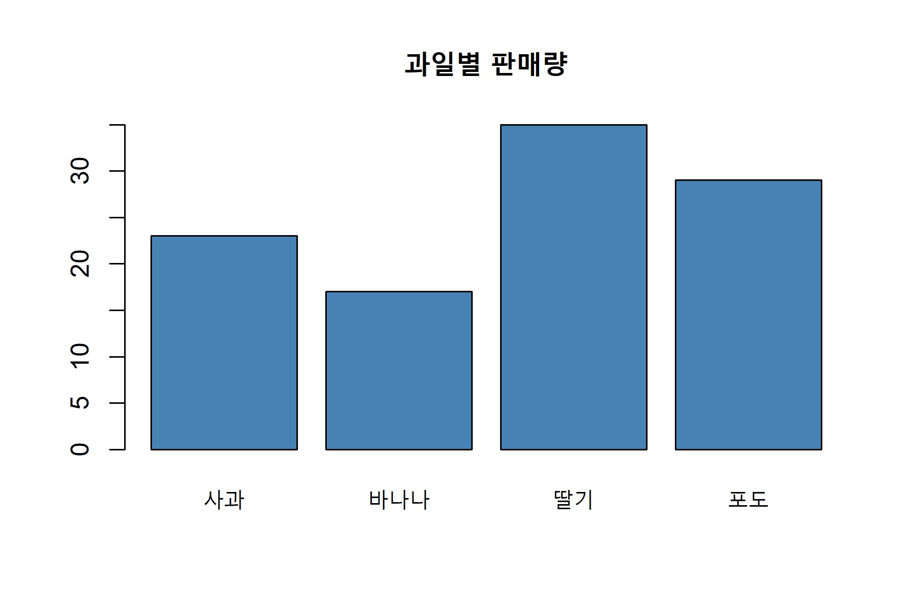
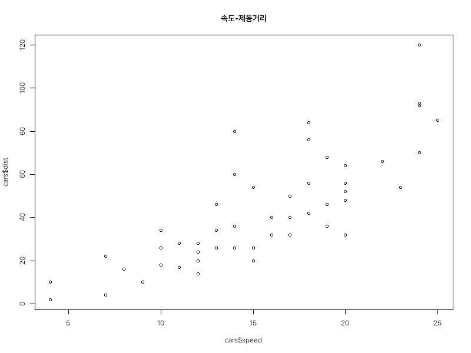
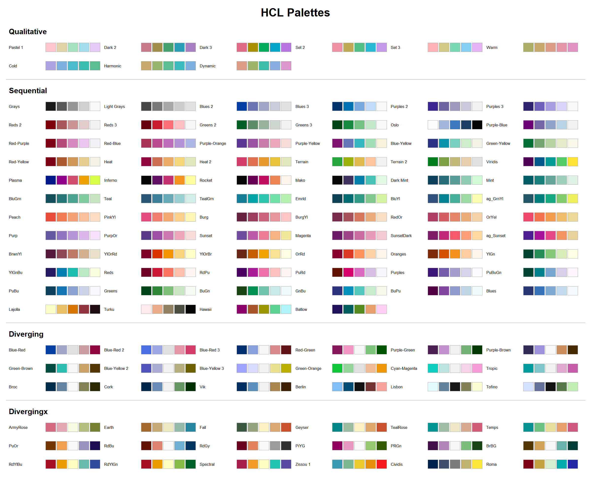
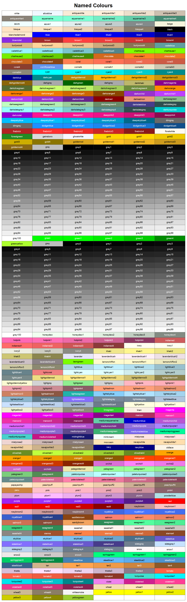

# 18. R 그래프

> 이 장은 Base R(R 4.1 이상)을 기준으로 합니다. 이 장에서 다루는 그래프 함수들은 모두 base R을 설치하면 함께 설치되는 **graphics**·**grDevices** 패키지 소속이라 별도의 패키지 설치 없이 바로 쓸 수 있습니다. ggplot2 등 tidyverse 계열 그래프 문법은 이 매뉴얼의 스코프(Base R 전용)를 벗어나므로 다루지 않습니다.

설문조사에서 응답자의 혈액형 분포, 학급별 시험 점수가 흩어진 정도, 실험군과 대조군의 평균 차이를 각각 막대그래프·히스토그램·상자그림으로 그려 보면, 표만으로는 드러나지 않던 치우침·이상치·집단 간 차이가 한눈에 들어옵니다.

R은 이런 시각화 요구를 데이터의 성격(범주형 vs. 연속형)과 목적(크기 비교, 분포 파악, 관계 파악)에 따라 다음과 같은 전용 함수로 제공합니다.

| 목적                 | 데이터 성격    | 함수                                      |
| ------------------ | --------- | --------------------------------------- |
| 범주별 크기·비율 비교       | 범주형       | `barplot()`(18.1), `pie()`(18.3)        |
| 연속형 변수 하나의 분포 파악   | 연속형       | `hist()`(18.2)                          |
| 여러 그룹의 분포·중심·퍼짐 비교 | 연속형 × 범주형 | `boxplot()`(18.4), `stripchart()`(18.5) |
| 두 연속형 변수의 관계 파악    | 연속형 × 연속형 | `plot()`(18.6)                          |

Base R의 그래프 시스템(`graphics` 패키지)은 함수를 두 층위로 나눕니다. `barplot()`·`hist()`·`pie()`·`boxplot()`·`plot()`처럼 새 그래프 창을 열고 좌표축까지 갖춘 완성된 그림을 그리는 함수를 **고수준(high-level) 함수**라 하고, `points()`·`lines()`·`text()`·`legend()`·`title()`·`mtext()`·`axis()`처럼 이미 열려 있는 그래프 위에 요소만 덧붙이는 함수를 **저수준(low-level) 함수**라고 합니다. 

---

## 18.1 Bar Plot

범주별 값(예: 지점별 매출, 학과별 학생 수)을 비교할 때 표로 나열하면 숫자를 하나하나 읽어야 크기 순서를 파악할 수 있습니다. 막대의 길이라는 시각적 단서를 쓰면 어느 범주가 가장 크고 작은지 즉시 비교할 수 있습니다.

### barplot()

`barplot(height, width = 1, space = NULL, names.arg = NULL, legend.text = NULL, beside = FALSE, horiz = FALSE, col = NULL, border = par("fg"), main = NULL, sub = NULL, xlab = NULL, ylab = NULL, xlim = NULL, ylim = NULL, plot = TRUE, ...)`는 벡터 또는 행렬 height의 값을 막대의 길이로 나타낸 막대그래프를 그립니다.

- `height` : 막대로 표시할 값. **벡터**를 넣으면 막대 하나짜리 단순 막대그래프가 되고, **행렬**을 넣으면 열(column)마다 하나의 막대를 그리되 그 안에 행(row)들이 `beside` 인자에 따라 누적되거나 나란히 놓입니다.
- `width` : 각 막대의 상대적 너비(기본값 1). 값 자체보다 막대 사이의 비율이 중요합니다.
- `space` : 막대 사이의 간격을 막대 너비 대비 비율로 지정합니다.
- `names.arg` : 막대 아래에 표시할 이름. 지정하지 않으면 `height`의 `names()`(벡터) 또는 열 이름(행렬)을 그대로 사용합니다.
- `beside` : `height`가 행렬일 때만 의미가 있습니다. `FALSE`(기본값)이면 한 열의 값들을 하나의 막대 안에 색깔별로 **누적**해서 쌓고, `TRUE`이면 한 열의 값들을 **나란히** 놓인 별도의 막대로 그립니다.
- `horiz` : `TRUE`이면 막대를 세로가 아니라 가로 방향으로 그립니다. 범주 이름이 길어서 겹칠 때 유용합니다.
- `col` : 막대 색. 행렬 입력이면 행 개수만큼의 색 벡터를 넣어 각 구성 요소를 구분합니다.
- `legend.text` : `TRUE`로 지정하면(또는 이름 벡터를 직접 넣으면) 행 이름을 범례로 자동 표시합니다. 행렬 입력에서 각 색이 무엇을 뜻하는지 알려줄 때 사용합니다.
- `main`, `sub`, `xlab`, `ylab` : 각각 제목, 부제, x축·y축 이름입니다(18.7절 `title()`로 나중에 추가하거나 바꿀 수도 있습니다).
- `plot` : `FALSE`로 지정하면 그래프는 그리지 않고 막대 좌표 계산 결과만 반환합니다.

**단순 막대그래프**

```r
fruit <- c(사과 = 23, 바나나 = 17, 딸기 = 35, 포도 = 29)
(bp <- barplot(fruit, main = "과일별 판매량", col = "steelblue",
               ylab = "판매량(상자)"))
#>      [,1]
#> [1,]  0.7
#> [2,]  1.9
#> [3,]  3.1
#> [4,]  4.3
```


`barplot()`은 그래프를 그리는 것 외에도, 각 막대 중심의 x좌표를 **보이지 않게(invisible) 반환**합니다. 이 좌표를 변수에 담아 두면, 막대 위에 값 레이블을 추가하는 `text()`의 위치로 그대로 활용할 수 있습니다.

```r
barplot(fruit, main = "과일별 판매량", col = "steelblue", ylim = c(0, 40))
text(x = bp, y = fruit + 2, labels = fruit)
```


**행렬 입력: 누적 막대와 그룹 막대**

R에 내장된 `VADeaths`(1940년 미국 버지니아주의 연령대별·성별·도농별 사망률, 인구 1,000명당) 행렬로 두 방식을 비교해 보겠습니다.

```r
VADeaths
#>       Rural Male Rural Female Urban Male Urban Female
#> 50-54       11.7          8.7       15.4          8.4
#> 55-59       18.1         11.7       24.3         13.6
#> 60-64       26.9         20.3       37.0         19.3
#> 65-69       41.0         30.9       54.6         35.1
#> 70-74       66.0         54.3       71.1         50.0
```

```r
# beside = FALSE(기본값): 열(성별·도농별)마다 연령대를 누적한 막대
barplot(VADeaths, col = hcl.colors(5, "Blues3"),
        main = "연령대별 사망률(누적)", ylab = "사망률(‱)")
```

.png)

```r
# beside = TRUE: 연령대별 막대를 나란히 배치하고 범례를 자동 표시
barplot(VADeaths, beside = TRUE, col = hcl.colors(5, "Blues3"),
        legend.text = TRUE, main = "연령대별 사망률(그룹)", ylab = "사망률(‱)")
```

.png)

누적 막대그래프는 열(그룹) 전체 합계를 비교하기에 좋고, 그룹 막대그래프는 같은 연령대끼리 성별·도농별 값을 나란히 비교하기에 좋습니다. 반환값의 형태도 달라지는데, `beside = FALSE`이면 열 개수만큼의 벡터를, `beside = TRUE`이면 (행 개수 × 열 개수) 크기의 행렬을 돌려줍니다.

```r
barplot(VADeaths, beside = TRUE, plot = FALSE)
#>      [,1] [,2] [,3] [,4]
#> [1,]  1.5  7.5 13.5 19.5
#> [2,]  2.5  8.5 14.5 20.5
#> [3,]  3.5  9.5 15.5 21.5
#> [4,]  4.5 10.5 16.5 22.5
#> [5,]  5.5 11.5 17.5 23.5
```

**가로 막대그래프**

범주 이름이 길거나 개수가 많으면 `horiz = TRUE`와 정렬(`sort()`)을 함께 쓰는 것이 읽기 좋습니다.

```r
barplot(sort(fruit), horiz = TRUE, las = 1, col = hcl.colors(4, "Set2"))
```

.png)

`las = 1`은 축 이름표를 항상 가로로 눕혀 표시하는 옵션으로, 가로 막대그래프에서 범주 이름을 읽기 쉽게 해 줍니다.

> **더 알아보기: dotchart() — 막대그래프의 대안**
>
> 범주 개수가 많아지면 막대그래프는 굵은 막대들이 시각적으로 무거워 보입니다. `dotchart(x, labels = NULL, ...)`는 막대 대신 점 하나로 값을 표시해 더 가볍고, 특히 범주가 많거나 값이 세밀하게 다를 때 비교하기 좋습니다.
>
> ```r
> dotchart(sort(fruit), main = "과일별 판매량(dotchart)")
> ```
>
> .png)
>
> 범주가 10개를 넘거나 여러 그룹을 겹쳐 비교해야 한다면 `dotchart()`를, 몇 개 안 되는 범주의 크기를 직관적으로 강조하고 싶다면 `barplot()`을 우선 고려하는 것이 일반적입니다.

---

## 18.2 Histogram

막대그래프는 "사과", "바나나"처럼 **범주형** 변수를 다룹니다. 그런데 시험 점수나 키처럼 **연속형** 변수는 값 하나하나가 거의 다 달라서, 그 값 각각을 막대로 그리면 의미 있는 그림이 나오지 않습니다. 연속형 변수의 분포(어디에 값이 몰려 있고, 얼마나 퍼져 있으며, 치우쳐 있는지)를 보려면 값을 일정한 구간으로 잘라 묶은 뒤 각 구간에 몇 개가 속하는지 세어야 합니다.

### hist()

`hist(x, breaks = "Sturges", freq = NULL, probability = !freq, include.lowest = TRUE, right = TRUE, col = "lightgray", border = NULL, main = paste("Histogram of", xname), xlim = range(breaks), ylim = NULL, xlab = xname, plot = TRUE, ...)`는 숫자형 벡터 x를 일정한 구간(계급, class)으로 나누어 각 구간에 속하는 값의 개수(또는 밀도)를 막대로 표시합니다.

- `x` : 분포를 파악할 숫자형 벡터.
- `breaks` : 구간을 어떻게 나눌지 지정합니다. 다음 네 가지 방식이 모두 가능합니다.
  - **숫자 하나**: 원하는 구간 개수의 대략적인 목표치(예: `breaks = 10`). 실제 구간 개수는 경계를 보기 좋은 값으로 다시 계산하는 과정에서 이 값과 다소 달라질 수 있습니다.
  - **숫자 벡터**: 구간의 경계를 직접 지정합니다(예: `breaks = c(0, 25, 50, 75, 100, 125)`). 구간 폭이 서로 달라도 됩니다.
  - **문자열**: 구간 개수를 자동으로 계산하는 알고리즘의 이름. `"Sturges"`(기본값), `"Scott"`, `"FD"`(또는 `"Freedman-Diaconis"`) 중 선택합니다.
  - **함수**: `x`를 받아 구간 개수(또는 경계)를 계산하는 함수.
- `freq` : `TRUE`이면 y축이 각 구간의 **빈도(개수)**, `FALSE`이면 **밀도(density, 막대 아래 면적의 합이 1이 되도록 조정한 값)**를 나타냅니다. 기본값은 `x`가 숫자형이면 `TRUE`입니다. 구간 폭이 서로 다르면(직접 지정한 경우) 개수를 그대로 비교하는 것이 왜곡을 낳으므로 `freq = FALSE`가 자동으로 적용됩니다.
- `right` : `TRUE`(기본값)이면 구간이 오른쪽으로 닫힌 `(a, b]` 형태, `FALSE`이면 왼쪽으로 닫힌 `[a, b)` 형태로 값을 나눕니다.
- `include.lowest` : 가장 첫 구간에 최솟값을 포함할지 여부입니다(기본값 `TRUE`).
- `col`, `border` : 막대 채우기 색과 테두리 색.
- `plot` : `FALSE`로 지정하면 그래프를 그리지 않고 구간·빈도 계산 결과만 리스트로 반환합니다.

**breaks 알고리즘 비교**

세 알고리즘은 모두 "적당한 구간 개수"를 데이터의 표본 크기나 퍼짐 정도로부터 추정하지만 계산 방식이 다릅니다. `nclass.Sturges()`·`nclass.scott()`·`nclass.FD()` 함수로 각 알고리즘이 제안하는 구간 개수를 직접 확인할 수 있습니다.

```r
nclass.Sturges(cars$dist)
nclass.scott(cars$dist)
nclass.FD(cars$dist)
#> [1] 7
#> [1] 5
#> [1] 8
```

`hist()`는 이 제안값을 그대로 쓰지 않고, 경계를 5나 10의 배수처럼 보기 좋은 값으로 다시 조정하기 때문에(`pretty()` 함수를 내부적으로 사용) 최종 구간 개수가 제안값과 정확히 일치하지 않을 수 있습니다.

```r
str(hist(cars$dist, main = "제동거리 분포", xlab = "제동거리(ft)"))
#> List of 6
#>  $ breaks  : num [1:7] 0 20 40 60 80 100 120
#>  $ counts  : int [1:6] 10 18 11 6 4 1
#>  $ density : num [1:6] 0.01 0.018 0.011 0.006 0.004 0.001
#>  $ mids    : num [1:6] 10 30 50 70 90 110
#>  $ xname   : chr "cars$dist"
#>  $ equidist: logi TRUE
#>  - attr(*, "class")= chr "histogram"
```


`nclass.Sturges()`는 7을 제안했지만, 실제로는 경계가 0부터 20 간격으로 조정되며 6개 구간(막대)이 만들어졌습니다. `breaks`에 숫자를 직접 지정해도 마찬가지 방식으로 조정됩니다.

```r
hist(cars$dist, breaks = 10, plot = FALSE)$breaks
#>  [1]   0  10  20  30  40  50  60  70  80  90 100 110 120
```

경계를 벡터로 직접 지정하면 원하는 폭으로 정확히 자를 수 있습니다.

```r
hist(cars$dist, breaks = c(0, 25, 50, 75, 100, 125), plot = FALSE)$counts
#> [1] 12 21 10  6  1
```

**밀도 곡선 함께 그리기**

`freq = FALSE`로 y축을 밀도로 바꾸면, 9.6절에서 다룰 `density()`(커널 밀도추정)의 곡선을 같은 척도로 겹쳐 그릴 수 있습니다. `rug()`는 x축 위에 원자료 각각의 위치를 짧은 세로선으로 표시해, 히스토그램의 구간 폭 때문에 가려질 수 있는 원자료의 실제 분포를 함께 보여줍니다.

```r
hist(cars$dist, freq = FALSE, main = "밀도로 표시한 히스토그램",
     xlab = "제동거리(ft)")
lines(density(cars$dist), col = "blue", lwd = 2)
rug(cars$dist)
```


> **주의: 구간 폭에 따라 히스토그램의 인상이 달라질 수 있습니다**
>
> 같은 데이터라도 `breaks`를 어떻게 지정하느냐에 따라 분포가 매끈해 보이거나 들쭉날쭉해 보일 수 있습니다. 구간을 너무 넓게 잡으면 봉우리가 여러 개인(다봉형) 분포도 하나로 뭉뚱그려지고, 너무 좁게 잡으면 우연한 잡음까지 봉우리로 보일 수 있습니다. 특별한 이유가 없다면 기본값(`"Sturges"`)으로 시작해서, 위 예제처럼 `breaks`를 몇 가지로 바꿔 가며 비교해 보는 것이 안전합니다.

---

## 18.3 Pie Chart

막대그래프가 값의 **크기**를 비교하는 데 유리하다면, 파이차트는 전체를 100%로 놓고 각 범주가 차지하는 **비율**을 직관적으로 보여주는 데 초점을 둡니다. "몇 개 회사가 시장을 어떻게 나눠 가지고 있는가"처럼 부분과 전체의 관계가 중요한 경우에 흔히 쓰입니다.

### pie()

`pie(x, labels = names(x), edges = 200, radius = 0.8, clockwise = FALSE, init.angle = if (clockwise) 90 else 0, col = NULL, border = NULL, main = NULL, ...)`는 양수 벡터 x의 값을 전체 대비 비율로 환산해 부채꼴(파이 조각)로 그립니다.

- `x` : 양수로 이루어진 벡터. 값 자체가 아니라 `x / sum(x)`로 계산된 비율이 조각의 크기가 됩니다.
- `labels` : 각 조각에 붙일 이름(기본값은 `x`의 `names()`).
- `radius` : 파이의 반지름(기본값 0.8). 바깥 여백에 범례나 긴 라벨을 함께 넣을 공간을 남기기 위해 1보다 작게 잡혀 있습니다.
- `clockwise` : 조각을 그리는 방향입니다. `FALSE`(기본값)면 반시계 방향, `TRUE`면 시계 방향으로 그립니다.
- `init.angle` : 첫 조각이 시작하는 각도(도 단위). 기본값은 `clockwise = FALSE`일 때 0도(3시 방향), `clockwise = TRUE`일 때 90도(12시 방향)입니다.
- `col` : 조각별 색. 지정하지 않으면 회색조로 채워지므로 조각을 구분하려면 직접 지정하는 것이 좋습니다.
- `edges` : 원을 근사할 때 사용하는 다각형의 변 개수(기본값 200으로 충분히 매끈합니다). 거의 조정할 일이 없는 인자입니다.

```r
share <- c(A사 = 35, B사 = 28, C사 = 20, D사 = 17)
pie(share, main = "시장 점유율", col = hcl.colors(4, "Set2"),
    clockwise = TRUE, init.angle = 90)
```


`clockwise = TRUE, init.angle = 90`을 지정하면 12시 방향에서 시작해 시계 방향으로 도는, 우리에게 익숙한 형태의 파이차트가 됩니다. 이 두 인자를 기본값 그대로 두면 3시 방향에서 반시계 방향으로 그려지므로 원하는 모양과 다를 수 있습니다.

> **주의: 파이차트로는 크기 비교가 정확하지 않을 수 있습니다**
>
> 사람은 길이(막대그래프)보다 각도나 넓이(파이차트)의 차이를 지각적으로 정확히 비교하기 어렵다는 점이 데이터 시각화 분야에서 오래전부터 지적되어 왔습니다. 조각이 4~5개를 넘거나 비율이 서로 비슷하면 어느 조각이 더 큰지 한눈에 판단하기 어려워집니다. 정확한 비교가 목적이라면 `barplot()`(특히 정렬한 가로 막대그래프)이나 앞서 소개한 `dotchart()`가 더 나은 선택인 경우가 많습니다.
>
> ```r
> barplot(sort(share), horiz = TRUE, las = 1, col = hcl.colors(4, "Set2"),
>         main = "시장 점유율(막대그래프로 비교)")
> ```
> 
> .png)
> 
> 파이차트는 "전체를 100%로 봤을 때 이 범주가 대략 이만큼을 차지한다"는 인상을 전달하는 용도로, 정밀한 순위 비교가 필요 없는 요약 자료에 제한적으로 쓰는 것을 권장합니다.

---

## 18.4 Box Plot

히스토그램은 분포의 모양을 자세히 보여주지만, 그룹이 여러 개일 때(예: 종별로 나뉜 iris 데이터) 히스토그램을 나란히 여러 개 그리면 그래프가 금방 복잡해집니다. 여러 그룹의 중심 위치·퍼짐 정도·이상치 유무를 한 화면에서 빠르게 비교하려면, 분포를 다섯 개의 숫자(최솟값·1사분위수·중위수·3사분위수·최댓값, `fivenum()` 참고)로 압축한 상자그림이 유리합니다.

### boxplot()

`boxplot(x, ..., range = 1.5, width = NULL, varwidth = FALSE, notch = FALSE, outline = TRUE, names, col = "lightgray", horizontal = FALSE)` 또는 `boxplot(formula, data, ...)`는 x(또는 formula로 지정한 그룹별 데이터)의 분포를 상자와 수염(whisker)으로 요약해 그립니다.

- `x`, `...` : 그룹별 숫자형 벡터들. `boxplot(x1, x2, x3)`처럼 여러 벡터를 나열하거나, 리스트 하나를 넣을 수 있습니다.
- `formula`, `data` : `반응변수 ~ 그룹변수` 형태의 수식으로 그룹을 지정할 수도 있습니다(9.3절 `lm()`과 같은 방식). 그룹변수가 팩터가 아니어도 자동으로 팩터로 취급됩니다.
- `range` : 수염의 최대 길이를 IQR(사분위범위, 9.2절)의 몇 배까지 그릴지 지정합니다(기본값 1.5). 이 범위를 벗어나는 값은 수염 대신 점으로 따로 표시되는데, 이 점들을 관례적으로 **이상치(outlier)**라고 부릅니다.
- `notch` : `TRUE`이면 상자의 중위수 부근을 잘록하게 표시합니다. 이 잘록한 구간은 중위수의 근사 95% 신뢰구간에 해당하며, 두 그룹의 잘록한 구간이 겹치지 않으면 중위수가 통계적으로 유의하게 다르다고 잠정적으로 판단할 수 있습니다(엄밀한 가설검정은 9.7절 참고).
- `varwidth` : `TRUE`이면 그룹별 표본 크기(n)에 비례해 상자의 너비를 다르게 그려, 표본이 적은 그룹의 상자를 시각적으로도 가늘게 표시합니다.
- `outline` : `FALSE`로 지정하면 이상치 점을 그래프에서 생략합니다. 이상치를 `stripchart()`(18.5절)로 따로 겹쳐 그릴 때 상자그림 쪽 점을 없애고 싶을 때 사용합니다.
- `horizontal` : `TRUE`이면 상자를 가로 방향으로 그립니다.
- `col`, `border` : 상자 채우기 색과 테두리 색.

```r
boxplot(Sepal.Length ~ Species, data = iris,
        main = "종별 꽃받침 길이", ylab = "Sepal.Length(cm)",
        col = hcl.colors(3, "Pastel1"))
```


`boxplot()`도 `barplot()`처럼 계산 결과를 보이지 않게 반환합니다. `str()`로 그 구조를 살펴보면 상자그림을 이루는 모든 통계량을 확인할 수 있습니다.

```r
bx <- boxplot(Sepal.Length ~ Species, data = iris, plot = FALSE)
str(bx)
#> List of 6
#>  $ stats: num [1:5, 1:3] 4.3 4.8 5 5.2 5.8 4.9 5.6 5.9 6.3 7 ...
#>  $ n    : num [1:3] 50 50 50
#>  $ conf : num [1:2, 1:3] 4.91 5.09 5.74 6.06 6.34 ...
#>  $ out  : num 4.9
#>  $ group: num 3
#>  $ names: chr [1:3] "setosa" "versicolor" "virginica"
```

`$stats`는 5행 × 그룹 수 열의 행렬로, 각 열이 해당 그룹의 (아래쪽 수염, 1사분위수, 중위수, 3사분위수, 위쪽 수염) 다섯 값을 담고 있습니다. `$out`은 이상치로 표시된 값이고 `$group`은 그 이상치가 몇 번째 그룹에 속하는지를 나타냅니다 — 위 결과에서는 setosa 그룹(1번째)에 4.9라는 이상치가 하나 있다는 뜻입니다.

> **더 알아보기: boxplot.stats() — 그래프 없이 상자그림 통계량만 계산하기**
>
> 그래프는 필요 없고 이상치 판정 기준이나 다섯 숫자 요약만 코드에서 활용하고 싶다면 `boxplot.stats(x, coef = 1.5, do.conf = TRUE, do.out = TRUE)`를 쓰면 됩니다. `boxplot()`을 호출할 때 내부적으로 쓰이는 바로 그 함수입니다.
>
> ```r
> str(boxplot.stats(iris$Sepal.Length[iris$Species == "virginica"]))
> #> List of 4
> #>  $ stats: num [1:5] 5.6 6.2 6.5 6.9 7.9
> #>  $ n    : int 50
> #>  $ conf : num [1:2] 6.34 6.66
> #>  $ out  : num 4.9
> ```
>
> virginica 그룹에도 4.9라는 이상치가 하나 있다는 것을 그래프 없이 확인할 수 있습니다. 이상치를 코드에서 자동으로 걸러내거나 표시해야 하는 파이프라인에 유용합니다.

---

## 18.5 Strip Chart

**문제 상황**: 상자그림(18.4절)은 다섯 숫자로 분포를 압축해서 보여 주는 만큼, 그 압축 과정에서 원자료의 세부 모습(예: 값이 두 군데로 몰려 있는 이봉형 분포, 실제 표본 크기)이 가려질 수 있습니다. 특히 표본 크기가 작을 때는 상자와 수염만 보고는 "정말 이 몇 개 안 되는 값들이 이런 모양이었나?"를 확인하기 어렵습니다. 이럴 때는 값 하나하나를 점으로 그대로 늘어놓는 것이 가장 정직한 방법입니다.

### stripchart()

`stripchart(x, method = "overplot", jitter = 0.1, offset = 1/3, vertical = FALSE, group.names, add = FALSE, pch = 0, col = par("fg"), ...)`는 x(벡터, formula, 또는 벡터들의 리스트)의 각 값을 하나의 점으로 늘어놓은 1차원 산점도(띠그래프)를 그립니다.

- `x` : 숫자형 벡터, `반응변수 ~ 그룹변수` 형태의 formula, 또는 벡터들의 리스트.
- `method` : 값이 겹칠 때 처리하는 방식입니다.
  - `"overplot"`(기본값) : 겹치는 점을 그대로 겹쳐서 그립니다. 표본이 크면 점들이 뭉쳐 보여 분간이 어려울 수 있습니다.
  - `"jitter"` : 점들을 세로(또는 가로)로 살짝 무작위로 흩뜨려 겹침을 완화합니다. 흩뜨리는 정도는 `jitter` 인자로 조절합니다.
  - `"stack"` : 같은 값(또는 매우 가까운 값)의 점들을 나란히 쌓아 올려 몇 개가 겹치는지 시각적으로 보여줍니다.
- `jitter` : `method = "jitter"`일 때 흩뜨리는 정도(기본값 0.1). 값이 클수록 점들이 더 넓게 퍼집니다.
- `vertical` : `FALSE`(기본값)이면 점들을 가로 방향(값이 x축)으로, `TRUE`이면 세로 방향(값이 y축)으로 늘어놓습니다. `boxplot()`과 겹쳐 그릴 때는 `boxplot()`의 기본 방향(세로)에 맞추어 `vertical = TRUE`로 지정해야 합니다.
- `add` : `TRUE`이면 새 그래프를 열지 않고 기존 그래프 위에 점을 덧그립니다. `boxplot()` 위에 원자료를 겹치는 용도로 자주 씁니다.
- `pch`, `col` : 점 모양과 색.

```r
stripchart(Sepal.Length ~ Species, data = iris, method = "jitter",
           vertical = TRUE, pch = 20, col = "steelblue",
           main = "종별 꽃받침 길이(원자료)", ylab = "Sepal.Length(cm)")
```

.png)

`method = "stack"`으로 지정하면 겹치는 점들이 층층이 쌓여, 특정 값 근처에 얼마나 많은 관측치가 몰려 있는지까지 드러납니다.

```r
stripchart(Sepal.Length ~ Species, data = iris, method = "stack",
           offset = 0.8, pch = 19)
```

.png)

**boxplot()과 겹쳐 그리기**

요즘 데이터 시각화에서는 상자그림 하나만 보여주기보다, 상자그림 위에 원자료 점을 함께 표시해 "요약 통계"와 "실제 관측치"를 동시에 보여주는 방식이 자주 권장됩니다. 상자그림만으로는 표본 크기가 작거나 분포가 특이한 경우를 놓치기 쉽기 때문입니다. `boxplot()`의 이상치 표시를 끄고(`outline = FALSE`) 그 위에 `stripchart(..., add = TRUE)`를 겹치면 됩니다.

```r
boxplot(Sepal.Length ~ Species, data = iris, outline = FALSE,
        main = "상자그림 + 원자료", ylab = "Sepal.Length(cm)")
stripchart(Sepal.Length ~ Species, data = iris, method = "jitter",
           vertical = TRUE, pch = 20,
           col = adjustcolor("steelblue", alpha.f = 0.5), add = TRUE)
```


`adjustcolor(col, alpha.f)`는 지정한 색에 투명도(0에 가까울수록 투명, 1이면 불투명)를 적용하는 함수로, 점이 많이 겹칠 때 서로 구분되도록 도와줍니다.

---

## 18.6 그 밖의 유용한 그래프

지금까지 설명한 다섯 가지 함수는 각각 범주형 데이터의 크기·비율 비교나 연속형 변수 하나(또는 그룹별)의 분포 파악에 특화되어 있습니다. 그런데 실제 데이터 분석에서는 이 틀에 딱 들어맞지 않는 요구도 자주 생깁니다 — 두 연속형 변수의 관계를 보고 싶거나, 수학 함수·확률분포의 모양을 눈으로 확인하고 싶거나, 변수가 여러 개일 때 모든 조합을 한꺼번에 훑어보고 싶거나, 행렬 형태의 데이터를 지도처럼 시각화하고 싶은 경우입니다. 이 절에서는 이런 요구에 대응하는 R의 나머지 주요 고수준 그래프 함수를 모아 정리합니다.

### plot()

`plot(x, y = NULL, type = "p", xlim = NULL, ylim = NULL, main = NULL, sub = NULL, xlab = NULL, ylab = NULL, asp = NA, ...)`는 두 변수 x, y의 관계를 좌표평면 위에 그리는 R에서 가장 기본적인 그래프 함수입니다. 9.4절에서 `cars$speed`와 `cars$dist`의 관계를 그릴 때 이미 여러 번 사용했습니다.

- `x`, `y` : 좌표. `y`를 생략하면 `x`를 y값으로, 순번(1, 2, 3, ...)을 x값으로 삼아 그립니다. `x`에 `lm` 객체처럼 자체적인 `plot` 메서드를 가진 객체를 넣으면 그 객체에 맞는 전용 그래프가 그려지기도 합니다(19장 S3 클래스에서 이 원리를 다룹니다).
- `type` : 점을 어떻게 연결할지 지정합니다.

| type | 의미 |
|---|---|
| `"p"` | 점만 표시(기본값, point) |
| `"l"` | 점을 선으로 연결(line), 점 자체는 표시 안 함 |
| `"b"` | 점과 선을 함께 표시(both) |
| `"o"` | 점과 선을 겹쳐서 표시(overplotted, `"b"`보다 선이 점을 관통) |
| `"h"` | 각 점에서 x축까지 수직선(histogram-like) |
| `"s"`, `"S"` | 계단형 선(step) |
| `"n"` | 아무것도 그리지 않고 좌표축만 그림(나중에 `points()`·`lines()`로 직접 채울 때) |

- `xlim`, `ylim` : x축·y축의 표시 범위. 여러 그래프를 같은 척도로 비교하려면 직접 지정하는 것이 좋습니다.
- `main`, `sub`, `xlab`, `ylab` : 제목·부제·축 이름(18.7절 `title()`로 나중에 추가하거나 수정할 수도 있습니다).
- `asp` : x축과 y축의 척도 비율(aspect ratio). `asp = 1`로 지정하면 x·y 단위 1이 화면에서 같은 길이로 그려져, 지도나 도형처럼 가로세로 비율이 중요한 그래프에 사용합니다.

```r
plot(1:10, c(3, 5, 4, 7, 6, 9, 8, 12, 10, 15), type = "b",
     main = "type = \"b\" 예시", xlab = "x", ylab = "y")
```


`plot()`으로 좌표축을 연 뒤에는 `points()`(점 추가), `lines()`(선 추가), `text()`(글자 추가) 같은 저수준 함수로 같은 그래프 위에 요소를 계속 덧붙일 수 있습니다. `points(x, y, ...)`와 `lines(x, y, ...)`는 각각 `plot(x, y, type = "p")`, `plot(x, y, type = "l")`과 인자 구성이 거의 같지만, 새 그래프를 열지 않고 기존 그래프에 덧그린다는 점이 다릅니다.

---

### curve()

`curve(expr, from = NULL, to = NULL, n = 101, add = FALSE, type = "l", xname = "x", xlab = xname, ylab = NULL, ...)`는 수학 함수(수식)를 x, y 좌표 벡터로 미리 만들지 않고 바로 그려 주는 함수입니다.

- `expr` : 그릴 함수식. `xname`으로 지정한 변수(기본값 `x`)를 포함하는 R 표현식이나, `x`를 받아 값을 돌려주는 함수 객체를 넣을 수 있습니다.
- `from`, `to` : x의 범위. `add = TRUE`로 기존 그래프에 덧그릴 때는 생략하면 현재 그래프의 x축 범위를 그대로 씁니다.
- `n` : 곡선을 매끄럽게 그리기 위해 계산할 점의 개수(기본값 101). 값이 클수록 곡선이 더 매끈해집니다.
- `add` : `TRUE`이면 새 그래프를 열지 않고 기존 그래프 위에 곡선을 덧그립니다. 여러 함수를 겹쳐 비교할 때 유용합니다.
- `type` : `plot()`과 마찬가지로 `"l"`(선, 기본값), `"p"`(점) 등을 지정할 수 있습니다.

```r
curve(sin(x), from = -2*pi, to = 2*pi, main = "sin과 cos 곡선")
curve(cos(x), add = TRUE, col = "red", lty = 2)   # 같은 그래프에 cos(x)를 겹쳐 그림
legend("bottomleft", legend = c("sin(x)", "cos(x)"),
       col = c("black", "red"), lty = c(1, 2), bty = "n")
```


수학 함수에서 다룬 함수나 확률분포의 밀도함수(예: `dnorm()`)의 모양을 눈으로 확인할 때도 `curve()`가 자주 쓰입니다.

```r
curve(dnorm(x), from = -4, to = 4, main = "표준정규분포 밀도함수")
```


---

### pairs()

`pairs(x, labels, panel = points, lower.panel = panel, upper.panel = panel, diag.panel = NULL, ...)`는 데이터프레임(또는 행렬) x에 들어 있는 모든 변수 쌍의 산점도를 격자 형태로 한 번에 그려 주는 **산점도 행렬(scatterplot matrix)**입니다.

- `x` : 숫자형 열들로 이루어진 데이터프레임 또는 행렬.
- `labels` : 대각선에 표시할 변수 이름(기본값은 `x`의 열 이름).
- `panel` : 각 칸(대각선 제외)에 그릴 그림의 종류를 결정하는 함수(기본값 `points`, 즉 산점도). `lower.panel`·`upper.panel`을 따로 지정하면 대각선 아래·위를 다른 방식(예: 위쪽은 상관계수 숫자)으로 그릴 수도 있습니다.
- `...` : `col`, `pch` 등 `plot()`과 공통되는 인자를 그대로 전달할 수 있습니다.

변수가 3개 이상일 때, 하나씩 `plot()`으로 그리는 대신 모든 조합을 한 번에 훑어보고 싶을 때 유용합니다.

```r
pairs(iris[1:4], col = as.integer(iris$Species),
      main = "iris 변수 간 산점도 행렬")
```


네 변수(꽃받침 길이·너비, 꽃잎 길이·너비)의 모든 쌍이 격자로 배치되며, 색으로 구분한 종(Species)에 따라 꽃잎 길이·너비 조합이 특히 뚜렷하게 갈라지는 것을 한눈에 볼 수 있습니다.

---

### matplot()

`matplot(x, y, type = "p", lty = 1:5, lwd = 1, pch = NULL, col = 1:6, xlab = NULL, ylab = NULL, xlim = NULL, ylim = NULL, add = FALSE, ...)`는 행렬(또는 데이터프레임)의 **여러 열을 한 그래프 위에 각각 다른 선·점으로** 그립니다. `barplot()`이 행렬의 열을 막대로 비교했다면, `matplot()`은 같은 데이터를 선 그래프로 비교하는 셈입니다.

- `x`, `y` : `matplot(y)`처럼 행렬 하나만 넣으면 그 행렬을 `y`로 삼아 각 열을 그리고, x축은 행 번호(`1:nrow(y)`)를 자동으로 사용합니다. `matplot(x, y)`처럼 둘 다 지정하면 공통의 x좌표에 대해 y행렬의 각 열을 그립니다.
- `type` : 열마다 어떻게 그릴지. `"p"`(점)·`"l"`(선)·`"b"`(점+선) 등 `plot()`의 `type`과 같은 값을 쓸 수 있으며, 열 개수보다 짧은 벡터로 지정하면 앞에서부터 반복해서 재활용됩니다.
- `lty`, `pch`, `col` : 열마다 다른 선 종류·점 모양·색을 벡터로 지정합니다. 기본값 자체가 이미 여러 값(`1:5`, `1:6`)이라 별도로 지정하지 않아도 열마다 자동으로 구분됩니다.
- `add` : `TRUE`이면 기존 그래프 위에 겹쳐 그립니다.

```r
matplot(VADeaths, type = "b", pch = 1:4, col = 1:4, lty = 1,
        xlab = "연령대 순번", ylab = "사망률(‱)",
        main = "연령대별 사망률(matplot)")
legend("topleft", legend = colnames(VADeaths), pch = 1:4, col = 1:4, bty = "n")
```

.png)

18.1절에서 `barplot(VADeaths, beside = TRUE)`로 그렸던 것과 같은 데이터를, 막대 대신 선으로 이어 연령대에 따른 **추세**(나이가 들수록 사망률이 어떻게 증가하는가)를 강조해 보여줍니다. 막대그래프가 그룹 간 크기 비교에 유리하다면, `matplot()`은 여러 계열의 변화 추이를 비교하는 데 유리합니다.

기존 그래프에 나중에 열을 추가로 덧그리고 싶다면 `matlines(x, y, ...)`·`matpoints(x, y, ...)`를 씁니다 — `plot()`에 대한 `lines()`·`points()`와 같은 관계입니다.

---

### image(), contour(), persp()

세 함수 모두 x·y 좌표 격자 위의 값(행렬 z)을 시각화한다는 공통점이 있습니다. 값을 색으로 표현하면 `image()`(히트맵), 같은 값을 잇는 선으로 표현하면 `contour()`(등고선), 값을 높이로 세워 입체로 표현하면 `persp()`(3차원 표면)가 됩니다. 지형 고도, 두 변수 조합에 따른 확률·밀도, 상관행렬처럼 "행과 열의 조합마다 값 하나씩"인 데이터에 적합합니다.

`image(x = seq(0, 1, length.out = nrow(z)), y = seq(0, 1, length.out = ncol(z)), z, col = hcl.colors(12, "YlOrRd", rev = TRUE), zlim = range(z, finite = TRUE), add = FALSE, ...)`

- `z` : 행렬(필수). 행이 x축, 열이 y축 방향의 값으로 취급됩니다.
- `x`, `y` : 각 행·열이 실제로 어떤 좌표에 해당하는지(기본값은 0~1 사이 등간격). 예를 들어 위경도나 실제 거리 단위를 갖는 데이터라면 직접 지정합니다.
- `col` : 값의 크기를 나타낼 색 팔레트. `hcl.colors()`로 지정하는 것이 최근 권장되는 방식입니다.
- `zlim` : 색으로 표현할 값의 범위. 여러 `image()`를 같은 색 기준으로 비교하려면 직접 지정해야 합니다.

`contour(x, y, z, nlevels = 10, levels = pretty(zlim, nlevels), labels = NULL, add = FALSE, ...)`

- `nlevels`, `levels` : 등고선을 몇 개 그릴지(기본 10개), 또는 어떤 값에서 그릴지 직접 지정합니다.
- `add` : `TRUE`이면 `image()` 위에 등고선을 겹쳐 그립니다(아래 예제처럼 히트맵과 함께 쓰는 경우가 많습니다).

`persp(x = seq(0, 1, length.out = nrow(z)), y = seq(0, 1, length.out = ncol(z)), z, theta = 0, phi = 15, expand = 1, col = "white", shade = NA, ticktype = "simple", ...)`

- `theta`, `phi` : 보는 방향을 정하는 각도. `theta`는 수평 회전, `phi`는 위아래로 기울이는 각도입니다. 값을 바꿔 가며 원하는 시야각을 찾습니다.
- `expand` : 높이(z) 방향의 비율을 가로·세로에 대해 얼마나 과장할지(기본값 1). 값이 작을수록 표면이 완만해 보입니다.
- `shade` : 0~1 사이 값을 지정하면 광원 효과(음영)를 넣어 입체감을 더합니다.

R에 내장된 `volcano`(뉴질랜드 마웅가 와우 화산의 87×61 격자 고도 데이터, 미터 단위) 행렬로 세 함수를 비교해 보겠습니다.

```r
dim(volcano)
#> [1] 87 61
```

```r
image(volcano, col = hcl.colors(20, "terrain"), main = "화산 지형 히트맵")
contour(volcano, add = TRUE)   # 히트맵 위에 등고선을 겹쳐 그림
```


```r
persp(volcano, theta = 30, phi = 20, col = "lightgreen",
      main = "화산 지형 3차원 표면")
```


`image()` + `contour(add = TRUE)` 조합은 색으로 대략적인 높낮이를, 등고선으로 정확한 경계를 함께 보여주어 지도·등고선도 형태의 자료를 다룰 때 특히 자주 쓰이는 조합입니다.

**관련 함수**: `hcl.colors()`(색상 팔레트, 18.7절), `heatmap()`(행렬을 계층적으로 재배열해 보여주는 확장판, stats 패키지), `outer()`(6.1절 — z 행렬을 두 벡터의 조합으로 직접 만들 때)

---

### symbols()

`symbols(x, y = NULL, circles, squares, rectangles, stars, thermometers, boxplots, inches = TRUE, add = FALSE, fg = par("col"), bg = NA, xlab = NULL, ylab = NULL, ...)`는 산점도의 각 점을 단순한 점 대신 **크기가 있는 도형**으로 그려, 세 번째(또는 그 이상의) 변수를 도형의 크기로 함께 표현합니다.

- `x`, `y` : 도형을 그릴 중심 좌표.
- `circles`, `squares`, `rectangles`, `stars`, `thermometers`, `boxplots` : 어떤 도형을 그릴지 정하는 인자들로, 이 중 **정확히 하나만** 지정해야 합니다. 예를 들어 `circles`에는 각 점의 원 반지름을, `squares`에는 정사각형의 한 변 길이를 벡터로 넣습니다.
- `inches` : `TRUE`(기본값)이면 가장 큰 도형의 크기가 1인치가 되도록 나머지 도형들의 크기를 비례해서 자동으로 조정합니다. 숫자를 지정하면 그 인치 값에 맞춰 조정하고, `FALSE`이면 `circles` 등에 넣은 값을 그래프 좌표 단위 그대로 사용합니다.
- `fg`, `bg` : 도형 테두리 색과 채우기 색.
- `add` : `TRUE`이면 기존 그래프 위에 겹쳐 그립니다.

```r
symbols(x = iris$Sepal.Length, y = iris$Sepal.Width,
        circles = iris$Petal.Length, inches = 0.15,
        bg = adjustcolor(as.integer(iris$Species), alpha.f = 0.5), fg = NA,
        xlab = "Sepal.Length", ylab = "Sepal.Width",
        main = "꽃잎 길이를 원 크기로 표현한 버블차트")
legend("topleft", legend = levels(iris$Species),
       pt.bg = adjustcolor(1:3, alpha.f = 0.5), pch = 21, bty = "n")
```


두 축(꽃받침 길이·너비)의 관계에 원의 크기(꽃잎 길이)와 색(종)까지 더해 한 그래프에서 네 가지 정보를 동시에 볼 수 있습니다. 다만 원의 **넓이**로 크기를 지각하는 것은 막대의 **길이**로 크기를 지각하는 것보다 부정확하다는 점(파이차트의 한계와 같은 이유)은 버블차트에도 그대로 적용되므로, 세 번째 변수의 정밀한 비교가 목적이라면 `pairs()`나 색상 구분만 쓰는 것이 더 정확할 수 있습니다.

---

### qqnorm(), qqline()

`qqnorm(y, main = "Normal Q-Q Plot", xlab = "Theoretical Quantiles", ylab = "Sample Quantiles", ...)`은 표본 y가 정규분포를 따르는지 시각적으로 점검하는 **Q-Q 플롯(분위수-분위수 그림)**을 그립니다. `qqline(y, distribution = qnorm, probs = c(0.25, 0.75), ...)`는 표본이 정확히 정규분포를 따를 때 점들이 놓여야 할 기준선을 겹쳐 그립니다.

- `y` : 검토할 숫자형 벡터(주로 회귀모형의 잔차, 9.6절 `residuals()` 참고).
- `qqline()`의 `distribution` : 비교 기준이 되는 분포의 분위수 함수(기본값 `qnorm`, 정규분포). 다른 분포와 비교하려면 `qexp` 등으로 바꿀 수 있습니다.
- `qqline()`의 `probs` : 기준선을 그릴 때 사용하는 두 분위수(기본값 1사분위수·3사분위수). 이 두 점을 지나는 직선을 기준선으로 삼습니다.

점들이 기준선을 따라 거의 일직선으로 늘어서면 정규분포에 가깝다고, 양 끝에서 선을 벗어나 휘어지면 꼬리가 정규분포보다 두껍거나(양 끝이 위로 휨) 얇다고(양 끝이 아래로 휨) 해석합니다.

```r
set.seed(1)
x <- rnorm(50)
qqnorm(x, main = "정규분포를 따르는 표본")
qqline(x, col = "red")
```


```r
fit <- lm(dist ~ speed, data = cars)
qqnorm(residuals(fit), main = "cars 회귀모형 잔차의 Q-Q 플롯")
qqline(residuals(fit), col = "red")
```


두 번째 예제처럼 회귀모형의 잔차가 정규분포를 따르는지 확인하는 용도로 자주 쓰이며, 모형 진단·가설검정에서 다루는 여러 통계 절차가 "오차의 정규성"을 전제로 하기 때문에 실무에서 빈번하게 그리는 그래프입니다.

---

## 18.7 그래프 요소 제어

그래프를 보고서나 논문에 쓸 수준으로 다듬으려면, 여러 그래프를 한 화면에 보기 좋게 배치하고, 제목·범례·좌표축 서식을 통일된 스타일로 정리하고, 마지막에는 파일로 저장해야 합니다.

이 절에서는 새 그래프를 그리는 함수 대신, 이미 열려 있는 그래프를 조정·장식·저장하는 함수들을 다룹니다. `par()`는 그래프 전반의 설정(배치·여백·색·글자 크기 등)을 담당하고, `legend()`·`title()`/`mtext()`는 각각 범례와 텍스트를 덧붙이며, 마지막으로 완성된 그래프를 파일로 저장하는 방법과 최근 R의 색상 팔레트까지 함께 정리합니다.

### par()

`par(..., no.readonly = FALSE)`는 그래프를 그리기 전이나 그리는 도중에 적용되는 **그래픽 매개변수(graphical parameter)**를 조회하거나 설정합니다. `par(이름 = 값)` 형태로 호출하면 이후에 그려지는 **모든** 그래프에 그 설정이 계속 적용된다는 점이 중요합니다. 한 그래프에만 잠깐 적용하고 싶다면 원래 값을 저장해 두었다가 나중에 복원해야 합니다.

자주 쓰이는 인자는 다음과 같습니다.

| 인자 | 의미 | 기본값(대략) |
|---|---|---|
| `mfrow`, `mfcol` | 한 화면에 그래프를 몇 행·몇 열로 배치할지(`c(행, 열)`). `mfrow`는 행 우선, `mfcol`은 열 우선으로 채웁니다. | `c(1, 1)` |
| `mar` | 그래프 하나의 여백(아래, 왼쪽, 위, 오른쪽 순서, 줄(line) 단위) | `c(5.1, 4.1, 4.1, 2.1)` |
| `oma` | 여러 그래프 전체를 감싸는 바깥 여백 | `c(0, 0, 0, 0)` |
| `mgp` | 축 제목·눈금 라벨·축선이 각각 가장자리에서 얼마나 떨어질지(줄 단위 3개 값) | `c(3, 1, 0)` |
| `las` | 축 눈금 라벨의 방향. `0`=축과 나란히(기본), `1`=항상 가로, `2`=축에 수직, `3`=항상 세로 | `0` |
| `cex`, `cex.main`, `cex.lab`, `cex.axis` | 글자 크기 배율(전체, 제목, 축 이름, 눈금 라벨) | `1` |
| `col`, `bg`, `fg` | 기본 그리기 색, 배경색, 축·테두리 기본색 | 검정/흰색 계열 |
| `pch` | 기본 점 모양(숫자 코드) | `1`(속이 빈 원) |
| `lty`, `lwd` | 기본 선 종류·선 굵기 | `1`(실선), `1` |

`pch`(점 모양)와 `lty`(선 종류)는 숫자 코드로 지정하며, 자주 쓰는 값은 다음과 같습니다.

| pch | 모양 | lty | 모양 |
|---|---|---|---|
| 1 | 속이 빈 원(기본값) | 1 | 실선(기본값) |
| 2 | 속이 빈 삼각형 | 2 | 파선(dashed) |
| 3 | + | 3 | 점선(dotted) |
| 4 | × | 4 | 일점쇄선(dotdash) |
| 16 | 속이 찬 원 | 5 | 긴 파선(longdash) |
| 17 | 속이 찬 삼각형 | 6 | 이점쇄선(twodash) |
| 19 | 속이 찬 큰 원 | | |

`no.readonly = TRUE`로 호출하면 사용자가 직접 바꿀 수 있는 설정값만 골라 리스트로 반환합니다. 원래 설정을 저장해 두었다가 나중에 그대로 복원하는 다음 관용구가 매우 자주 쓰입니다.

```r
op <- par(no.readonly = TRUE)   # 현재 설정 저장

par(mfrow = c(1, 2))            # 그래프 두 개를 한 행에 배치
barplot(c(사과 = 23, 바나나 = 17, 딸기 = 35))
hist(cars$dist)

par(op)                         # 원래 설정으로 복원
```


`mfrow = c(1, 2)`는 이후 그려지는 그래프를 1행 2열의 격자에 차례로 채워 넣습니다. 그래프를 다 그린 뒤 `par(op)`로 복원하지 않으면, 이 코드 다음에 그리는 그래프도 계속 2칸짜리 격자에 그려진다는 점에 유의해야 합니다.

> **더 알아보기: layout() — 크기가 다른 여러 그래프 배치하기**
>
> `par(mfrow = ...)`는 모든 칸의 크기가 똑같은 격자만 만들 수 있습니다. 특정 그래프를 더 크게 배치하고 싶다면(예: 산점도 하나 옆에 작은 그래프 두 개) `layout(mat, widths, heights)`를 씁니다. `mat`는 각 칸에 몇 번째 그래프를 넣을지 나타내는 행렬로, 같은 숫자를 여러 칸에 반복하면 그 그래프가 그 칸들을 모두 차지합니다.
>
> ```r
> layout(matrix(c(1, 1, 2, 3), nrow = 2, byrow = TRUE))
> plot(cars$speed, cars$dist, main = "산점도(위 전체)")
> hist(cars$dist, main = "히스토그램(아래 왼쪽)")
> boxplot(cars$dist, main = "상자그림(아래 오른쪽)")
> layout(1)   # 다시 1칸짜리 기본 배치로 복원
> ```
> 
> 
> 
> 위 코드는 `matrix(c(1,1,2,3), nrow=2, byrow=TRUE)`가 나타내는 배치(1행: 1, 1 / 2행: 2, 3)대로, 첫 번째 그래프(산점도)가 위쪽 전체 칸을 차지하고 두 번째·세 번째 그래프가 아래쪽 왼쪽·오른쪽에 각각 배치됩니다. 복원은 `layout(1)`로 합니다(`par(mfrow = c(1, 1))`과 같은 효과).


---

### legend()

`legend(x, y = NULL, legend, fill = NULL, col = par("col"), lty, lwd, pch, bty = "o", bg = par("bg"), cex = 1, ncol = 1, horiz = FALSE, title = NULL, ...)`는 그래프에 범례(각 색·모양이 무엇을 뜻하는지 설명하는 상자)를 추가합니다.

- `x`, `y` : 범례를 놓을 위치. 좌표를 직접 지정할 수도 있지만, `"topleft"`, `"top"`, `"topright"`, `"left"`, `"center"`, `"right"`, `"bottomleft"`, `"bottom"`, `"bottomright"`처럼 위치를 나타내는 문자열을 쓰는 것이 훨씬 편리합니다.
- `legend` : 범례에 표시할 이름(문자 벡터).
- `fill` : 막대그래프·상자그림처럼 색이 채워진 사각형으로 범례 표식을 그릴 때 색을 지정합니다.
- `col`, `lty`, `lwd`, `pch` : 산점도·선 그래프처럼 점이나 선으로 범례 표식을 그릴 때 각각의 색·선 종류·선 굵기·점 모양을 지정합니다. `legend`와 길이가 같은 벡터로 넣으면 항목마다 다르게 표시됩니다.
- `bty` : 범례 테두리 상자의 종류. `"o"`(기본값, 테두리 있음)와 `"n"`(테두리 없음)을 주로 씁니다.
- `ncol`, `horiz` : 범례 항목을 여러 열로 배치하거나(`ncol`), 가로 한 줄로 배치할지(`horiz = TRUE`) 지정합니다.
- `title` : 범례 자체에 붙일 소제목.

```r
plot(iris$Sepal.Length, iris$Petal.Length,
     pch = as.integer(iris$Species), col = as.integer(iris$Species),
     xlab = "Sepal.Length", ylab = "Petal.Length",
     main = "종별 꽃받침·꽃잎 길이")
legend("topleft", legend = levels(iris$Species),
       pch = 1:3, col = 1:3, bty = "n", title = "Species")
```


`iris$Species`(팩터)를 `as.integer()`로 정수로 바꾸면 각 종이 1, 2, 3이 되고, 이 값이 그대로 `pch`·`col`의 코드로 쓰입니다. `legend()`에서도 같은 순서(`levels(iris$Species)`, `1:3`)로 항목을 나열해야 그래프의 점과 범례가 정확히 대응합니다.

---

### title(), mtext()

`title(main = NULL, sub = NULL, xlab = NULL, ylab = NULL, line = NA, outer = FALSE, ...)`는 이미 그려진 그래프에 제목·부제·축 이름을 추가하거나 덮어씁니다. `plot()`을 호출할 때 `main` 등을 직접 넣어도 되지만, `title()`을 따로 호출하면 색·글자 크기·글꼴을 각 요소마다 다르게 지정하거나, 그래프를 다 그린 뒤에 제목을 나중에 붙이고 싶을 때 편리합니다.

- `main`, `sub`, `xlab`, `ylab` : 각각 제목, 부제(그래프 아래쪽에 작게 표시), x축·y축 이름.
- `line` : 기본 위치에서 몇 줄(line) 떨어진 곳에 표시할지 조정합니다.
- `outer` : `TRUE`이면 `par(mfrow = ...)` 등으로 여러 그래프를 배치했을 때, 개별 그래프가 아니라 전체를 감싸는 바깥 여백(`oma`)에 표시합니다.

`mtext(text, side = 3, line = 0, outer = FALSE, ...)`는 `title()`보다 더 자유롭게, 그래프의 네 방향 중 원하는 곳에 텍스트를 추가하는 함수입니다.

- `text` : 표시할 문자열.
- `side` : 텍스트를 넣을 방향. `1`=아래, `2`=왼쪽, `3`=위(기본값), `4`=오른쪽.
- `line` : 그래프 가장자리에서 몇 줄 떨어진 곳에 표시할지.

```r
plot(cars$speed, cars$dist, xlab = "속도(mph)", ylab = "제동거리(ft)")
lines(lowess(cars$speed, cars$dist), col = "blue", lwd = 2)
legend("topleft", legend = "lowess 평활선", col = "blue", lwd = 2, bty = "n")
title(main = "속도-제동거리 관계", sub = "cars 데이터셋")
mtext("R Basic Manual 예제", side = 4, line = 0.5, cex = 0.7)
```


`title()`은 그래프 중앙 위쪽(`main`)과 아래쪽(`sub`)처럼 정해진 자리에만 텍스트를 넣을 수 있는 반면, `mtext()`의 `side = 4`(오른쪽)처럼 `title()`이 다루지 않는 위치에도 자유롭게 텍스트를 넣을 수 있습니다.

> **더 알아보기: axis(), abline() — 좌표축과 기준선 직접 그리기**
>
> `plot(..., axes = FALSE)`로 좌표축을 생략한 뒤 `axis(side, at, ...)`로 원하는 위치에만 눈금을 직접 그릴 수 있습니다. `abline(a, b, h, v, ...)`는 그래프 위에 직선을 추가하는데, `h`(수평선)·`v`(수직선)로 기준값을 표시하거나, `lm()` 등 회귀모형 객체를 그대로 넣어 회귀직선을 겹쳐 그릴 수도 있습니다.
>
> ```r
> plot(cars$speed, cars$dist, axes = FALSE, xlab = "속도", ylab = "제동거리")
> axis(1, at = seq(0, 25, 5))                 # x축 눈금을 5 간격으로 직접 지정
> axis(2, at = seq(0, 120, 20), las = 1)      # y축 눈금을 20 간격으로, 가로로 눕혀 표시
> box()                                        # 그래프 테두리 상자를 다시 그림
> abline(lm(dist ~ speed, data = cars), col = "red", lty = 2)  # 회귀직선(9.3절)
> abline(h = mean(cars$dist), col = "gray", lty = 3)           # 평균 위치의 수평 기준선
> ```
> 
> 
> 
> `axes = FALSE`로 그래프를 그리면 테두리 상자(`box()`)까지 함께 사라지므로, 축을 직접 그린 뒤 `box()`로 테두리를 다시 그려 주는 것이 일반적입니다.


---

### 그래프를 파일로 저장하기

지금까지의 그래프는 모두 화면(그래픽 장치)에 그려졌습니다. 보고서나 논문에 삽입하려면 파일로 저장해야 하며, 크게 두 가지 방식이 있습니다.

**방식 1: 파일 장치를 먼저 열고 그리기**

가장 기본적인 방식으로, 순서는 항상 "① 파일 장치 열기 → ② 평소처럼 그래프 그리기 → ③ `dev.off()`로 장치 닫기"입니다. 화면에는 아무것도 나타나지 않고 지정한 파일에 곧바로 저장됩니다. R이 지원하는 주요 그래픽 장치(파일 형식)는 다음과 같습니다.

| 함수                           | 형식        | 종류       | 특징                                                 |
| ---------------------------- | --------- | -------- | -------------------------------------------------- |
| `png()`                      | PNG       | 래스터(비트맵) | 배경을 투명하게 저장 가능, 웹·문서용으로 가장 무난                      |
| `jpeg()`                     | JPEG      | 래스터      | 사진에 적합, 손실 압축이라 선·글자가 많은 그래프에는 부적합                 |
| `tiff()`, `bmp()`            | TIFF, BMP | 래스터      | 무손실이지만 파일 용량이 큼, 일부 학술지가 TIFF를 요구                  |
| `pdf()`, `cairo_pdf()`       | PDF       | 벡터       | 확대해도 깨지지 않음, 여러 페이지를 한 파일에 저장 가능(`onefile = TRUE`) |
| `svg()`                      | SVG       | 벡터       | 웹·편집 프로그램(예: Illustrator)에서 다시 손질하기 좋음             |
| `postscript()`, `cairo_ps()` | PS/EPS    | 벡터       | 일부 학술지·LaTeX 워크플로에서 요구하는 전통적 형식                    |

**래스터(raster)** 형식은 픽셀 단위로 저장되어 확대하면 계단 현상이 생기는 반면, **벡터(vector)** 형식은 도형 정보 자체를 저장해 아무리 확대해도 선명합니다. 논문·인쇄물처럼 크기를 키울 가능성이 있다면 `pdf()`나 `svg()` 같은 벡터 형식을, 웹 페이지에 삽입할 미리보기 이미지처럼 크기가 고정되어 있다면 `png()`을 우선 고려하는 것이 일반적입니다.

- `filename`(또는 `file`) : 저장할 파일 경로. `png()`처럼 확장자에 번호가 들어간 기본값(`"Rplot%03d.png"`)은 한 세션에서 여러 장을 저장할 때 자동으로 번호를 붙여 줍니다.
- `width`, `height` : 이미지 크기. `png()`·`jpeg()` 등 래스터 장치는 기본 단위가 픽셀(`units = "px"`)이고, `pdf()`·`svg()` 등 벡터 장치는 기본 단위가 인치(in)입니다. 인쇄물에 넣을 목적이라면 `units = "in"`으로 맞추고 `width`·`height`를 실제 삽입 크기(인치)에 맞게 지정하는 것이 안전합니다.
- `res` : 래스터 장치에서 해상도(dpi)를 지정합니다. 화면 표시용은 72~96이면 충분하지만, 인쇄용은 보통 300 이상을 씁니다. `res`를 지정하면 `width`·`height`(인치)와 결합해 실제 픽셀 크기가 정해집니다.
- `bg` : 배경색(기본값은 흰색). `png()`에 `bg = "transparent"`를 지정하면 배경이 투명한 이미지를 만들 수 있어, 배경색이 있는 슬라이드 등에 얹기 좋습니다.
- `pointsize` : 기본 글자 크기(포인트 단위).

```r
fruit <- c(사과 = 23, 바나나 = 17, 딸기 = 35, 포도 = 29)

# 래스터 형식(PNG)으로 저장 — 웹·문서용
png("과일판매량.png", width = 6, height = 4, units = "in", res = 300, bg = "white")
barplot(fruit, main = "과일별 판매량", col = "steelblue")
dev.off()
```



```r
# 벡터 형식(PDF)으로 저장 — 인쇄·논문용
cairo_pdf("과일판매량.pdf", width = 6, height = 4)
par(family = "Malgun Gothic")
barplot(fruit, main = "과일별 판매량", col = "steelblue")
dev.off()
```

`cairo_pdf()`는 R에서 PDF 형식의 벡터 그래픽 파일을 만드는 그래픽 장치(graphics device)입니다. 기본 `pdf()`와 목적은 같지만, Cairo라는 그래픽 엔진을 이용해 글꼴과 문자, 특히 한글·유니코드 문자를 좀 더 안정적으로 처리합니다. 또한 `cairo_pdf()`를 사용할 때에는 `par(family = "Pretendard")`와 같이 실제 폰트 이름을 직접 지정하는 방식이 더 확실합니다.

`dev.off()`를 호출하지 않으면 파일이 완전히 저장되지 않거나, 이후 그리는 그래프까지 계속 같은 파일에 겹쳐 그려집니다. 저장이 끝나면 반드시 호출해야 합니다.


**방식 2: 화면에 이미 그린 그래프를 파일로 복사하기**

RStudio의 Plots 창처럼 화면(screen device)에 그래프를 먼저 그려 확인하고, 마음에 들 때만 파일로 저장하고 싶은 경우도 많습니다. 이때는 그래프를 다시 그릴 필요 없이 `dev.copy(device, ...)`나 `dev.print(device = postscript, ...)`로 현재 화면의 그래프를 그대로 파일 장치에 복사할 수 있습니다.

```r
plot(cars$speed, cars$dist, main = "속도-제동거리")   # 화면에 그래프를 그려 확인
dev.copy(png, filename = "제동거리.png", width = 800, height = 600)
dev.off()   # 복사된 파일 장치를 닫아야 저장이 완료됨
```



`dev.print()`는 `dev.copy()` + `dev.off()`를 한 번에 처리해 주는 축약형입니다. 다만 화면과 파일 장치는 여백·글자 크기 비율이 정확히 같지 않을 수 있으므로, 최종 결과물의 품질이 중요하다면 방식 1(파일 장치를 직접 열어 다시 그리기)이 더 안정적입니다.

**장치 관리 함수**

여러 그래픽 장치가 동시에 열려 있을 수도 있습니다(예: 화면 하나 + 저장용 PDF 하나). 다음 함수로 현재 열려 있는 장치를 관리합니다.

- `dev.cur()` : 지금 그림이 그려지는 활성 장치를 확인합니다.
- `dev.list()` : 현재 열려 있는 장치 전체 목록을 봅니다.
- `dev.set(which)` : 여러 장치 중 하나를 활성 장치로 전환합니다.
- `dev.new()` : 새 화면 장치를 엽니다(스크립트를 여러 번 실행해도 그래프가 같은 창에 겹쳐 그려지지 않도록 할 때 유용합니다).
- `graphics.off()` : 열려 있는 그래픽 장치를 모두 닫습니다. 스크립트 끝에서 정리용으로 자주 씁니다.

> **참고: savePlot()을 쓰지 않은 이유**
>
> R 도움말을 찾아보면 `savePlot(filename, type, device = dev.cur())`이라는 함수도 있습니다. 다만 이 함수는 특정 화면 장치에서만 동작합니다 — Windows에서는 `windows()` 장치, Linux/Unix에서는 cairo 기반 `X11()` 장치일 때만 쓸 수 있고, 그 외의 장치(예: `pdf()`·`png()` 같은 파일 장치, RStudio 자체 그래프 창)에서 호출하면 오류가 납니다.
>
> ```r
> pdf(NULL)
> plot(1:10)
> savePlot("test.png")
> #> savePlot("test.png")에서 다음과 같은 에러가 발생했습니다:
> #>   'windows'장치들로부터 복사만을 할 수 있습니다
> ```
>
> R 도움말도 `savePlot()`의 대안으로 위에서 다룬 `dev.copy()`·`dev.print()`를 "장치에 독립적(device independent)"이라고 소개하고 있어, 이 매뉴얼에서도 그 두 함수를 표준적인 방법으로 안내합니다.


> **더 알아보기: 최신 R의 색상 팔레트 (hcl.colors, palette.colors)**
>
> R 4.0.0(2020년)부터 그래프의 기본 색상 팔레트가 `"black"`, `"red"`, `"green3"`, `"blue"` 같은 원색 위주의 예전 팔레트(`"R3"`)에서, 좀 더 부드럽고 구분하기 쉬운 색으로 이루어진 새 기본 팔레트(`"R4"`)로 바뀌었습니다. `palette()`를 그냥 호출하면 현재 세션의 기본 팔레트를 확인할 수 있습니다.
>
> ```r
> palette()
> #> [1] "black"   "#DF536B" "#61D04F" "#2297E6" "#28E2E5" "#CD0BBC" "#F5C710"
> #> [8] "gray62"
> ```
>
> 이 장의 여러 예제에서 쓴 `hcl.colors(n, palette)`는 HCL(색상·채도·명도) 색공간을 기반으로 계산된 팔레트를 반환하는 함수로, `rainbow()` 같은 예전 함수보다 색 사이의 지각적 차이가 고르고 색맹 사용자도 구분하기 쉽다는 장점이 있어 최근 권장되는 방식입니다. 어떤 팔레트 이름들을 쓸 수 있는지는 `hcl.pals()`로 확인할 수 있습니다.
>
> ```r
> length(hcl.pals())    # 사용 가능한 팔레트군 개수
> #> [1] 115
> 
> hcl.colors(4, "Set2")
> #> [1] "#ED90A4" "#ABB150" "#00C1B2" "#ACA2EC"
> ```
>
> 특히 색맹 친화적인 팔레트가 필요하다면 `palette.colors(n, palette = "Okabe-Ito")`를 추천합니다. 오카베·이토가 제안한 이 팔레트는 적록색맹을 포함한 여러 색각 이상에서도 각 색이 서로 구분되도록 설계되었습니다.
>
> ```r
> palette.colors(5, "Okabe-Ito")
> #>       black      orange     skyblue bluishgreen      yellow 
> #>   "#000000"   "#E69F00"   "#56B4E9"   "#009E73"   "#F0E442" 
> ```
>
> 미리 정의된 팔레트 이름 전체 목록은 `palette.pals()`로, 두 색 이상을 보간한 나만의 연속형 팔레트는 `colorRampPalette(c(색1, 색2, ...))`로 만들 수 있습니다.
> 
> 


