# 09. 통계 함수

## 9.1 확률분포

### 확률분포란 무엇인가

확률분포는 확률변수(random variable)가 취할 수 있는 값과, 그 값(또는 구간)이 나타날 확률을 대응시킨 규칙입니다.

확률분포는 크게 두 갈래로 나뉩니다.

* **이산확률분포**: 결과값이 0, 1, 2, ...처럼 셀 수 있는 값만 가능한 경우입니다. 이항분포, 베르누이분포, 다항분포, 초기하분포, 기하분포, 음이항분포, 포아송 분포 등이 있습니다.
* **연속확률분포**: 결과값이 실수 구간 어디든 놓일 수 있는 경우입니다. 키, 몸무게, 반응 시간처럼 소수점 이하로 얼마든지 세밀하게 쪼갤 수 있는 값이 여기 속합니다. 균등분포, 정규분포, 표준정규분포, 로그정규분포, 지수분포, 감마분포, 베타분포, 코시분포, 와이블분포, 로지스틱분포, t분포, 카이제곱분포, F분포, 스튜던트 범위 분포 등이 있습니다.

### r·d·p·q 접두어 체계

R에서 확률분포와 관련된 함수는 거의 예외 없이 `[접두어][분포이름]` 형태의 이름을 갖습니다. 예를 들어 정규분포(영어로 normal distribution)를 나타내는 `norm`에 접두어 `r`을 붙이면 `rnorm()`이 됩니다. 이 규칙만 알아 두면 처음 보는 분포 함수도 이름만으로 용도를 짐작할 수 있습니다.

| 접두어 | 의미                 | 반환하는 값                    |
| --- | ------------------ | ------------------------- |
| `r` | random (난수)        | 그 분포를 따르는 난수를 생성          |
| `d` | density (밀도)       | 특정 값 x에서의 확률(밀도)값         |
| `p` | probability (누적확률) | 특정 값 이하(또는 이상)가 나올 누적확률   |
| `q` | quantile (분위수)     | 특정 누적확률에 대응하는 값(`p`의 역함수) |

| 분포 | 접미어 | 분포 | 접미어 |
|---|---|---|---|
| 균등분포 | `unif` | 카이제곱분포 | `chisq` |
| 정규분포 | `norm` | F분포 | `f` |
| 로그정규분포 | `lnorm` | 스튜던트 범위 분포 | `tukey` |
| 지수분포 | `exp` | 이항분포 | `binom` |
| 감마분포 | `gamma` | 다항분포 | `multinom` |
| 베타분포 | `beta` | 초기하분포 | `hyper` |
| 코시분포 | `cauchy` | 기하분포 | `geom` |
| 와이블분포 | `weibull` | 음이항분포 | `nbinom` |
| 로지스틱분포 | `logis` | 포아송분포 | `pois` |
| t분포 | `t` | 윌콕슨 순위합 분포 | `wilcox` |
|  |  | 윌콕슨 부호순위 분포 | `signrank` |

> **참고**: R 콘솔에서 `?Distributions`를 입력하면 base R이 제공하는 모든 확률분포 함수의 목록과 R 도움말을 한 번에 확인할 수 있습니다.

**공통으로 등장하는 인자들**

분포마다 고유한 모수(예: 정규분포의 `mean`, `sd`) 외에, 거의 모든 `d`·`p`·`q` 함수에 공통으로 등장하는 인자가 있습니다. 이를 미리 알아두면 이후 각 분포를 설명할 때 반복하지 않고 넘어갈 수 있습니다.

* **`n`**: `r` 함수에서 생성할 난수의 개수입니다. (다항분포·초기하분포·윌콕슨 계열처럼 표본을 구성하는 뜻의 `n`을 이미 쓰는 함수에서는 난수 개수를 `nn`으로 따로 표기합니다.)
* **`x`, `q`**: `d` 함수와 `p` 함수에서 확률(밀도)값·누적확률을 계산할 대상 값입니다. 벡터를 넣으면 각 원소에 대한 값을 한 번에 계산해 반환합니다.
* **`p`**: `q` 함수에서 분위수를 구할 기준이 되는 누적확률(0~1)입니다.
* **`log`** (`d` 함수): `TRUE`로 지정하면 밀도값 자체가 아니라 그 자연로그값을 반환합니다. 여러 확률을 곱해야 하는 우도(likelihood) 계산에서는 값이 너무 작아져 0으로 반올림되는 문제가 생기기 쉬운데, 로그를 취해 덧셈으로 바꾸면 이런 수치적 불안정을 피할 수 있어 실무·연구에서 즐겨 사용합니다.
* **`lower.tail`** (`p`·`q` 함수): 기본값 `TRUE`는 "x 이하일 확률" P(X ≤ x)를 계산합니다. `FALSE`로 지정하면 "x 초과일 확률" P(X > x), 즉 반대쪽 꼬리(오른쪽 꼬리) 확률을 바로 계산해 줍니다. `1 - p함수(x)`를 직접 계산하는 것과 결과는 같지만, x가 매우 크거나 작아 `1 - p`가 부동소수점 오차로 뭉개지는 상황에서는 `lower.tail = FALSE`가 더 정확합니다.
* **`log.p`** (`p`·`q` 함수): `TRUE`이면 확률을 그대로 주고받는 대신 확률의 로그값을 입출력합니다. `log`와 마찬가지로 극단적으로 작은 확률을 다룰 때의 정밀도 문제를 피하기 위한 옵션입니다.
* **`ncp`**: 비중심모수(non-centrality parameter)입니다. t분포·카이제곱분포·F분포처럼 검정통계량의 분포를 다루는 함수에서 등장하며, 귀무가설이 아니라 특정 대립가설이 참일 때 검정통계량이 어떤 분포를 따르는지를 나타냅니다. 통계적 검정력(power) 분석에서 주로 사용되며, 기본값 0을 그대로 두면 흔히 아는 '중심'분포가 됩니다.

**재현 가능한 난수, `set.seed()`**

`r` 계열 함수는 실행할 때마다 다른 난수를 생성합니다. 그런데 책이나 강의자료, 협업 문서에서는 "누가 실행해도 같은 결과가 나오는" 코드가 필요할 때가 많습니다. 이럴 때 난수를 생성하기 직전에 `set.seed(정수)`를 실행해 두면, 이후의 난수 생성 결과가 항상 동일하게 재현됩니다. 이 절의 모든 예제에도 재현성을 위해 `set.seed()`를 적용했습니다.

다음 그림은 표준정규분포에서 `pnorm(1)`이 계산하는 값이 실제로 확률밀도함수 곡선 아래 면적(왼쪽 색칠한 영역)과 같다는 것을 보여줍니다. 아래에서 소개할 모든 연속확률분포의 `p` 함수는 이와 동일한 원리로 "곡선 아래 면적 = 누적확률"을 계산합니다.

```r
x <- seq(-4, 4, by = 0.01)
plot(x, dnorm(x), type = "l", lwd = 2, col = "red",
     xlab = "x", ylab = "밀도", main = "표준정규분포: P(X ≤ 1) = pnorm(1)")
u <- seq(-4, 1, by = 0.01)
# x=1보다 왼쪽 영역을 분홍색으로 칠함
polygon(c(-4, u, 1), c(0, dnorm(u), 0), col = "pink", border = NA)
# 칠해진 영역 위에 곡선 테두리를 다시 그림
lines(x, dnorm(x), lwd = 2, col = "red")

# P(X ≤ 1) — 위 그림에서 칠해진 면적의 값
pnorm(1)
#> [1] 0.8413447
```

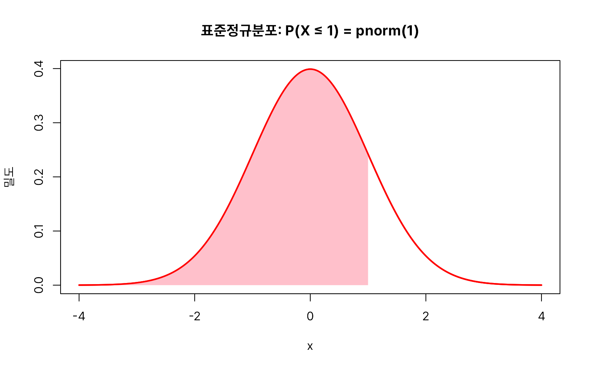

### 연속형 확률분포

#### 균등분포(unif)

균등분포(uniform distribution)는 분포가 특정 범위내에서 균등하게 나타나는 경우를 의미합니다. "1부터 45 사이의 숫자 중 아무거나 하나를 뽑는다"처럼, 특정 구간 안의 모든 값이 똑같은 확률로 나타나는 상황을 표현할 때 균등분포를 씁니다. 

균등분포와 관련된 함수는 다음 네 가지입니다.

* `runif(n, min = 0, max = 1)`
* `dunif(x, min = 0, max = 1, log = FALSE)`
* `punif(q, min = 0, max = 1, lower.tail = TRUE, log.p = FALSE)`
* `qunif(p, min = 0, max = 1, lower.tail = TRUE, log.p = FALSE)`

**인자 설명**

* `min`, `max`: 균등분포의 하한과 상한입니다(기본값 0과 1). 이 구간 밖의 x에 대해서는 밀도가 0입니다.
* `n`, `x`, `q`, `p`, `log`, `lower.tail`, `log.p`: 9.1.2절에서 설명한 공통 인자와 의미가 같습니다.

`runif(n, min, max)`는 `min`부터 `max` 사이에서 균등하게 n개의 난수를 생성합니다. 함수명은 난수를 뜻하는 `r`과 균등분포를 뜻하는 `unif`가 결합된 것입니다.

```r
set.seed(1)
# 2와 5 사이에서 균등하게 10개 추출
runif(10, min = 2, max = 5)
#>  [1] 2.796526 3.116372 3.718560 4.724623 2.605046 4.695169 4.834026 3.982393
#>  [9] 3.887342 2.185359

set.seed(1)
# min, max 생략 시 0과 1 사이
runif(10)
#>  [1] 0.26550866 0.37212390 0.57285336 0.90820779 0.20168193 0.89838968
#>  [7] 0.94467527 0.66079779 0.62911404 0.06178627

set.seed(1)
# 표본을 충분히 많이 뽑으면 평균은 이론적 평균 (min+max)/2 = 0.5에 근접
mean(runif(100000))
#> [1] 0.4996247
```

`dunif(x, min, max)`는 균등분포의 확률밀도함수값을 구합니다. 구간 안에서는 값이 항상 `1/(max-min)`로 일정합니다.

```r
# 균등분포의 확률밀도함수 시각화 (0과 3사이의 분포는 균등함)
x <- seq(-2, 5, by = 0.01)
plot(x, dunif(x, 0, 3), type = "l", col = "red")
```


구간(min, max)이 달라지면 균등분포의 폭과 높이가 함께 바뀝니다. 구간이 넓어질수록 밀도(높이)는 낮아지는데, 이는 "곡선 아래 전체 면적은 항상 1"이라는 확률분포의 기본 성질 때문입니다.

```r
x <- seq(-2, 8, by = 0.01)
# 구간 [0, 3]
plot(x, dunif(x, 0, 3), type = "l", lwd = 2, col = "red",
     xlab = "x", ylab = "밀도", ylim = c(0, 1),
     main = "구간(min, max)이 넓어질수록 밀도는 낮아진다")
# 구간 [0, 2] — 더 좁고 높음
lines(x, dunif(x, 0, 2), type = "l", lwd = 2, col = "blue")
# 구간 [0, 6] — 더 넓고 낮음
lines(x, dunif(x, 0, 6), type = "l", lwd = 2, col = "darkgreen")
legend("topright", legend = c("min=0, max=3", "min=0, max=2", "min=0, max=6"),
       col = c("red", "blue", "darkgreen"), lwd = 2, bty = "n")
```


```r
# 1/(3-0) = 0.333...
dunif(0.5, min = 0, max = 3)
#> [1] 0.3333333
```

`punif(q, min, max)`는 q 이하일 누적확률을 구합니다. 균등분포에서는 누적확률이 구간 안에서 직선으로 일정하게 증가합니다.

```r
# 0.5/3 = 0.1666...
punif(0.5, min = 0, max = 3)
#> [1] 0.1666667
```

```r
x <- seq(-5, 5, by = 0.01)
# 구간 [-2, 2] 누적분포함수(직선으로 일정하게 증가)
plot(x, punif(x, -2, 2), type = "l", lwd = 2, col = "red",
     xlab = "x", ylab = "밀도", main = "균등분포 누적확률")
```


`qunif(p, min, max)`는 누적확률 p에 대응하는 값을 구합니다. `punif()`의 역함수입니다.

```r
# 확률이 0.3이 되는 지점의 x값
qunif(0.3, min = 0, max = 5)
#> [1] 1.5

# 역으로 확인
punif(1.5, min = 0, max = 5)
#> [1] 0.3
```


#### 정규분포(norm)

성인 남성의 키를 조사하면 대부분 165~180cm 사이에 몰려 있고, 150cm 이하나 200cm 이상은 극히 드뭅니다. 시험 점수, 측정 오차, 공정 불량률처럼 "평균 근처에 많이 몰리고 양 극단으로 갈수록 드물어지는" 현상은 자연·사회현상 전반에서 반복적으로 나타납니다.

이런 반복적인 패턴을 수학자 가우스(Carl Friedrich Gauss)가 종 모양(bell-shaped) 곡선으로 정식화한 것이 정규분포(normal distribution)이며, 그의 이름을 따 가우시안(Gaussian) 분포라고도 부릅니다.

정규분포는 분포가 종 모양의 형태로 평균에 가까울수록 발생확률이 높고 평균에서 멀어질수록 발생할 확률이 낮은 분포입니다. 정규분포의 모양은 평균(mean, 중심의 위치)과 표준편차(sd, 퍼진 정도) 두 값만으로 완전히 결정됩니다. 특히 평균이 0이고 표준편차가 1인 정규분포를 **표준정규분포(standard normal distribution)**라 부르며, 다른 정규분포를 표준화(standardize)할 때의 기준이 됩니다.

정규분포와 관련된 함수는 다음 네 가지입니다.

* `rnorm(n, mean = 0, sd = 1)`
* `dnorm(x, mean = 0, sd = 1, log = FALSE)`
* `pnorm(q, mean = 0, sd = 1, lower.tail = TRUE, log.p = FALSE)`
* `qnorm(p, mean = 0, sd = 1, lower.tail = TRUE, log.p = FALSE)`

**인자 설명**

* `mean`: 분포의 평균(중심 위치). 기본값 0.
* `sd`: 표준편차(퍼짐 정도). 기본값 1. 값이 클수록 곡선이 옆으로 넓게 퍼지고 낮아집니다.

`rnorm(n, mean, sd)`는 지정한 평균과 표준편차를 갖는 정규분포에서 n개의 난수를 생성합니다.

```r
set.seed(1)
# 표준정규분포(평균 0, 표준편차 1)에서 난수 10개
rnorm(10)
#>  [1] -0.6264538  0.1836433 -0.8356286  1.5952808  0.3295078 -0.8204684
#>  [7]  0.4874291  0.7383247  0.5757814 -0.3053884

set.seed(1)
# 평균 50, 표준편차 3인 분포에서 난수 10개
rnorm(10, mean = 50, sd = 3)
#>  [1] 48.12064 50.55093 47.49311 54.78584 50.98852 47.53859 51.46229 52.21497
#>  [9] 51.72734 49.08383
```

```r
set.seed(1)
# 표준정규분포에서 난수 2000개 생성
x <- rnorm(2000)
# 평균 0 근처로 종 모양으로 몰리는 것을 확인
hist(x)
```


`dnorm(x, mean, sd)`는 정규분포의 확률밀도함수값을 구합니다.

```r
# 표준정규분포에서 x = 0.5일 때의 밀도값
dnorm(0.5, mean = 0, sd = 1)
#> [1] 0.3520653
```

```r
x <- seq(-5, 5, by = 0.01)
# 표준정규분포(평균 0, 표준편차 1)의 확률밀도함수
plot(x, dnorm(x, 0, 1), type = "l", col = "red")
```


`pnorm(q, mean, sd)`는 q 이하일 누적확률을 구합니다.

```r
pnorm(0.5, mean = 0, sd = 1)
#> [1] 0.6914625

# 표준정규분포에서 평균으로부터 표준편차 1배 이내에 들 확률(약 84%)
pnorm(1, mean = 0, sd = 1)
#> [1] 0.8413447
```

`qnorm(p, mean, sd)`는 누적확률 p에 대응하는 값을 구하는, `pnorm()`의 역함수입니다.

```r
# 누적확률 0.8413에 대응하는 x값 (앞의 예제와 반대 방향 확인)
qnorm(0.8413, mean = 0, sd = 1)
#> [1] 0.9998151

pnorm(1, mean = 0, sd = 1)
#> [1] 0.8413447
```

`lower.tail = FALSE`를 지정하면 반대쪽(오른쪽) 꼬리 확률, 즉 P(X > x)를 바로 구할 수 있습니다. 가설검정에서 유의확률(p-value)을 구할 때 자주 쓰이는 방식입니다.

```r
# P(X > 1.96), 양측 검정 유의수준 0.05의 기준값과 관련
pnorm(1.96, lower.tail = FALSE)
#> [1] 0.0249979

# 위와 동일한 결과, lower.tail 방식이 극단값에서 더 안정적
1 - pnorm(1.96)
#> [1] 0.0249979
```

`log = TRUE`를 지정하면 밀도값 대신 그 자연로그값을 반환합니다.

```r
# log = TRUE로 바로 로그밀도값을 구함
dnorm(0, log = TRUE)
#> [1] -0.9189385

# 밀도값을 구한 뒤 직접 로그를 취함 — 결과는 동일
log(dnorm(0))
#> [1] -0.9189385
```

평균이 이동하면 곡선이 좌우로 이동하고, 표준편차가 커지면 곡선이 옆으로 넓게 퍼지면서 낮아집니다.

```r
x <- seq(-6, 6, by = 0.01)
# 평균 0(기준)
plot(x, dnorm(x, 0, 1), type = "l", lwd = 2, col = "red",
	 xlab = "x", ylab = "밀도", main = "평균이 이동하면 곡선도 좌우로 이동한다")
# 평균을 -2로 이동
lines(x, dnorm(x, -2, 1), type = "l", lwd = 2, col = "blue")
# 평균을 2로 이동
lines(x, dnorm(x, 2, 1), type = "l", lwd = 2, col = "darkgreen")
legend("topright", legend = c("평균 -2", "평균 0", "평균 2"),
	   col = c("blue", "red", "darkgreen"), lwd = 2, bty = "n")
```


```r
x <- seq(-6, 6, by = 0.01)
# 표준편차 0.5 — 좁고 뾰족함
plot(x, dnorm(x, 0, 0.5), type = "l", lwd = 2, col = "blue",
	 xlab = "x", ylab = "밀도", main = "표준편차가 커질수록 곡선은 넓게 퍼지고 낮아진다")
# 표준편차 1(기준)
lines(x, dnorm(x, 0, 1), type = "l", lwd = 2, col = "red")
# 표준편차 2 — 넓고 완만함
lines(x, dnorm(x, 0, 2), type = "l", lwd = 2, col = "darkgreen")
legend("topright", legend = c("표준편차 0.5", "표준편차 1", "표준편차 2"),
	   col = c("blue", "red", "darkgreen"), lwd = 2, bty = "n")
```


#### 로그정규분포(lnorm)

로그정규분포(log-normal distribution)는 확률변수에 로그를 취하게 되면 그 값이 정규분포를 따르는 연속확률분포입니다. 소득, 부동산 가격, 주가처럼 "0보다 작을 수 없고, 소수의 매우 큰 값이 오른쪽으로 긴 꼬리를 만드는" 자료입니다. 정규분포로 설명하기 어렵습니다. 그런데 이런 값에 로그를 취하면 종 모양의 정규분포에 가까워지는 경우가 많습니다. 이처럼 "로그를 취한 값이 정규분포를 따르는" 확률변수의 분포가 로그정규분포입니다.

우리나라의 소득분포는 로그정규분포에 가깝습니다. 즉 왼쪽 소득이 낮은 층의 비율이 높다고 볼 수 있습니다. 로그 정규 분포는 신뢰도 분석, 주식 변동의 모형화 등에 사용됩니다. 로그정규분포의 모양을 결정하는 것은 평균과 표준편차입니다.

로그정규분포와 관련된 함수는 다음 네 가지입니다.

* `rlnorm(n, meanlog = 0, sdlog = 1)`
* `dlnorm(x, meanlog = 0, sdlog = 1, log = FALSE)`
* `plnorm(q, meanlog = 0, sdlog = 1, lower.tail = TRUE, log.p = FALSE)`
* `qlnorm(p, meanlog = 0, sdlog = 1, lower.tail = TRUE, log.p = FALSE)`

**인자 설명**

* `meanlog`, `sdlog`: 로그를 취한 값이 따르는 정규분포의 평균과 표준편차입니다. 원래 척도(로그를 취하기 전)에서의 평균·표준편차가 아니라는 점에 주의해야 합니다.

```r
set.seed(1)
# meanlog=0, sdlog=1인 로그정규분포에서 난수 10개 생성
rlnorm(10, meanlog = 0, sdlog = 1)
#>  [1] 0.5344838 1.2015872 0.4336018 4.9297132 1.3902836 0.4402254 1.6281250
#>  [8] 2.0924271 1.7785196 0.7368371

# x=0.5에서의 밀도값
dlnorm(0.5, meanlog = 0, sdlog = 1)
#> [1] 0.6274961

# x=2 이하일 누적확률
plnorm(2, meanlog = 0, sdlog = 1)
#> [1] 0.7558914

# 누적확률 0.7에 대응하는 x값
qlnorm(0.7, meanlog = 0, sdlog = 1)
#> [1] 1.689446

# 역으로 확인
plnorm(1.689446, meanlog = 0, sdlog = 1)
#> [1] 0.7000001
```

로그정규분포의 확률밀도함수는 왼쪽으로 몰리고 오른쪽으로 긴 꼬리를 가진 비대칭 모양입니다.

```r
# meanlog=0, sdlog=1인 로그정규분포의 확률밀도함수
x <- seq(0, 10, by = 0.01)
plot(x, dlnorm(x, meanlog = 0, sdlog = 1), type = "l", lwd = 2, col = "red",
     xlab = "x", ylab = "밀도", main = "로그정규분포의 확률밀도함수 (meanlog=0, sdlog=1)")
```


`sdlog`가 커질수록 오른쪽 꼬리가 더 길고 두꺼워집니다.

```r
x <- seq(0, 6, by = 0.01)
# sdlog=0.5 — 꼬리가 가장 짧음
plot(x, dlnorm(x, meanlog = 0, sdlog = 0.5),
	 type = "l", lwd = 2, col = "red", ylim = c(0, 1.0), xlab = "x", ylab = "밀도",
	 main = "로그정규분포: sdlog가 커질수록 오른쪽 꼬리가 길어진다")
# sdlog=1
lines(x, dlnorm(x, meanlog = 0, sdlog = 1), col = "blue", lwd = 2)
lines(x, dlnorm(x, meanlog = 0, sdlog = 1.5), col = "darkgreen", lwd = 2) # sdlog=1.5 — 꼬리가 가장 길고 두꺼움
legend("topright", legend = c("sdlog = 0.5", "sdlog = 1", "sdlog = 1.5"),
	   col = c("red", "blue", "darkgreen"), lwd = 2, bty = "n")
```

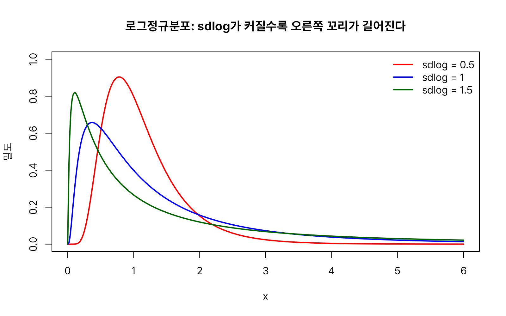


#### 지수분포(exp)

지수분포(exponential distribution)는 **어떤 사건이 처음 일어날 때까지 걸리는 시간**을 나타내는 연속확률분포입니다. 예를 들어, 콜센터에 다음 전화가 걸려올 때까지의 시간, 방사성 원소가 붕괴할 때까지의 시간, 기계가 고장 날 때까지의 시간처럼 **다음 사건이 발생할 때까지의 대기 시간(waiting time)**을 모델링할 때 사용됩니다.

지수분포는 포아송분포와 밀접한 관계를 갖습니다. **포아송분포가 일정한 시간 동안 몇 번 사건이 발생하는지를 나타낸다면, 지수분포는 그 사건이 처음 발생할 때까지 얼마나 기다려야 하는지를 나타냅니다.** 따라서 두 분포는 같은 현상을 서로 다른 관점에서 설명하는 분포라고 할 수 있습니다.

지수분포는 감마분포의 특수한 경우라고 볼 수 있습니다. 감마분포가 α번째 사건이 일어날 때 까지 걸리는 시간에 대한 분포라면, 지수분포는 첫번째 사건이 발생할 때 까지 걸리는 시간에 대한 분포라고 할 수 있습니다.

지수분포는 기하분포와도 관련이 있습니다. 지수분포는 사건이 발생할 때까지의 대기시간인 반면, 기하분포는 사건이 발생할 때까지의 시도횟수입니다.

지수분포와 관련된 함수는 다음 네 가지입니다.

* `rexp(n, rate = 1)`
* `dexp(x, rate = 1, log = FALSE)`
* `pexp(q, rate = 1, lower.tail = TRUE, log.p = FALSE)`
* `qexp(p, rate = 1, lower.tail = TRUE, log.p = FALSE)`

**인자 설명**

* `rate`: 단위 시간당 사건이 발생하는 평균 횟수(발생률)입니다. 평균 대기 시간은 `1/rate`가 됩니다. 예를 들어 `rate = 2`는 평균적으로 한 단위 시간에 2번 사건이 일어난다는 뜻이며, 이때 평균 대기시간은 0.5입니다.

```r
set.seed(1)
# rate=1인 지수분포에서 대기시간 난수 10개 생성
rexp(10, rate = 1)
#>  [1] 0.7551818 1.1816428 0.1457067 0.1397953 0.4360686 2.8949685 1.2295621
#>  [8] 0.5396828 0.9565675 0.1470460

# x=0.5에서의 밀도값
dexp(0.5, rate = 1)
#> [1] 0.6065307

# 0.5시간 이내에 사건이 발생할 확률
pexp(0.5, rate = 1)
#> [1] 0.3934693

# 1시간 이내에 사건이 발생할 확률
pexp(1, rate = 1)
#> [1] 0.6321206

# 누적확률 0.7에 대응하는 대기시간
qexp(0.7, rate = 1)
#> [1] 1.203973

# 역으로 확인
pexp(1.203973, rate = 1)
#> [1] 0.7000001
```

지수분포의 확률밀도함수는 x=0에서 가장 높고 오른쪽으로 갈수록 꾸준히 감소합니다.

```r
# rate=1인 지수분포의 확률밀도함수
x <- seq(0, 7, by = 0.01)
plot(x, dexp(x, rate = 1), type = "l", lwd = 2, col = "red",
     xlab = "x", ylab = "밀도", main = "지수분포의 확률밀도함수 (rate=1)")
```


지수분포는 **무기억성(memoryless property)**이라는 독특한 성질을 가집니다. "이미 2시간을 기다렸다"는 사실이 "앞으로 5시간을 더 기다릴 확률"에 전혀 영향을 주지 않습니다. 즉 P(X > 2+5 | X > 2) = P(X > 5)가 성립합니다.

```r
# P(X > 5) : 처음부터 5시간을 기다릴 확률
1 - pexp(5, rate = 0.5)
#> [1] 0.082085

# P(X > 7 | X > 2) : 이미 2시간을 기다린 상태에서 5시간을 더 기다릴 확률
(1 - pexp(7, rate = 0.5)) / (1 - pexp(2, rate = 0.5))
#> [1] 0.082085
```

두 값이 정확히 일치합니다. 이미 2시간을 기다렸다는 조건이 "앞으로 5시간을 더" 기다릴 확률에 아무 영향을 주지 않는다는 뜻입니다.

`rate`가 클수록(사건이 자주 발생할수록) 대기 시간은 짧아지는 쪽으로 분포가 몰립니다.

```r
x <- seq(0, 5, by = 0.01)
# rate=0.5 — 대기시간이 길게 퍼짐
plot(x, dexp(x, rate = 0.5), type = "l", lwd = 2, col = "red",
     xlab = "x", ylab = "밀도",
     main = "rate가 클수록 짧은 대기시간 쪽으로 분포가 몰린다")
# rate=1
lines(x, dexp(x, rate = 1), type = "l", lwd = 2, col = "blue")
# rate=2 — 대기시간이 짧게 몰림
lines(x, dexp(x, rate = 2), type = "l", lwd = 2, col = "darkgreen")
legend("topright", legend = c("rate=0.5", "rate=1", "rate=2"),
       col = c("red", "blue", "darkgreen"), lwd = 2, bty = "n")
```

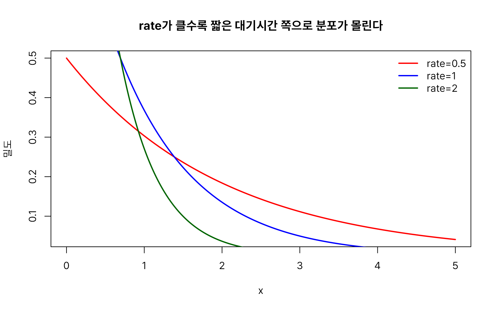


#### 감마분포(gamma)

감마분포(gamma distribution)는 α번째 사건이 일어날 때 까지 걸리는 시간에 대한 연속확률분포입니다. 지수분포가 "사건이 처음 한 번 일어날 때까지의 대기 시간"이라면, 감마분포는 이를 일반화하여 "사건이 α번째 일어날 때까지 걸리는 시간"을 다룹니다. 예를 들어 병원에 세 번째 응급 환자가 도착할 때까지 걸리는 시간, 부품이 세 번째로 교체될 때까지의 누적 사용 시간 등을 표현할 수 있습니다. 감마함수(gamma function)를 바탕으로 정의되며, 감마함수는 계승(factorial)을 실수로 확장하기 위해 오일러가 제안한 함수입니다.

감마분포와 관련된 함수는 다음 네 가지입니다.

* `rgamma(n, shape, rate = 1, scale = 1/rate)`
* `dgamma(x, shape, rate = 1, scale = 1/rate, log = FALSE)`
* `pgamma(q, shape, rate = 1, scale = 1/rate, lower.tail = TRUE, log.p = FALSE)`
* `qgamma(p, shape, rate = 1, scale = 1/rate, lower.tail = TRUE, log.p = FALSE)`

**인자 설명**

* `shape`: 형상 모수(α). 사건이 몇 번째 일어날 때까지를 볼 것인지에 대응하며, 분포의 기본적인 모양(왼쪽으로 치우친 정도)을 결정합니다.
* `rate`: 척도를 발생률로 지정하는 방식입니다(기본값 1).
* `scale`: 척도를 직접 지정하는 방식이며 `1/rate`와 같습니다. `rate`와 `scale`은 같은 것을 다른 방식으로 표현한 것이므로 **둘 중 하나만 지정**해야 합니다.

```r
set.seed(1)
# shape=2, rate=1인 감마분포에서 난수 10개 생성
rgamma(10, shape = 2, rate = 1)
#>  [1] 0.8308650 3.5707563 3.4631704 2.0508119 3.8854090 2.5405402 2.2880663
#>  [8] 1.1492927 0.6810215 0.8356237

# x=0.5에서의 밀도값
dgamma(0.5, shape = 2, rate = 1)
#> [1] 0.3032653

# x=1 이하일 누적확률
pgamma(1, shape = 2, rate = 1)
#> [1] 0.2642411

# 누적확률 0.7에 대응하는 x값
qgamma(0.7, shape = 2, rate = 1)
#> [1] 2.439216

# 역으로 확인
pgamma(2.439216, shape = 2, rate = 1)
#> [1] 0.6999965
```

```r
# shape=2, rate=1인 감마분포의 확률밀도함수
x <- seq(0, 10, by = 0.01)
plot(x, dgamma(x, shape = 2, rate = 1), type = "l", lwd = 2, col = "red",
     xlab = "x", ylab = "밀도", main = "감마분포의 확률밀도함수 (shape=2, rate=1)")
```


`shape`가 1이면 감마분포는 지수분포와 완전히 같아집니다. `shape`가 커질수록 좌우대칭에 가까운 종 모양이 됩니다.

```r
x <- seq(0, 15, by = 0.01)
# shape=1 — 지수분포와 동일
plot(x, dgamma(x, shape = 1, rate = 1), type = "l", lwd = 2, col = "red",
     xlab = "x", ylab = "밀도", ylim = c(0, 0.4),
     main = "shape가 1이면 지수분포와 같고, 커질수록 종 모양에 가까워진다")
# shape=2
lines(x, dgamma(x, shape = 2, rate = 1), type = "l", lwd = 2, col = "blue")
# shape=4
lines(x, dgamma(x, shape = 4, rate = 1), type = "l", lwd = 2, col = "darkgreen")
# shape=8 — 좌우대칭에 가까움
lines(x, dgamma(x, shape = 8, rate = 1), type = "l", lwd = 2, col = "purple")
legend("topright", legend = c("shape=1", "shape=2", "shape=4", "shape=8"),
       col = c("red", "blue", "darkgreen", "purple"), lwd = 2, bty = "n")
```

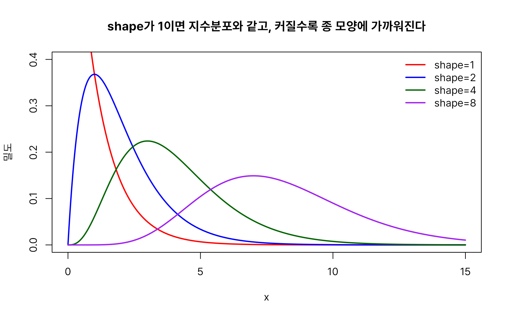


#### 베타분포(beta)

베타분포(Beta distribution)는 **0과 1 사이의 값을 갖는 연속확률변수를 모델링하는 데 사용되는 연속확률분포**입니다. 즉, 확률, 비율, 점유율, 성공률, 지지율처럼 **0과 1 사이의 값을 갖는 변수**를 표현하는 데 가장 널리 사용되는 분포입니다.

베타분포는 두 개의 모수 $α$와 $β$에 의해 결정됩니다. 모수가 $α$와 $β$ 두 개이므로 다양한 형태의 분포가 만들어질 수 있습니다.

- α=β=1이면 **균등분포(Uniform distribution)**가 됩니다.
- α=β>1이면 가운데가 가장 높은 종 모양이 됩니다.
- α>β이면 1에 가까운 값이 많이 나타납니다.
- α<β이면 0에 가까운 값이 많이 나타납니다.
- α,β<1이면 양쪽 끝(0과 1)에서 확률이 커지는 U자 모양이 됩니다.

베타분포와 관련된 함수는 다음 네 가지입니다.

* `rbeta(n, shape1, shape2, ncp = 0)`
* `dbeta(x, shape1, shape2, ncp = 0, log = FALSE)`
* `pbeta(q, shape1, shape2, ncp = 0, lower.tail = TRUE, log.p = FALSE)`
* `qbeta(p, shape1, shape2, ncp = 0, lower.tail = TRUE, log.p = FALSE)`

**인자 설명**

* `shape1`, `shape2`: 베타분포의 두 매개변수(관례적으로 α, β로 표기)입니다. 두 값이 같으면 0.5를 중심으로 좌우대칭이 되고, `shape1`이 `shape2`보다 크면 오른쪽(1에 가까운 쪽)으로, 작으면 왼쪽(0에 가까운 쪽)으로 치우칩니다. 두 값이 모두 1보다 작으면 양 끝(0과 1 근처)에서 밀도가 오히려 높아지는 U자형이 됩니다.

```r
set.seed(1)
# shape1=2, shape2=5인 베타분포에서 난수 10개 생성
rbeta(10, shape1 = 2, shape2 = 5)
#>  [1] 0.1754713 0.3242588 0.1456002 0.3569608 0.1476529 0.3944399 0.4582268
#>  [8] 0.2279711 0.6757239 0.3710276

# x=0.5에서의 밀도값
dbeta(0.5, shape1 = 2, shape2 = 5)
#> [1] 0.9375

# x=0.5 이하일 누적확률
pbeta(0.5, shape1 = 2, shape2 = 3)
#> [1] 0.6875

# 누적확률 0.7에 대응하는 x값
qbeta(0.7, shape1 = 2, shape2 = 3)
#> [1] 0.5084048

# 역으로 확인
pbeta(0.5084048, shape1 = 2, shape2 = 3)
#> [1] 0.7000001
```

```r
# shape1=2, shape2=5인 베타분포의 확률밀도함수
x <- seq(0, 1, by = 0.01)
plot(x, dbeta(x, shape1 = 2, shape2 = 5), type = "l", lwd = 2, col = "red",
     xlab = "x", ylab = "밀도", main = "베타분포의 확률밀도함수 (shape1=2, shape2=5)")
```


`shape1`과 `shape2`의 조합에 따라 오른쪽 치우침·왼쪽 치우침·대칭·U자형 등 다양한 모양이 나타납니다.

```r
x <- seq(0.01, 0.99, by = 0.001)
# α=1, β=1 — 균등분포와 동일
plot(x, dbeta(x, shape1 = 1, shape2 = 1), type = "l", lwd = 2, col = "black",
     xlab = "x", ylab = "밀도", ylim = c(0, 4),
     main = "shape1(α), shape2(β)의 조합에 따른 베타분포 모양")
# α=5, β=5 — 대칭 종모양
lines(x, dbeta(x, shape1 = 5, shape2 = 5), type = "l", lwd = 2, col = "red")
# α=5, β=2 — 1쪽으로 치우침
lines(x, dbeta(x, shape1 = 5, shape2 = 2), type = "l", lwd = 2, col = "blue")
# α=2, β=5 — 0쪽으로 치우침
lines(x, dbeta(x, shape1 = 2, shape2 = 5), type = "l", lwd = 2, col = "darkgreen")
lines(x, dbeta(x, shape1 = 0.5, shape2 = 0.5), type = "l", lwd = 2, col = "purple") # α=0.5, β=0.5 — 양 끝이 높은 U자형
legend("top",
       legend = c("α=1, β=1 (균등)", "α=5, β=5 (대칭 종모양)", "α=5, β=2 (1쪽 치우침)",
                  "α=2, β=5 (0쪽 치우침)", "α=0.5, β=0.5 (U자형)"),
       col = c("black", "red", "blue", "darkgreen", "purple"),
       lwd = 2, bty = "n", cex = 0.75)
```

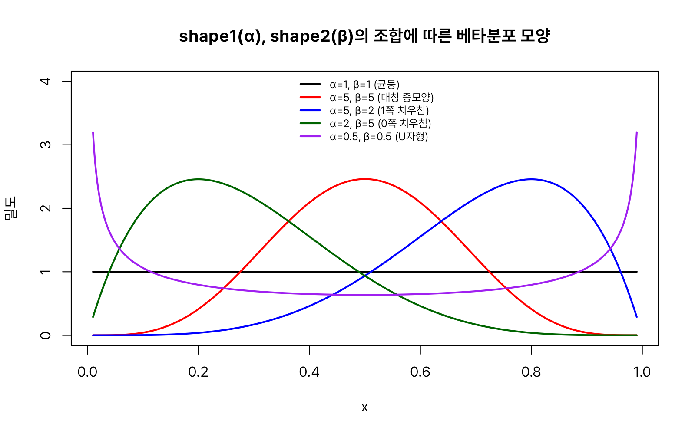


#### 코시분포(cauchy)

코시분포(Cauchy distribution)는 **평균과 분산이 존재하지 않는 연속확률분포**입니다. 종 모양을 하고 있어 정규분포와 비슷해 보이지만, 꼬리가 매우 두꺼워 극단적인 값이 자주 나타나는 것이 가장 큰 특징입니다. 로버스트(robust) 통계나 이상치(outlier)가 많은 자료를 다루는 시뮬레이션에서 "꼬리가 아주 두꺼운 분포"의 예시로 자주 등장합니다. 프랑스 수학자 오귀스탱 루이 코시(Augustin-Louis Cauchy)의 이름을 땄으며, 로렌츠(Lorentz) 분포라고도 불립니다.

코시분포와 관련된 함수는 다음 네 가지입니다.

* `rcauchy(n, location = 0, scale = 1)`
* `dcauchy(x, location = 0, scale = 1, log = FALSE)`
* `pcauchy(q, location = 0, scale = 1, lower.tail = TRUE, log.p = FALSE)`
* `qcauchy(p, location = 0, scale = 1, lower.tail = TRUE, log.p = FALSE)`

**인자 설명**

* `location`: 분포의 중심(봉우리 위치)입니다. 정규분포의 `mean`과 비슷한 역할이지만, 코시분포는 평균 자체가 정의되지 않으므로 '평균'이 아니라 '중심'이라고 표현합니다.
* `scale`: 분포가 얼마나 넓게 퍼지는지를 나타냅니다.

```r
set.seed(1)
# location=0, scale=1인 코시분포에서 난수 10개 생성
rcauchy(10, location = 0, scale = 1)
#>  [1]  1.1025199  2.3538306 -4.2926262 -0.2966426  0.7346469 -0.3305220
#>  [7] -0.1755794 -1.8082431 -2.3286244  0.1965824

# x=2에서의 밀도값
dcauchy(2, location = 0, scale = 1)
#> [1] 0.06366198

# x=3 이하일 누적확률
pcauchy(3, location = 0, scale = 1)
#> [1] 0.8975836

# 누적확률 0.8에 대응하는 x값
qcauchy(0.8, location = 0, scale = 1)
#> [1] 1.376382

# 역으로 확인
pcauchy(1.376382, location = 0, scale = 1)
#> [1] 0.8
```

```r
# location=0, scale=1인 코시분포의 확률밀도함수
x <- seq(-10, 10, by = 0.05)
plot(x, dcauchy(x, location = 0, scale = 1), type = "l", lwd = 2, col = "red",
     xlab = "x", ylab = "밀도", main = "코시분포의 확률밀도함수 (location=0, scale=1)")
```


같은 개수의 난수를 뽑아 평균을 계산해 보면, 정규분포의 표본평균은 이론적 평균(0)에 가깝게 안정적으로 모이는 반면 코시분포의 표본평균은 극단값 하나에도 크게 흔들립니다.

```r
set.seed(1)
# 이론적으로 평균이 존재하지 않음 — 극단값의 영향을 크게 받음
mean(rcauchy(100000))
#> [1] -2.14717

set.seed(1)
# 이론적 평균 0에 안정적으로 수렴
mean(rnorm(100000))
#> [1] -0.002244083
```

코시분포는 정규분포와 비슷한 종 모양이지만, 양쪽 꼬리가 훨씬 천천히 0에 접근합니다(두꺼운 꼬리, heavy tail).

```r
x <- seq(-10, 10, by = 0.05)
# 표준정규분포 — 꼬리가 빠르게 0에 수렴
plot(x, dnorm(x, mean = 0, sd = 1), type = "l", lwd = 2, col = "black",
	 xlab = "x", ylab = "밀도",
	 main = "코시분포(빨강)는 정규분포(검정)보다 꼬리가 훨씬 두껍다")
# 코시분포 — 꼬리가 두꺼움
lines(x, dcauchy(x, location = 0, scale = 1), type = "l", lwd = 2, col = "red")
legend("topright", legend = c("표준정규분포", "코시분포"),
	   col = c("black", "red"), lwd = 2, bty = "n")
```

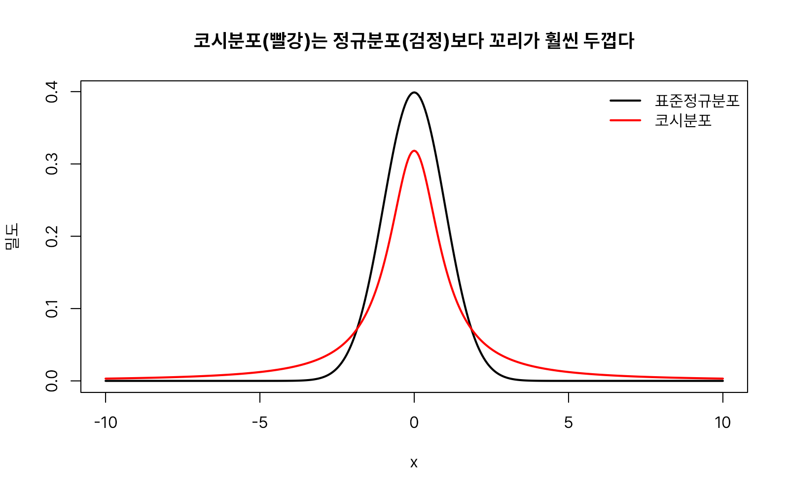

`scale`이 커질수록 코시분포는 옆으로 더 넓게 퍼집니다.

```r
# 척도(scale)가 커질수록 분포가 옆으로 넓게 퍼진다
x <- seq(-10, 10, by = 0.05)
plot(x, dcauchy(x, location = 0, scale = 0.5), type = "l", lwd = 2, col = "red",
     xlab = "x", ylab = "밀도", main = "척도(scale)가 커질수록 분포가 옆으로 넓게 퍼진다")
lines(x, dcauchy(x, location = 0, scale = 1), type = "l", lwd = 2, col = "blue")
lines(x, dcauchy(x, location = 0, scale = 2), type = "l", lwd = 2, col = "darkgreen")
legend("topright", legend = c("scale=0.5", "scale=1", "scale=2"),
       col = c("red", "blue", "darkgreen"), lwd = 2, bty = "n")
```


#### 와이블분포(weibull)

와이블분포(weibull)는 제품이 언제 고장 날지, 부품의 수명이 얼마나 될지를 추정하는 신뢰성 공학(reliability engineering)에서 가장 널리 쓰이는 분포입니다. 지수분포는 "고장률이 시간이 지나도 항상 일정하다"고 가정하지만, 실제 제품은 초기 불량(초반에 고장률이 높음)이나 마모(시간이 지날수록 고장률이 증가)를 보이는 경우가 많습니다. 와이블분포는 형상 모수 하나로 이런 다양한 고장 패턴을 모두 표현할 수 있도록 지수분포를 일반화한 분포입니다. 스웨덴의 물리학자 발로디 와이블(Waloddi Weibull)이 1939년 재료의 파괴강도 분포를 설명하며 제안했습니다.

와이블분포의 모양을 결정하는 것은 형상 모수(shape parameter)와 척도 모수(scale parameter)입니다. 형상모수의 값이 낮으면 오른쪽으로 치우친 곡선을, 높으면 왼쪽으로 치우친 곡선을 나타내며, 값이 3이면 정규분포에 가까운 곡선을 나타냅니다. 척도모수의 값이 크면 분포가 좁아지고, 반대로 값이 크면 분포가 넓어집니다.

와이블분포와 관련된 함수는 다음 네 가지입니다.

* `rweibull(n, shape, scale = 1)`
* `dweibull(x, shape, scale = 1, log = FALSE)`
* `pweibull(q, shape, scale = 1, lower.tail = TRUE, log.p = FALSE)`
* `qweibull(p, shape, scale = 1, lower.tail = TRUE, log.p = FALSE)`

**인자 설명**

* `shape`: 형상 모수입니다. 1보다 작으면 고장률이 시간에 따라 감소(초기 불량형), 1이면 지수분포와 동일(고장률 일정), 1보다 크면 고장률이 시간에 따라 증가(마모형)하는 모양이 됩니다. 3 부근에서는 정규분포와 비슷한 좌우대칭 형태에 가까워집니다.
* `scale`: 척도 모수입니다. 값이 클수록 분포가 오른쪽으로 넓게 퍼집니다.

```r
set.seed(1)
# shape=2, scale=2인 와이블분포에서 난수 10개 생성
rweibull(10, shape = 2, scale = 2)
#>  [1] 2.3031351 1.9884953 1.4928168 0.6205871 2.5306627 0.6546796 0.4771333
#>  [8] 1.2873343 1.3615326 3.3371090

# x=0.5에서의 밀도값
dweibull(0.5, shape = 2, scale = 2)
#> [1] 0.2348533

# x=2 이하일 누적확률
pweibull(2, shape = 2, scale = 2)
#> [1] 0.6321206

# 누적확률 0.7에 대응하는 x값
qweibull(0.7, shape = 2, scale = 2)
#> [1] 2.194514

# 역으로 확인
pweibull(2.194514, shape = 2, scale = 2)
#> [1] 0.7
```

```r
# shape=2, scale=2인 와이블분포의 확률밀도함수
x <- seq(0, 7, by = 0.01)
plot(x, dweibull(x, shape = 2, scale = 2), type = "l", lwd = 2, col = "red",
     xlab = "x", ylab = "밀도", main = "와이블분포의 확률밀도함수 (shape=2, scale=2)")
```


`shape = 1`일 때 지수분포와 완전히 같아지고, `shape`가 커질수록 좌우대칭에 가까운 종 모양으로 바뀝니다.

```r
x <- seq(0, 6, by = 0.01)
# shape=1 — 지수분포와 동일
plot(x, dweibull(x, shape = 5, scale = 2), type = "l", lwd = 2, col = "red",
     xlab = "x", ylab = "밀도",
     main = "shape=1이면 지수분포와 같고, 커질수록 종 모양에 가까워진다")
# shape=2
lines(x, dweibull(x, shape = 3, scale = 2), type = "l", lwd = 2, col = "blue")
# shape=3
lines(x, dweibull(x, shape = 2, scale = 2), type = "l", lwd = 2, col = "darkgreen")
# shape=5 — 정규분포에 가까운 대칭 모양
lines(x, dweibull(x, shape = 1, scale = 2), type = "l", lwd = 2, col = "purple")
legend("topright", legend = c("shape=5", "shape=3", "shape=2", "shape=1"),
       col = c("red", "blue", "darkgreen", "purple"), lwd = 2, bty = "n")
```

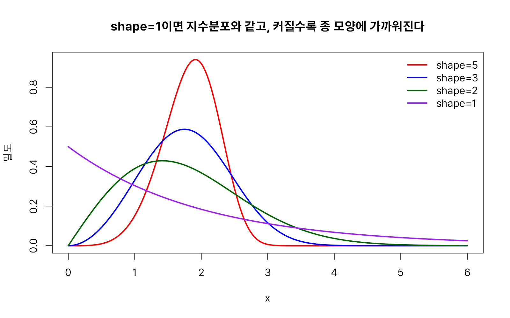


#### 로지스틱분포(logis)

로지스틱 회귀분석(logistic regression)이나 신경망의 활성화 함수에서 등장하는 **시그모이드(sigmoid) 함수**가 사실은 로지스틱분포의 누적분포함수와 정확히 같습니다. 데이터분석·머신러닝을 다루는 강의에서 "왜 하필 시그모이드 모양을 쓰는가"를 설명할 때 로지스틱분포를 함께 소개하면 두 개념이 자연스럽게 연결됩니다.

로지스틱분포와 관련된 함수는 다음 네 가지입니다.

* `rlogis(n, location = 0, scale = 1)`
* `dlogis(x, location = 0, scale = 1, log = FALSE)`
* `plogis(q, location = 0, scale = 1, lower.tail = TRUE, log.p = FALSE)`
* `qlogis(p, location = 0, scale = 1, lower.tail = TRUE, log.p = FALSE)`

**인자 설명**

* `location`: 분포의 중심(정규분포의 `mean`과 같은 역할). 시그모이드 함수 기준으로는 0.5 확률이 나타나는 x축 위치입니다.
* `scale`: 곡선이 얼마나 완만하게 0에서 1로 올라가는지를 결정합니다. 값이 작을수록 S자 곡선이 가팔라집니다.

```r
set.seed(1)
# location=0, scale=1인 로지스틱분포에서 난수 10개 생성
rlogis(10, location = 0, scale = 1)
#>  [1] -1.0175307 -0.5231160  0.2935024  2.2919458 -1.3758152  2.1794589
#>  [7]  2.8376212  0.6668515  0.5284179 -2.7202966

# x=0에서의 밀도값
dlogis(0, location = 0, scale = 1)
#> [1] 0.25

# x=0 이하일 누적확률(중심이므로 0.5)
plogis(0)
#> [1] 0.5

# x=2 이하일 누적확률
plogis(2)
#> [1] 0.8807971

# 누적확률 0.7에 대응하는 x값
qlogis(0.7)
#> [1] 0.8472979

# 역으로 확인
plogis(0.8472979)
#> [1] 0.7
```

`plogis()`는 로지스틱 회귀·신경망의 시그모이드 함수 `1 / (1 + exp(-x))`와 완전히 동일한 값을 계산합니다.

```r
# 신경망 등에서 흔히 쓰는 시그모이드 함수를 직접 정의
sigmoid <- function(x) 1 / (1 + exp(-x))
# 직접 정의한 시그모이드로 계산
sigmoid(2)
#> [1] 0.8807971

# plogis()로 계산 — 두 값이 같음
plogis(2)
#> [1] 0.8807971
```

`plogis()`의 그래프가 바로 그 유명한 S자형 시그모이드 곡선입니다.

```r
x <- seq(-10, 10, by = 0.05)
# 로지스틱분포의 누적분포함수 — S자형 곡선
plot(x, plogis(x, location = 0, scale = 1), type = "l", lwd = 2, col = "red",
     xlab = "x", ylab = "P(X ≤ x)",
     main = "로지스틱분포의 누적분포함수 = 시그모이드 곡선")
# 확률 0.5 지점 표시
abline(h = 0.5, lty = 2, col = "gray50")
# location(중심) 지점 표시
abline(v = 0, lty = 2, col = "gray50")
```

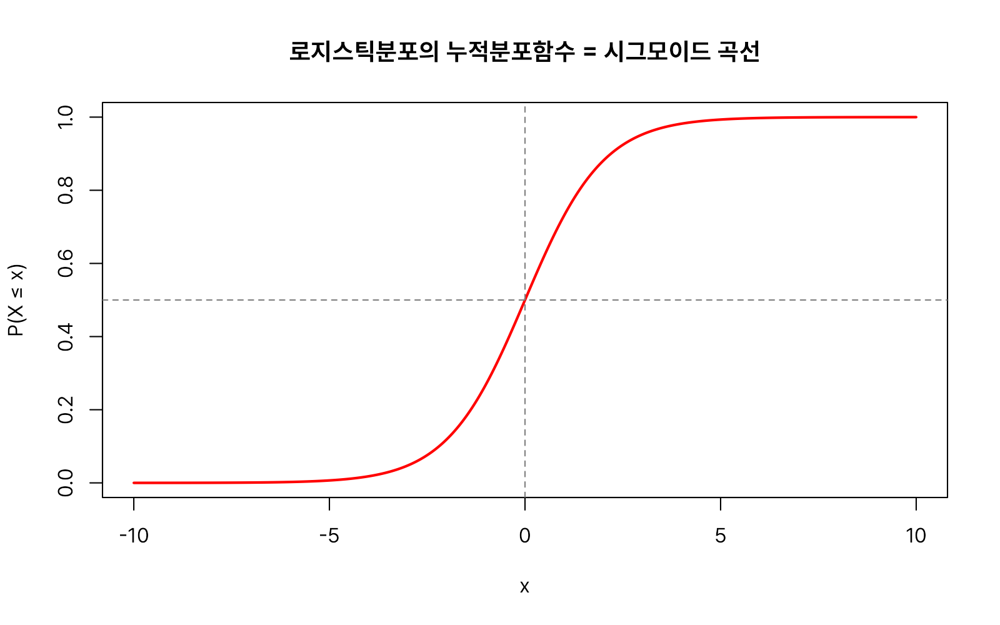


#### t분포(t)

표본의 크기가 충분히 크면(일반적으로 30개 이상), 표본평균은 중심극한정리에 의해 정규분포로 잘 근사됩니다. 그러나 표본이 10개나 5개처럼 작은 경우에는 모집단의 표준편차를 알 수 없어 표본에서 계산한 표준편차로 대신 추정해야 합니다. 이처럼 모집단의 표준편차를 추정하는 과정에서 추가적인 불확실성이 발생하므로, 표준정규분포를 그대로 사용하는 것보다 이러한 불확실성을 반영하는 **t분포**를 사용하는 것이 더 정확한 추론을 할 수 있습니다.

t분포는 표준정규분포와 마찬가지로 평균이 0인 좌우대칭의 종 모양을 띠지만, 표본의 불확실성을 반영하기 때문에 양쪽 꼬리가 더 두껍습니다. 특히 자유도(degrees of freedom)가 작을수록 꼬리가 두꺼워져 극단적인 값이 나타날 가능성을 더 크게 반영하며, 자유도가 증가할수록 표준정규분포에 점점 가까워집니다. 자유도가 약 30 이상이면 표준정규분포와 거의 구별되지 않을 정도로 비슷해집니다.

t분포는 '스튜던트 t분포(Student's t-distribution)'를 줄여 부르는 말입니다. 이 분포는 프리드리히 로베르트 헬메르트(1875)와 야코프 뤼로트(1876)가 처음 수학적으로 유도하였지만 당시에는 널리 알려지지 않았습니다. 이후 1908년 아일랜드 기네스(Guinness) 양조장에서 근무하던 윌리엄 실리 고셋(William Sealy Gosset)은 보리의 품질을 평가하는 과정에서 발생하는 소표본 문제를 해결하기 위해 이 분포를 독립적으로 유도하여 'Student'라는 필명으로 논문을 발표하였습니다. 당시 기네스사는 연구원의 실명으로 논문을 발표하는 것을 허용하지 않았기 때문입니다. 이후 로널드 피셔(Ronald A. Fisher)가 이 분포를 통계추론의 일반적인 이론으로 발전시키고 'Student's t-distribution'이라는 이름으로 소개하면서 오늘날 널리 사용되게 되었습니다.

t분포와 관련된 함수는 다음 네 가지입니다.

* `rt(n, df, ncp)`
* `dt(x, df, ncp, log = FALSE)`
* `pt(q, df, ncp, lower.tail = TRUE, log.p = FALSE)`
* `qt(p, df, ncp, lower.tail = TRUE, log.p = FALSE)`

**인자 설명**

* `df`: 자유도입니다. t검정에서는 보통 표본크기(n)에서 1을 뺀 값(n-1)을 사용합니다. 값이 클수록 표준정규분포에 가까워집니다.
* `ncp`: 비중심모수(9.1.2절 참고). 생략하면(중심 t분포) 대립가설 없이 순수한 검정통계량의 분포를 나타내고, 지정하면 특정 대립가설 하에서의 분포(검정력 계산 등에 사용)를 나타냅니다.

```r
set.seed(1)
# 자유도 5인 t분포에서 난수 10개 생성
rt(10, df = 5)
#>  [1] -0.65769408 -0.59734723  0.51893251 -0.33018072 -0.22250611  0.55853573
#>  [7] -0.39149113 -0.01357225  0.75881946  0.80487760

# x=0.5에서의 밀도값
dt(0.5, df = 5)
#> [1] 0.3279185

# x=0.5 이하일 누적확률
pt(0.5, df = 10)
#> [1] 0.6860532

# 누적확률 0.7에 대응하는 x값
qt(0.7, df = 10)
#> [1] 0.541528

# 역으로 확인
pt(0.5415280, df = 10)
#> [1] 0.7000049
```

```r
# 자유도 5인 t분포의 확률밀도함수 — 표준정규분포와 비슷하지만 꼬리가 더 두껍다
x <- seq(-5, 5, by = 0.01)
plot(x, dt(x, df = 5), type = "l", lwd = 2, col = "red",
     xlab = "x", ylab = "밀도", main = "t분포의 확률밀도함수 (df=5)")
```


t분포의 값(임계값)은 신뢰구간·가설검정에서 자주 사용됩니다. 자유도가 10일 때와 200일 때의 95% 양측 신뢰구간 임계값을 표준정규분포의 임계값(1.96)과 비교해 보면, 자유도가 커질수록 t분포가 정규분포에 얼마나 가까워지는지 확인할 수 있습니다.

```r
# 자유도 10일 때의 임계값 — 정규분포보다 눈에 띄게 큼
qt(0.975, df = 10)
#> [1] 2.228139

# 자유도 200일 때 — 표준정규분포와 거의 같음
qt(0.975, df = 200)
#> [1] 1.971896

# 표준정규분포의 임계값(비교 기준)
qnorm(0.975)
#> [1] 1.959964
```

자유도가 작을수록(특히 2 이하) 꼬리가 매우 두껍고, 자유도가 커질수록 검은 실선으로 표시한 표준정규분포에 급격히 가까워집니다.

```r
x <- seq(-5, 5, by = 0.01)
# 자유도 2 — 꼬리가 가장 두꺼움
plot(x, dt(x, df = 30), type = "l", lwd = 2, col = "purple",
     xlab = "x", ylab = "밀도",
     main = "자유도가 커질수록 표준정규분포(검은 실선)에 가까워진다")
# 자유도 5
lines(x, dt(x, df = 5), type = "l", lwd = 2, col = "blue")
# 자유도 30 — 표준정규분포와 거의 겹침
lines(x, dt(x, df = 2), type = "l", lwd = 2, col = "darkgreen") 
# 표준정규분포(기준선)
lines(x, dnorm(x), type = "l", lwd = 2, col = "black")
legend("topright", legend = c("df=30", "df=5", "df=2", "표준정규분포"),
       col = c("purple", "blue", "darkgreen", "black"), lwd = 2, bty = "n")
```

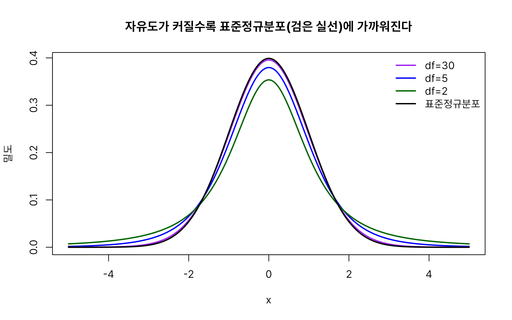


#### 카이제곱분포(chisq)

카이제곱분포($\chi^2$분포)는 범주형 자료의 적합도·독립성 검정, 분산에 대한 추론에서 핵심적으로 사용되는 분포입니다. 서로 독립인 k개의 표준정규분포 확률변수를 각각 제곱한 다음 모두 더하면 카이제곱분포가 되며, 이때 k가 자유도가 됩니다. 감마분포의 특수한 형태(shape = df/2, rate = 1/2)로도 볼 수 있습니다.

카이제곱분포와 관련된 함수는 다음 네 가지입니다.

* `rchisq(n, df, ncp = 0)`
* `dchisq(x, df, ncp = 0, log = FALSE)`
* `pchisq(q, df, ncp = 0, lower.tail = TRUE, log.p = FALSE)`
* `qchisq(p, df, ncp = 0, lower.tail = TRUE, log.p = FALSE)`

**인자 설명**

* `df`: 자유도입니다. 제곱해서 더한 표준정규분포 확률변수의 개수에 해당하며, 분포의 모양을 결정하는 유일한 모수입니다. 값이 커질수록 좌우대칭인 종 모양에 가까워집니다.
* `ncp`: 비중심모수(9.1.2절 참고).

```r
set.seed(1)
# 자유도 5인 카이제곱분포에서 난수 10개 생성
rchisq(10, df = 5)
#>  [1]  2.424343  8.645423  8.408512  5.258747 10.578594  6.360859  5.794318
#>  [8]  3.182862  2.059268  2.435836

# x=2에서의 밀도값
dchisq(2, df = 5)
#> [1] 0.1383692

# x=5 이하일 누적확률
pchisq(5, df = 3)
#> [1] 0.8282029

# 누적확률 0.7에 대응하는 x값
qchisq(0.7, df = 3)
#> [1] 3.664871

# 역으로 확인
pchisq(3.664871, df = 3)
#> [1] 0.7
```

```r
# 자유도 3인 카이제곱분포의 확률밀도함수 — 오른쪽으로 긴 꼬리를 가진 비대칭 모양
x <- seq(0, 20, by = 0.01)
plot(x, dchisq(x, df = 3), type = "l", lwd = 2, col = "red",
     xlab = "x", ylab = "밀도", main = "카이제곱분포의 확률밀도함수 (df=3)")
```


카이제곱검정에서 유의수준 0.05 기준으로 자주 참조하는 자유도 3의 우측 임계값은 다음과 같이 구합니다.

```r
# 카이제곱검정에서 자유도 3, 유의수준 0.05의 기각값
qchisq(0.95, df = 3)
#> [1] 7.814728
```

카이제곱분포는 항상 0 이상의 값만 가지며 오른쪽으로 긴 꼬리를 가진 비대칭 모양입니다. 자유도가 커질수록 점점 좌우대칭에 가까워집니다.

```r
x <- seq(0, 30, by = 0.01)
# 자유도 3
plot(x, dchisq(x, df = 3), type = "l", lwd = 2, col = "red",
     xlab = "x", ylab = "밀도", ylim = c(0, 0.5),
     main = "자유도가 커질수록 좌우대칭에 가까워진다")
# 자유도 5
lines(x, dchisq(x, df = 5), type = "l", lwd = 2, col = "blue")
lines(x, dchisq(x, df = 10), type = "l", lwd = 2, col = "darkgreen") # 자유도 10
# 자유도 20 — 점점 좌우대칭에 가까워짐
lines(x, dchisq(x, df = 20), type = "l", lwd = 2, col = "purple")
legend("topright", legend = c("df=3", "df=5", "df=10", "df=20"),
       col = c("red", "blue", "darkgreen", "purple"), lwd = 2, bty = "n")
```

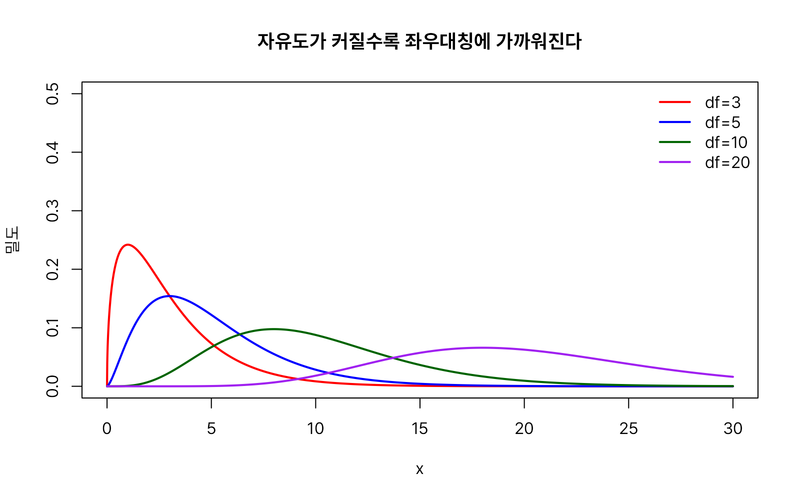


#### F분포(f)

두 그룹의 분산이 같은지 비교하거나(`var.test()`), 분산분석(ANOVA)에서 여러 그룹의 평균이 같은지 검정할 때, "두 카이제곱분포 확률변수의 비율"이 어떤 분포를 따르는지가 필요합니다. 이 비율의 분포가 F분포이며, 이름은 로널드 피셔(Ronald Fisher)의 이니셜에서 왔습니다.

F분포(F-distribution)는 **두 모집단의 분산을 비교하거나 분산의 비율을 분석할 때 사용하는 연속확률분포**입니다. F분포는 카이제곱분포처럼 오른쪽으로 긴 꼬리를 가진 비대칭 분포모양을 가지고 있습니다. F분포의 모양을 결정하는 것은 분자와 분모의 자유도이며, 두 자유도가 커질수록 정규분포에 가깝게 됩니다.

F분포와 관련된 함수는 다음 네 가지입니다.

* `rf(n, df1, df2, ncp)`
* `df(x, df1, df2, ncp, log = FALSE)`
* `pf(q, df1, df2, ncp, lower.tail = TRUE, log.p = FALSE)`
* `qf(p, df1, df2, ncp, lower.tail = TRUE, log.p = FALSE)`

**인자 설명**

* `df1`: 분자(numerator)의 자유도.
* `df2`: 분모(denominator)의 자유도.
* `ncp`: 비중심모수(9.1.2절 참고).

> **주의**: 확률밀도함수를 구하는 함수의 이름이 `df()`인데, 이는 데이터 프레임을 만드는 `data.frame()`의 축약형이 아니라 F분포(F distribution)를 뜻합니다. 데이터 프레임 관련 작업 중에 `df`라는 이름으로 변수를 만들어 두면 이 함수를 가리게 되므로 변수명을 `df`로 짓는 습관은 피하는 것이 좋습니다.

```r
set.seed(1)
# 분자자유도 5, 분모자유도 8인 F분포에서 난수 10개 생성
rf(10, df1 = 5, df2 = 8)
#>  [1] 0.30163286 1.55759874 1.68665150 1.57028316 0.67676475 0.74895625
#>  [7] 0.28819063 0.86272666 1.43219645 0.06250465

# x=1에서의 밀도값
df(1, df1 = 5, df2 = 8)
#> [1] 0.4748814

# x=2 이하일 누적확률
pf(2, df1 = 3, df2 = 3)
#> [1] 0.7082086

# 누적확률 0.7에 대응하는 x값
qf(0.7, df1 = 3, df2 = 3)
#> [1] 1.939843

# 역으로 확인
pf(1.939843, df1 = 3, df2 = 3)
#> [1] 0.7
```

```r
# 분자자유도 5, 분모자유도 8인 F분포의 확률밀도함수
x <- seq(0, 5, by = 0.01)
plot(x, df(x, df1 = 5, df2 = 8), type = "l", lwd = 2, col = "red",
     xlab = "x", ylab = "밀도", main = "F분포의 확률밀도함수 (df1=5, df2=8)")
```


분산분석에서 자주 참조하는 유의수준 0.05 기준 임계값(예: 분자 자유도 3, 분모 자유도 20)은 다음과 같이 구합니다.

```r
# 분산분석에서 자주 쓰는 유의수준 0.05 기각값
qf(0.95, df1 = 3, df2 = 20)
#> [1] 3.098391
```

두 자유도가 모두 커질수록 F분포도 좌우대칭에 가까워집니다.

```r
x <- seq(0, 4, by = 0.01)
# df1=3, df2=3
plot(x, df(x, df1 = 3, df2 = 3), type = "l", lwd = 2, col = "red",
     xlab = "x", ylab = "밀도",
     main = "두 자유도가 모두 커질수록 좌우대칭에 가까워진다")
# df1=10, df2=10
lines(x, df(x, df1 = 10, df2 = 10), type = "l", lwd = 2, col = "blue")
# df1=30, df2=30 — 좌우대칭에 가까워짐
lines(x, df(x, df1 = 30, df2 = 30), type = "l", lwd = 2, col = "darkgreen")
legend("topright", legend = c("df1=3, df2=3", "df1=10, df2=10", "df1=30, df2=30"),
       col = c("red", "blue", "darkgreen"), lwd = 2, bty = "n")
```

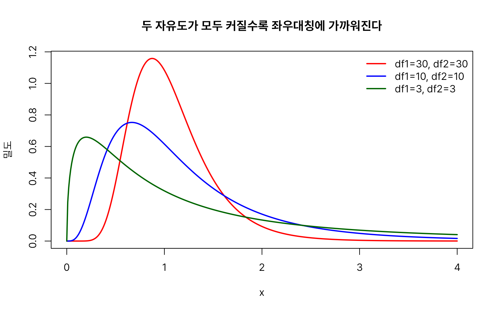


#### 스튜던트 범위 분포(tukey)

스튜던트 범위 분포(Studentized Range Distribution)는 정규분포를 따르는 여러 표본들 중에서 최댓값과 최솟값의 차이(범위)가 어떻게 분포하는지를 나타내는 확률분포입니다.

분산분석(ANOVA)으로 "여러 그룹 중 최소 한 곳은 평균이 다르다"는 것을 확인한 다음에는, 구체적으로 "어느 그룹과 어느 그룹이 다른가"를 짝지어 비교해야 합니다. 이때 그룹을 두 개씩 짝지어 t검정을 반복하면 비교 횟수가 늘어날수록 우연히 유의한 결과가 나올 위험(1종 오류)이 커집니다. 튜키(Tukey)의 HSD 검정(Tukey's Honestly Significant Difference test)은 이 위험을 통제하면서 모든 그룹 쌍을 동시에 비교할 수 있게 해 주는 사후검정(post-hoc test)이며, 이때 기준이 되는 분포가 스튜던트 범위 분포(Studentized range distribution)입니다.

스튜던트 범위 분포와 관련된 함수는 다음 두 가지입니다(난수 생성용 `r` 함수와 밀도함수용 `d` 함수는 제공되지 않습니다).

* `ptukey(q, nmeans, df, nranges = 1, lower.tail = TRUE, log.p = FALSE)`
* `qtukey(p, nmeans, df, nranges = 1, lower.tail = TRUE, log.p = FALSE)`

**인자 설명**

* `nmeans`: 비교하는 그룹(평균)의 개수입니다.
* `df`: 분산분석의 잔차(residual) 자유도입니다.
* `nranges`: 비교하는 범위(range)의 개수로, 일반적인 튜키 검정에서는 기본값 1을 그대로 둡니다.

```r
ptukey(3, nmeans = 6, df = 5)
#> [1] 0.6007972

# 그룹 6개, 잔차자유도 20일 때 유의수준 0.05 기각값
qtukey(0.95, nmeans = 6, df = 20)
#> [1] 4.445237
```

`ptukey()`가 계산하는 것은 누적확률입니다. 점선으로 표시한 지점이 바로 위에서 구한 유의수준 0.05 기각값입니다.

```r
x <- seq(0, 8, by = 0.01)
# nmeans=6, df=20인 누적분포함수
plot(x, ptukey(x, nmeans = 6, df = 20), type = "l", lwd = 2, col = "red",
     xlab = "x", ylab = "누적확률",
     main = "스튜던트 범위 분포의 누적분포함수 (nmeans=6, df=20)")
# 유의수준 0.05 기각값 위치 표시
abline(v = qtukey(0.95, nmeans = 6, df = 20), lty = 2, col = "gray50")
```


비교하는 그룹 수(`nmeans`)가 많아질수록 분포가 오른쪽으로 이동해, 같은 유의수준이라도 기각값이 커집니다.

```r
# 비교하는 그룹 수(nmeans)가 많을수록 분포가 오른쪽으로 이동한다
x <- seq(0, 10, by = 0.01)
plot(x, ptukey(x, nmeans = 3, df = 20), type = "l", lwd = 2, col = "red",
     xlab = "x", ylab = "누적확률", main = "그룹 수(nmeans)에 따른 스튜던트 범위 분포의 변화")
lines(x, ptukey(x, nmeans = 6, df = 20), type = "l", lwd = 2, col = "blue")
lines(x, ptukey(x, nmeans = 10, df = 20), type = "l", lwd = 2, col = "darkgreen")
legend("bottomright", legend = c("nmeans=3", "nmeans=6", "nmeans=10"),
       col = c("red", "blue", "darkgreen"), lwd = 2, bty = "n")
```


### 이산형 확률분포

#### 이항분포(binom)

동전을 10번 던졌을 때 앞면이 정확히 7번 나올 확률은 얼마일까요? 혹은 불량률이 5%인 공정에서 제품 100개를 검사했을 때 불량품이 3개 이하로 나올 확률은 얼마일까요? 이렇게 "성공 아니면 실패"인 시행(베르누이 시행)을 여러 번 독립적으로 반복할 때, 성공 횟수가 어떻게 분포하는지가 필요합니다.

이항분포(binomial distribution)는 시행결과가 오직 2개인 베르누이 시행을 여러번 반복하였을 때 나타나는 확률분포입니다. 시행결과가 오직 2개인 경우의 예로는 성공과 실패, 0과 1, 앞면과 뒷면 등을 들 수 있습니다. 만일 여기서 시행횟수가 1번이면 베르누이분포가 됩니다.

이항분포와 관련된 함수는 다음 네 가지입니다.

* `rbinom(n, size, prob)`
* `dbinom(x, size, prob, log = FALSE)`
* `pbinom(q, size, prob, lower.tail = TRUE, log.p = FALSE)`
* `qbinom(p, size, prob, lower.tail = TRUE, log.p = FALSE)`

**인자 설명**

* `size`: 반복 시행 횟수입니다.
* `prob`: 매 시행에서 성공할 확률입니다.

> **참고**: 이산확률분포의 `d` 함수는 연속형과 달리 특정 지점에서의 확률(질량) 자체를 반환합니다. 일부 교재에서는 이를 확률질량함수(probability mass function, pmf)라 구분해 부르지만, R 도움말은 연속형·이산형을 가리지 않고 모두 density(밀도)라는 용어를 사용하므로 이 매뉴얼에서도 R 도움말 표기를 따릅니다.

```r
set.seed(1)
# 동전을 5번 던지는 시행을 10세트 반복 — 각 세트의 성공(앞면) 횟수
rbinom(10, size = 5, prob = 0.5)
#>  [1] 2 2 3 4 2 4 4 3 3 1

# 30번 시행에서 정확히 10번 성공할 확률
dbinom(10, size = 30, prob = 0.5)
#> [1] 0.0279816

# 30번 시행에서 20번 이하로 성공할 확률
pbinom(20, size = 30, prob = 0.5)
#> [1] 0.978613

qbinom(0.7, size = 30, prob = 0.5)
#> [1] 16

pbinom(16, size = 30, prob = 0.5)
#> [1] 0.7076676
```

```r
# size=30, prob=0.5인 이항분포의 확률질량함수
x <- 0:30
plot(x, dbinom(x, size = 30, prob = 0.5), type = "h", lwd = 2, col = "red",
     xlab = "성공 횟수", ylab = "확률", main = "이항분포의 확률질량함수 (size=30, prob=0.5)")
```


시행 횟수 `size`가 같아도 성공확률 `prob`이 달라지면 분포의 중심과 모양이 함께 바뀝니다. `prob`이 0.5에서 멀어질수록 좌우 비대칭이 뚜렷해집니다.

```r
x <- 0:30
# prob=0.2 — 왼쪽으로 치우침
plot(x, dbinom(x, size = 30, prob = 0.2), type = "l", lwd = 2, col = "blue",
     xlab = "성공 횟수", ylab = "확률",
     main = "prob이 0.5에서 멀어질수록 분포가 비대칭이 된다")
# prob=0.5 — 좌우대칭
lines(x, dbinom(x, size = 30, prob = 0.5), type = "l", lwd = 2, col = "red")
# prob=0.8 — 오른쪽으로 치우침
lines(x, dbinom(x, size = 30, prob = 0.8), type = "l", lwd = 2, col = "darkgreen") 
legend("topright", legend = c("prob=0.2", "prob=0.5", "prob=0.8"),
       col = c("blue", "red", "darkgreen"), lwd = 2, bty = "n")
```

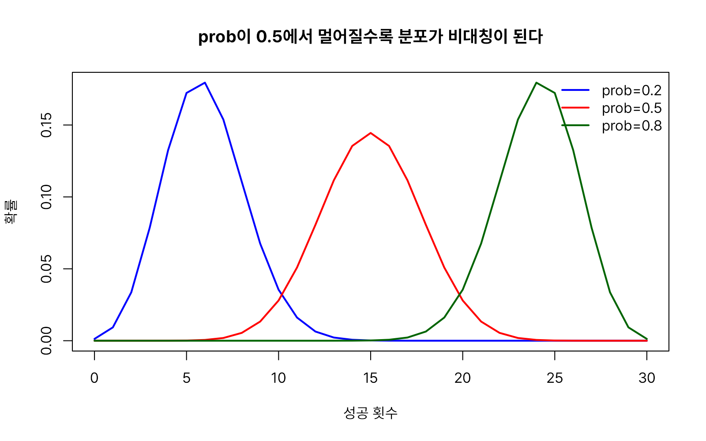


#### 베르누이분포

시행을 딱 한 번만 하는 이항분포, 즉 `size = 1`인 이항분포가 베르누이분포(Bernoulli distribution)입니다. 스위스 수학자 야코프 베르누이(Jakob Bernoulli)의 이름을 땄습니다. R에는 베르누이분포만을 위한 별도의 함수가 없으며, `rbinom()`에서 `size = 1`로 지정하는 것이 표준적인 방법입니다.

```r
set.seed(1)
# 동전 던지기 10회, 매번 앞면(1)/뒷면(0) 중 하나
rbinom(10, size = 1, prob = 0.5)
#>  [1] 0 0 1 1 0 1 1 1 1 0

# 성공(1)이 나올 확률
dbinom(1, size = 1, prob = 0.5)
#> [1] 0.5

# 실패(0)가 나올 확률
dbinom(0, size = 1, prob = 0.5)
#> [1] 0.5
```

베르누이분포는 결과가 0과 1 두 값밖에 없으므로, 확률질량함수도 두 개의 막대(또는 점)로만 표현됩니다.

```r
x <- 0:1
# 결과 0과 1 각각의 확률(모두 0.5)
plot(x, dbinom(x, size = 1, prob = 0.5), type = "h", lwd = 6, col = "red",
     xlab = "결과(0 또는 1)", ylab = "확률", xaxt = "n", ylim = c(0, 1),
     main = "베르누이분포의 확률질량함수 (prob=0.5)")
# x축 눈금을 0과 1로만 표시
axis(1, at = c(0, 1))
```


성공확률(`prob`)이 달라지면 두 막대(0과 1)의 높이 비율도 그만큼 달라집니다.

```r
# 성공확률(prob)에 따라 베르누이분포의 두 막대 비율이 달라진다
p_vals <- c(0.2, 0.5, 0.8)
tbl <- rbind(`0(실패)` = 1 - p_vals, `1(성공)` = p_vals)
colnames(tbl) <- paste0("prob=", p_vals)
barplot(tbl, beside = TRUE, col = c("red", "blue"), ylab = "확률",
        main = "성공확률(prob)에 따라 베르누이분포 모양이 달라진다")
legend("topright", legend = rownames(tbl), fill = c("red", "blue"), bty = "n")
```


> 이산적인 값 중에서 무작위로 하나를 뽑는 것이 목적이라면 `sample(c(0, 1), size = n, replace = TRUE, prob = c(1-p, p))`로도 베르누이 시행을 흉내 낼 수 있습니다. 다만 `sample()`은 분포 함수가 아니라 자료 선택 함수로 분류되므로, 확률분포 개념을 다룰 때는 `rbinom(n, size = 1, prob)`을 사용하는 편이 이항분포와의 연관성을 분명히 드러내 줍니다.


#### 다항분포(multinom)

다항분포(Multinomial Distribution)는 한 번의 시행에서 여러 범주(category) 중 하나가 선택되는 실험을 여러 번 반복했을 때, 각 범주가 몇 번씩 나오는지를 나타내는 확률분포입니다. 이항분포가 성공과 실패의 두 가지 결과만 다루는 것이라면, 다항분포는 세 가지 이상의 결과를 다룹니다. 예를 들면 여론조사에서 'A후보 지지·B후보 지지·무응답'처럼 결과가 세 가지 이상인 경우를 들 수 있습니다.

다항분포와 관련된 함수는 다음 두 가지입니다(연속형과 달리 `p`·`q` 함수는 제공되지 않습니다. 여러 범주에 걸친 누적확률이나 분위수는 명확하게 정의하기 어렵기 때문입니다).

* `rmultinom(n, size, prob)`
* `dmultinom(x, size = NULL, prob, log = FALSE)`

**인자 설명**

* `n`: 다항분포 실험의 수행 횟수입니다.
* `size`: 전체 시행 횟수입니다.
* `prob`: 각 범주에 대한 성공확률로 구성된 벡터입니다. 합이 1이 아니어도 내부적으로 자동 표준화되어 비율로 취급됩니다.
* `x` (`dmultinom`): 각 범주별로 몇 번씩 나왔는지를 나타내는 벡터이며, 원소의 합이 `size`와 같아야 합니다.

```r
set.seed(1)
rmultinom(n = 5, size = 10, prob = c(0.2, 0.3, 0.5))
# 각 열이 한 세트(10회 시행)의 결과: 1행=범주1 횟수, 2행=범주2 횟수, 3행=범주3 횟수
#>      [,1] [,2] [,3] [,4] [,5]
#> [1,]    1    2    1    4    2
#> [2,]    3    5    5    3    1
#> [3,]    6    3    4    3    7
```

```r
# 여론조사에서 유권자 40%가 A후보, 10%가 B후보를 지지하고 50%는 무응답일 때,
# 10명 중 3명이 A, 2명이 B, 5명이 무응답을 할 확률
dmultinom(c(3, 2, 5), size = 10, prob = c(0.4, 0.1, 0.5))
#> [1] 0.0504
```

시행을 충분히 많이 반복해 시뮬레이션해 보면, 각 범주가 나오는 평균 횟수가 지정한 확률(prob)에 비례한다는 것을 확인할 수 있습니다.

```r
set.seed(1)
# 여론조사(10명 표본)를 5000번 시뮬레이션
x <- rmultinom(n = 5000, size = 10, prob = c(0.4, 0.1, 0.5))
# 범주별 평균 인원수
barplot(rowMeans(x), names.arg = c("A후보(0.4)", "B후보(0.1)", "무응답(0.5)"),
        col = c("red", "blue", "darkgreen"), ylab = "10명 중 평균 인원수",
        main = "여론조사 시뮬레이션 결과의 범주별 평균")
```


성공확률 벡터(`prob`)를 다르게 지정하면 범주별 평균 비중도 그에 비례해서 달라집니다.

```r
# 성공확률 벡터(prob)가 달라지면 범주별 평균 발생 비중도 함께 달라진다
set.seed(1)
probs_list <- list(c(0.4, 0.1, 0.5), c(0.33, 0.33, 0.34), c(0.7, 0.2, 0.1))
means_mat <- sapply(probs_list, function(p) rowMeans(rmultinom(n = 5000, size = 10, prob = p)))
colnames(means_mat) <- c("(0.4,0.1,0.5)", "(0.33,0.33,0.34)", "(0.7,0.2,0.1)")
barplot(means_mat, beside = TRUE, col = c("red", "blue", "darkgreen"),
        ylab = "평균 발생 횟수", main = "성공확률 벡터(prob)에 따라 범주별 비중이 달라진다")
legend("topright", legend = c("범주1", "범주2", "범주3"),
       fill = c("red", "blue", "darkgreen"), bty = "n")
```


#### 초기하분포(hyper)

초기하분포(Hypergeometric Distribution)는 복원하지 않고(without replacement) 표본을 추출할 때, 원하는 대상이 몇 개 포함될지를 나타내는 확률분포입니다. 이항분포와 매우 비슷하지만, 추출한 것을 다시 넣지 않는다는 점이 가장 큰 차이입니다.

예를 들면 흰색공 5개, 검정색공 5개가 있는 모집단에서 5개의 공을 표본으로 추출할 경우 처음에는 흰색공이 나오고 두번째에 흰색공이 나올 확률은 복원이냐 비복원이냐에 따라 다릅니다. 복원추출은 확률이 5/10(0.5)로 유지되지만, 비복원추출은 4/9로 줄어들게 됩니다.

모집단이 매우 크고 표본의 크기가 모집단에 비해 충분히 작으면, 비복원추출에서도 추출할 때마다 성공확률이 거의 변하지 않으므로 초기하분포는 이항분포와 매우 유사해집니다. 따라서 이러한 경우에는 어느 분포를 사용해도 거의 같은 결과를 얻습니다. 따라서 대규모 모집단에서 소수의 표본만 추출하는 상황에서는 계산이 간단한 이항분포를 사용하는 경우가 많습니다.

초기하분포와 관련된 함수는 다음 네 가지입니다.

* `rhyper(nn, m, n, k)`
* `dhyper(x, m, n, k, log = FALSE)`
* `phyper(q, m, n, k, lower.tail = TRUE, log.p = FALSE)`
* `qhyper(p, m, n, k, lower.tail = TRUE, log.p = FALSE)`

**인자 설명**

* `m`: 모집단 안에서 '원하는 항목'(예: 흰 공)의 개수입니다.
* `n`: 모집단 안에서 '원하지 않는 항목'(예: 검은 공)의 개수입니다. (다른 분포의 표본 개수 `n`과 이름은 같지만 의미가 다르므로 혼동에 주의해야 합니다.)
* `k`: 모집단(`m`+`n`개)에서 비복원으로 뽑는 표본의 개수입니다.
* `nn`: 생성할 난수의 개수입니다(다른 분포의 `n`에 대응).

```r
set.seed(1)
# 흰 공 10개, 검은 공 20개 중 5개를 비복원으로 뽑을 때 흰 공의 개수
rhyper(nn = 10, m = 10, n = 20, k = 5)
#>  [1] 1 1 2 3 1 3 3 2 2 0

dhyper(2, m = 10, n = 20, k = 5)
#> [1] 0.3599848

phyper(3, m = 10, n = 10, k = 5)
#> [1] 0.8482972

qhyper(0.5, m = 10, n = 10, k = 5)
#> [1] 2

phyper(2, m = 10, n = 10, k = 5)
#> [1] 0.5
```

```r
# m=10, n=20, k=5인 초기하분포의 확률질량함수
x <- 0:5
plot(x, dhyper(x, m = 10, n = 20, k = 5), type = "h", lwd = 2, col = "red",
     xlab = "x", ylab = "확률", main = "초기하분포의 확률질량함수 (m=10, n=20, k=5)")
```


모집단의 크기(`m`+`n`)가 표본 크기(`k`)에 비해 충분히 크면, 한 번 뽑았다고 해서 남은 구성비가 크게 달라지지 않으므로 초기하분포는 이항분포와 거의 같아집니다. 아래 그림에서 모집단이 작을 때(빨간선)와 이항분포(초록 점선)의 차이가, 모집단이 커질수록(파란선) 사라지는 것을 볼 수 있습니다.

```r
x <- 0:5
# 작은 모집단(총 20개)의 초기하분포
plot(x, dhyper(x, m = 10, n = 10, k = 5), type = "l", lwd = 2, col = "red",
     xlab = "x", ylab = "확률",
     main = "모집단이 커질수록 초기하분포는 이항분포에 가까워진다")
# 큰 모집단(총 200개) — 이항분포에 더 가까움
lines(x, dhyper(x, m = 100, n = 100, k = 5), type = "l", lwd = 2, col = "blue")
# 비교 기준: 이항분포(size=5, prob=0.5)
lines(x, dbinom(x, size = 5, prob = 0.5), type = "b", lty = 2, lwd = 2,
      col = "darkgreen", pch = 16)
legend("top",
       legend = c("초기하(m=10, n=10, k=5)", "초기하(m=100, n=100, k=5)",
                  "이항(size=5, prob=0.5, 점선)"),
       col = c("red", "blue", "darkgreen"), lwd = 2, lty = c(1, 1, 2),
       bty = "n", cex = 0.8)
```

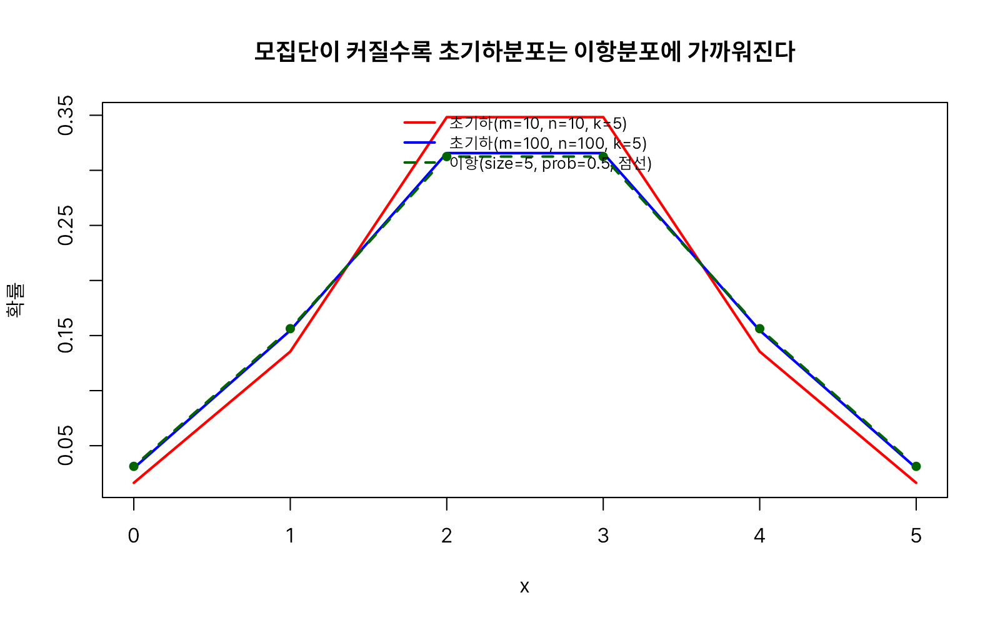


#### 기하분포(geom)

기하분포(Geometric Distribution)는 독립적인 시행을 반복할 때, 첫 번째 성공이 나올 때까지 필요한 시행 횟수를 나타내는 확률분포입니다.

즉, "처음으로 성공할 때까지 몇 번을 시도해야 하는가?"를 다루는 분포입니다. 예를 들어 영업사원이 첫 계약을 성사시킬 때까지 몇 명의 고객을 만나야 하는지, 불량품이 아닌 정상품이 처음 나올 때까지 몇 개를 검사해야 하는지 등을 표현할 수 있습니다.

기하분포와 관련된 함수는 다음 네 가지입니다.

* `rgeom(n, prob)`
* `dgeom(x, prob, log = FALSE)`
* `pgeom(q, prob, lower.tail = TRUE, log.p = FALSE)`
* `qgeom(p, prob, lower.tail = TRUE, log.p = FALSE)`

**인자 설명**

* `prob`: 매 시행에서 성공할 확률입니다.
* `x`, `q`: R의 `dgeom()`·`pgeom()`은 **첫 성공 전까지의 실패 횟수**를 기준으로 합니다(즉 x=0은 "첫 시도에 바로 성공"을 의미). 책에 따라 "성공까지의 총 시도 횟수"(x+1)를 기준으로 정의하기도 하므로, 다른 자료와 비교할 때는 어느 쪽 정의를 쓰는지 반드시 확인해야 합니다.

```r
set.seed(1)
rgeom(10, prob = 0.5)
#>  [1] 0 1 4 0 1 0 0 3 2 0

# 실패를 2번 겪고 세 번째 시도에서 처음 성공할 확률
dgeom(2, prob = 0.5)
#> [1] 0.125

# 실패가 3번 이하일(즉 4번째 시도 이내에 성공할) 확률
pgeom(3, prob = 0.5)
#> [1] 0.9375

qgeom(0.7, prob = 0.5)
#> [1] 1

pgeom(1, prob = 0.5)
#> [1] 0.75
```

```r
# prob=0.5인 기하분포의 확률질량함수 — x=0(첫 시도에 바로 성공)일 확률이 가장 높다
x <- 0:10
plot(x, dgeom(x, prob = 0.5), type = "h", lwd = 2, col = "red",
     xlab = "x (첫 성공까지의 실패 횟수)", ylab = "확률", main = "기하분포의 확률질량함수 (prob=0.5)")
```


성공확률이 높을수록 적은 실패 만에 성공하는 쪽으로 분포가 몰립니다.

```r
x <- 0:10
# prob=0.7 — 적은 실패로 빨리 성공
plot(x, dgeom(x, prob = 0.7), type = "l", lwd = 2, col = "red",
     xlab = "x (첫 성공까지의 실패 횟수)", ylab = "확률",
     main = "성공확률이 높을수록 적은 실패 만에 성공하는 쪽으로 몰린다")
# prob=0.5
lines(x, dgeom(x, prob = 0.5), type = "l", lwd = 2, col = "blue")
# prob=0.2 — 실패를 많이 겪어야 성공
lines(x, dgeom(x, prob = 0.2), type = "l", lwd = 2, col = "darkgreen")
legend("topright", legend = c("prob=0.7", "prob=0.5", "prob=0.2"),
       col = c("red", "blue", "darkgreen"), lwd = 2, bty = "n")
```

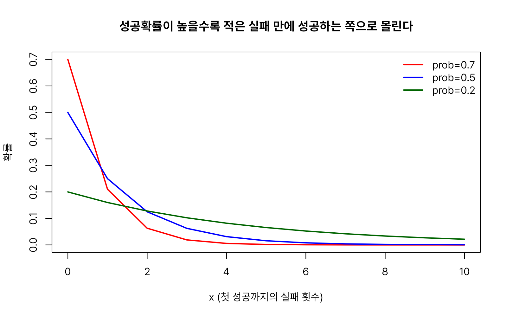


#### 음이항분포(nbinom)

음이항분포(Negative Binomial Distribution)는 독립적인 시행을 반복할 때, k번째 성공이 나올 때까지 필요한 시행 횟수를 나타내는 확률분포입니다. 기하분포가 "첫 번째 성공까지"의 시도 횟수라면, 음이항분포는 이를 일반화하여 "k번째 성공까지" 몇 번을 시도해야 하는지를 다룹니다. 

예를 들어 농구 선수가 자유투를 5개 성공할 때까지 몇 번을 던져야 하는지, 조립 라인에서 불량품이 100개 나올 때까지 몇 개를 생산하는지 등을 표현합니다. 또한 실무에서는 분산이 평균보다 뚜렷하게 큰 '과산포(overdispersion)' 카운트 자료를 포아송분포 대신 모형화할 때도 널리 사용됩니다.

음이항분포와 관련된 함수는 다음 네 가지입니다.

* `rnbinom(n, size, prob, mu)`
* `dnbinom(x, size, prob, mu, log = FALSE)`
* `pnbinom(q, size, prob, mu, lower.tail = TRUE, log.p = FALSE)`
* `qnbinom(p, size, prob, mu, lower.tail = TRUE, log.p = FALSE)`

**인자 설명**

* `size`: 목표로 하는 성공 횟수(k)입니다.
* `prob`: 매 시행에서 성공할 확률입니다.
* `mu`: `prob` 대신 평균으로 분포를 지정하는 방식입니다. 내부적으로 `prob = size/(size+mu)` 관계로 변환되므로 **`prob`과 `mu` 중 하나만** 지정합니다. 카운트 자료 모형에서는 평균(`mu`)으로 지정하는 방식이 더 직관적이어서 자주 쓰입니다.

```r
set.seed(1)
# 5번째 성공까지 겪는 실패 횟수
rnbinom(10, size = 5, prob = 0.5)
#>  [1] 6 3 3 4 4 4 4 6 3 4

dnbinom(2, size = 5, prob = 0.5)
#> [1] 0.1171875

pnbinom(3, size = 5, prob = 0.5)
#> [1] 0.3632813

qnbinom(0.2, size = 5, prob = 0.5)
#> [1] 2

pnbinom(2, size = 5, prob = 0.5)
#> [1] 0.2265625
```

```r
# prob 대신 평균 mu로 지정 — 두 방식이 같은 분포를 가리키는지 확인
dnbinom(2, size = 5, mu = 4)
#> [1] 0.1568064

dnbinom(2, size = 5, prob = 5 / (5 + 4))
#> [1] 0.1568064
```

```r
# size=5, prob=0.5인 음이항분포의 확률질량함수
x <- 0:20
plot(x, dnbinom(x, size = 5, prob = 0.5), type = "h", lwd = 2, col = "red",
     xlab = "x", ylab = "확률", main = "음이항분포의 확률질량함수 (size=5, prob=0.5)")
```


목표 성공 횟수(`size`)가 커질수록 그만큼 더 많은 실패를 겪어야 하므로, 분포가 오른쪽으로 이동합니다.

```r
x <- 0:20
# size=1 — 기하분포와 동일
plot(x, dnbinom(x, size = 1, prob = 0.5), type = "l", lwd = 2, col = "red",
     xlab = "x", ylab = "확률",
     main = "성공횟수(size)가 커질수록 분포가 오른쪽으로 이동한다")
# size=3
lines(x, dnbinom(x, size = 3, prob = 0.5), type = "l", lwd = 2, col = "blue")
# size=5
lines(x, dnbinom(x, size = 5, prob = 0.5), type = "l", lwd = 2, col = "darkgreen")
# size=7 — 더 오른쪽으로 이동
lines(x, dnbinom(x, size = 7, prob = 0.5), type = "l", lwd = 2, col = "purple")
legend("topright", legend = c("size=1", "size=3", "size=5", "size=7"),
       col = c("red", "blue", "darkgreen", "purple"), lwd = 2, bty = "n")
```


#### 포아송분포(pois)

포아송분포(Poisson Distribution)는 일정한 시간이나 공간에서 어떤 사건이 몇 번 발생하는지를 나타내는 확률분포입니다. 한 시간 동안 은행 창구에 방문하는 고객 수, 하루 동안 걸려오는 콜센터 전화 수, 책 한 페이지에 있는 오타 수처럼 "단위 시간(또는 단위 공간)당 사건이 몇 번 일어나는가"를 다루는 분포입니다. 프랑스의 수학자 시메옹 드니 푸아송(Siméon Denis Poisson)이 정립했습니다.

이항분포의 시행 횟수(`size`)가 매우 크고 성공확률(`prob`)이 매우 작으면 포아송분포와 유사해집니다. 반대로 포아송분포의 평균(`lambda`)이 커지면 정규분포에 가까워집니다.

포아송분포와 지수분포는 같은 현상을 서로 다른 관점에서 설명하는 확률분포입니다. 포아송분포는 일정한 시간이나 공간에서 사건이 몇 번 발생하는지를 나타내는 반면, 지수분포는 다음 사건이 발생할 때까지 걸리는 시간을 나타냅니다. 예를 들어 콜센터에 시간당 평균 12통의 전화가 걸려온다면, 한 시간 동안 걸려오는 전화의 수는 포아송분포로 모델링하고, 현재 시점에서 다음 전화가 걸려올 때까지의 대기 시간은 지수분포로 모델링합니다.

포아송분포와 관련된 함수는 다음 네 가지입니다.

* `rpois(n, lambda)`
* `dpois(x, lambda, log = FALSE)`
* `ppois(q, lambda, lower.tail = TRUE, log.p = FALSE)`
* `qpois(p, lambda, lower.tail = TRUE, log.p = FALSE)`

**인자 설명**

* `lambda`: 단위 시간(공간)당 평균 발생 횟수입니다. 포아송분포는 평균과 분산이 모두 `lambda`로 같다는 특징이 있습니다.

```r
set.seed(1)
# 평균 5회인 사건의 발생 횟수를 10세트 시뮬레이션
rpois(10, lambda = 5)
#>  [1] 4 4 5 8 3 8 9 6 6 2

# 정확히 2번 발생할 확률
dpois(2, lambda = 5)
#> [1] 0.08422434

# 3번 이하로 발생할 확률
ppois(3, lambda = 5)
#> [1] 0.2650259

qpois(0.265, lambda = 5)
#> [1] 3

ppois(3, lambda = 5)
#> [1] 0.2650259
```

```r
# lambda=5인 포아송분포의 확률질량함수
x <- 0:20
plot(x, dpois(x, lambda = 5), type = "h", lwd = 2, col = "red",
     xlab = "x", ylab = "확률", main = "포아송분포의 확률질량함수 (lambda=5)")
```


`lambda`가 커질수록 분포의 중심이 오른쪽으로 이동하고, 봉우리 모양도 점점 좌우대칭에 가까워집니다.

```r
x <- 0:30
# lambda=2
plot(x, dpois(x, lambda = 2), type = "l", lwd = 2, col = "red",
     xlab = "x", ylab = "확률",
     main = "lambda가 커질수록 중심이 오른쪽으로 이동하며 대칭에 가까워진다")
# lambda=5
lines(x, dpois(x, lambda = 5), type = "l", lwd = 2, col = "blue")
# lambda=10
lines(x, dpois(x, lambda = 10), type = "l", lwd = 2, col = "darkgreen") 
# lambda=20 — 대칭에 가까워짐
lines(x, dpois(x, lambda = 20), type = "l", lwd = 2, col = "purple")
legend("topright", legend = c("lambda=2", "lambda=5", "lambda=10", "lambda=20"),
       col = c("red", "blue", "darkgreen", "purple"), lwd = 2, bty = "n")
```

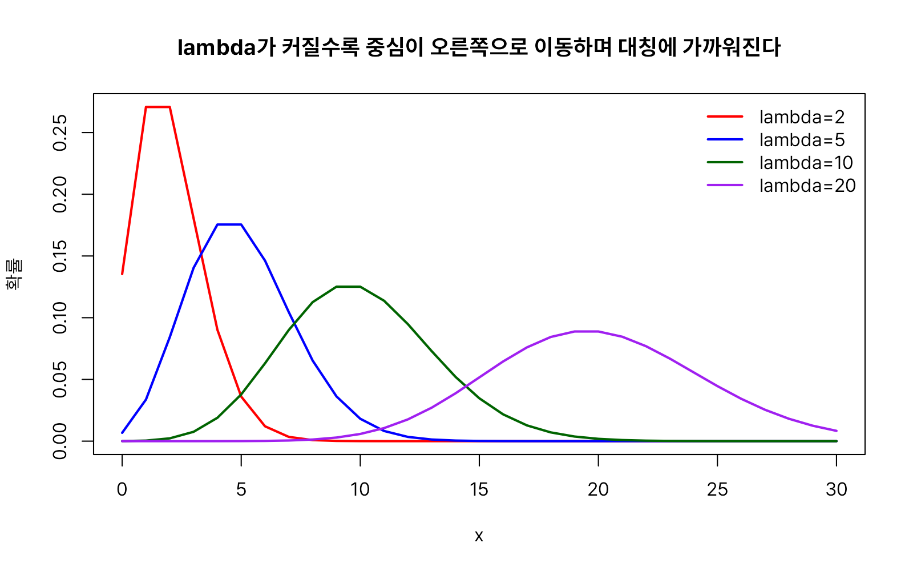


### 순위 기반 검정 분포

정규분포를 가정하기 어려운 자료를 비교할 때는 t검정 대신 순위(rank)를 이용한 비모수 검정을 사용합니다. 대표적으로 서로 독립인 두 집단을 비교하는 윌콕슨 순위합 검정(Wilcoxon rank-sum test)과, 동일한 대상의 사전·사후 값처럼 짝지어진 자료를 비교하는 윌콕슨 부호순위 검정(Wilcoxon signed-rank test)이 있습니다. 두 검정 모두 `wilcox.test()` 하나로 수행하지만, 그 내부에서 유의확률을 계산하는 데 사용하는 기준분포는 서로 다릅니다.

#### 윌콕슨 순위합 분포(wilcox)

윌콕슨 순위합 분포(Wilcoxon Rank Sum Distribution)는 두 독립집단의 순위합(rank sum)이 어떤 값을 가질 확률분포입니다. 이 분포는 윌콕슨 순위합 검정(Wilcoxon rank sum test) 또는 맨-휘트니 U 검정(Mann–Whitney U test)에서 검정통계량의 분포로 사용됩니다.

윌콕슨 순위합 분포는 두 독립집단의 위치가 같은지를 비교할 때 사용하는 분포입니다. 특히 모집단이 정규분포를 따른다고 가정하기 어렵거나 표본의 크기가 작아 정규성 가정을 만족하지 않는 경우에 유용합니다. 또한 이상치의 영향을 줄이면서 두 집단을 비교할 수 있다는 장점이 있습니다. 따라서 윌콕슨 순위합 검정은 독립표본 t-검정을 적용하기 어려운 상황에서 사용할 수 있는 대표적인 비모수 검정 방법입니다.

윌콕슨 순위합 분포와 관련된 함수는 다음 네 가지입니다.

* `rwilcox(nn, m, n)`
* `dwilcox(x, m, n, log = FALSE)`
* `pwilcox(q, m, n, lower.tail = TRUE, log.p = FALSE)`
* `qwilcox(p, m, n, lower.tail = TRUE, log.p = FALSE)`

**인자 설명**

* `m`, `n`: 비교하는 두 독립표본 각각의 표본 크기입니다.
* `nn`: 생성할 난수의 개수입니다.

```r
set.seed(1)
# 표본 크기 8, 10일 때 순위합 통계량 난수 10개 생성
rwilcox(nn = 10, m = 8, n = 10)
#>  [1] 34 61 11 57 49 42 49 28 46 39

# 순위합 통계량이 20일 확률
dwilcox(20, m = 8, n = 10)
#> [1] 0.007770008

# 순위합 통계량이 40 이하일 누적확률
pwilcox(40, m = 8, n = 10)
#> [1] 0.5172997

# 누적확률 0.7에 대응하는 순위합 값
qwilcox(0.7, m = 8, n = 10)
#> [1] 46

# 역으로 확인
pwilcox(46, m = 8, n = 10)
#> [1] 0.7136981
```

윌콕슨 순위합 분포는 좌우대칭 모양을 가지며, 표본크기(m, n)가 커질수록 봉우리가 넓어지고 완만해집니다.

```r
x <- 0:80
# 순위합 통계량(m=8, n=10)의 확률질량함수 — 좌우대칭
plot(x, dwilcox(x, m = 8, n = 10), type = "h", lwd = 2, col = "red",
     xlab = "x (순위합 통계량)", ylab = "확률",
     main = "윌콕슨 순위합 분포의 확률질량함수 (m=8, n=10)")
```


표본크기(`m`, `n`)가 커질수록 통계량이 취할 수 있는 값의 범위가 넓어지면서 분포도 완만해집니다.

```r
# 표본크기(m, n)가 커질수록 분포가 넓어지고 완만해진다
x <- 0:100
plot(x, dwilcox(x, m = 4, n = 6), type = "l", lwd = 2, col = "red",
     xlab = "x", ylab = "확률", main = "표본크기(m, n)에 따른 윌콕슨 순위합 분포의 변화")
lines(x, dwilcox(x, m = 8, n = 10), type = "l", lwd = 2, col = "blue")
lines(x, dwilcox(x, m = 12, n = 15), type = "l", lwd = 2, col = "darkgreen")
legend("topright", legend = c("m=4, n=6", "m=8, n=10", "m=12, n=15"),
       col = c("red", "blue", "darkgreen"), lwd = 2, bty = "n")
```


#### 윌콕슨 부호순위 분포(signrank)

윌콕슨 부호순위 분포(Wilcoxon Signed-Rank Distribution)는 대응되는 두 관측값의 차이에 순위를 부여한 뒤, 부호가 있는 순위합이 어떤 값을 가질 확률분포입니다. 이 분포는 윌콕슨 부호순위 검정(Wilcoxon signed-rank test)에서 검정통계량의 분포로 사용됩니다.

윌콕슨 순위합 검정이 서로 독립적인 두 집단을 비교하는 방법이라면, 윌콕슨 부호순위 검정은 대응표본(짝지어진 자료)을 비교하는 방법입니다. 윌콕슨 부호순위 분포는 동일한 대상에 대해 처리 전과 처리 후를 비교하거나, 두 관측값이 서로 대응되는 경우에 사용됩니다. 특히 모집단이 정규분포를 따른다는 가정을 하기 어렵거나 표본의 크기가 작아 대응표본 t-검정을 적용하기 어려운 상황에서 유용합니다. 또한 원자료 대신 차이값의 순위를 이용하기 때문에 이상치의 영향을 줄일 수 있다는 장점이 있습니다. 따라서 윌콕슨 부호순위 검정은 대응표본 t-검정의 비모수적 대안으로 사용되는 대표적인 검정 방법입니다.

윌콕슨 부호순위 분포와 관련된 함수는 다음 네 가지입니다.

* `rsignrank(nn, n)`
* `dsignrank(x, n, log = FALSE)`
* `psignrank(q, n, lower.tail = TRUE, log.p = FALSE)`
* `qsignrank(p, n, lower.tail = TRUE, log.p = FALSE)`

**인자 설명**

* `n`: 짝지어진 표본의 개수입니다.
* `nn`: 생성할 난수의 개수입니다.

```r
set.seed(1)
# 짝지어진 표본 15쌍일 때 부호순위합 통계량 난수 10개 생성
rsignrank(nn = 10, n = 15)
#>  [1] 65 38 94 44 36 41 77 49 63 66

# 부호순위합 통계량이 50일 확률
dsignrank(50, n = 15)
#> [1] 0.01904297

# 부호순위합 통계량이 60 이하일 누적확률
psignrank(60, n = 15)
#> [1] 0.5110168

# 누적확률 0.7에 대응하는 부호순위합 값
qsignrank(0.7, n = 15)
#> [1] 69

# 역으로 확인
psignrank(69, n = 15)
#> [1] 0.7002563
```

윌콕슨 부호순위 분포 역시 좌우대칭이며, 짝지어진 표본의 개수(n)가 커질수록 분포가 넓어집니다.

```r
x <- 0:120
# 부호순위합 통계량(n=15)의 확률질량함수 — 좌우대칭
plot(x, dsignrank(x, n = 15), type = "h", lwd = 2, col = "red",
     xlab = "x (부호순위합 통계량)", ylab = "확률",
     main = "윌콕슨 부호순위 분포의 확률질량함수 (n=15)")
```


짝지어진 표본의 개수(`n`)가 커질수록 분포가 넓어지고 완만해집니다.

```r
# 짝지어진 표본의 개수(n)가 커질수록 분포가 넓어지고 완만해진다
x <- 0:150
plot(x, dsignrank(x, n = 8), type = "l", lwd = 2, col = "red",
     xlab = "x", ylab = "확률", main = "표본크기(n)에 따른 윌콕슨 부호순위 분포의 변화")
lines(x, dsignrank(x, n = 15), type = "l", lwd = 2, col = "blue")
lines(x, dsignrank(x, n = 20), type = "l", lwd = 2, col = "darkgreen")
legend("topright", legend = c("n=8", "n=15", "n=20"),
       col = c("red", "blue", "darkgreen"), lwd = 2, bty = "n")
```


### 상황별 확률분포 선택 가이드

아래 표는 "어떤 상황에서 어떤 분포를 참고하면 좋은지"를 정리한 것입니다.

| 다루려는 상황 | 분포 | 핵심 함수 |
|---|---|---|
| 구간 안 모든 값이 똑같이 나올 확률 | 균등분포 | `runif`, `dunif`, `punif`, `qunif` |
| 평균 근처에 몰리는 종 모양 연속 자료 | 정규분포 | `rnorm`, `dnorm`, `pnorm`, `qnorm` |
| 오른쪽으로 긴 꼬리를 가진 양수 자료(소득·주가 등) | 로그정규분포 | `rlnorm`, `dlnorm`, `plnorm`, `qlnorm` |
| 다음 사건이 일어날 때까지의 대기시간 | 지수분포 | `rexp`, `dexp`, `pexp`, `qexp` |
| α번째 사건이 일어날 때까지의 대기시간 | 감마분포 | `rgamma`, `dgamma`, `pgamma`, `qgamma` |
| 0~1 사이의 비율·확률 자체를 확률변수로 | 베타분포 | `rbeta`, `dbeta`, `pbeta`, `qbeta` |
| 극단값이 잦은 두꺼운 꼬리 자료 | 코시분포 | `rcauchy`, `dcauchy`, `pcauchy`, `qcauchy` |
| 제품·부품의 수명, 고장 시간 | 와이블분포 | `rweibull`, `dweibull`, `pweibull`, `qweibull` |
| 로지스틱 회귀·시그모이드와 관련된 S자형 확률 | 로지스틱분포 | `rlogis`, `dlogis`, `plogis`, `qlogis` |
| 표본이 작을 때(주로 n<30)의 평균 검정 | t분포 | `rt`, `dt`, `pt`, `qt` |
| 분산 추정, 범주형 자료의 적합도·독립성 검정 | 카이제곱분포 | `rchisq`, `dchisq`, `pchisq`, `qchisq` |
| 두 분산의 비교, 분산분석(ANOVA) | F분포 | `rf`, `df`, `pf`, `qf` |
| 분산분석 이후 그룹 간 사후비교(Tukey HSD) | 스튜던트 범위 분포 | `ptukey`, `qtukey` |
| 반복 시행에서의 성공 횟수(n번 중 x번 성공) | 이항분포 | `rbinom`, `dbinom`, `pbinom`, `qbinom` |
| 단 한 번의 성공/실패 시행 | 베르누이분포 | `rbinom(size = 1, ...)` |
| 세 범주 이상으로 나뉘는 시행 결과 | 다항분포 | `rmultinom`, `dmultinom` |
| 비복원추출에서 원하는 항목이 뽑히는 개수 | 초기하분포 | `rhyper`, `dhyper`, `phyper`, `qhyper` |
| 처음 성공할 때까지의 시도(실패) 횟수 | 기하분포 | `rgeom`, `dgeom`, `pgeom`, `qgeom` |
| k번째 성공할 때까지의 시도 횟수, 과산포 카운트 자료 | 음이항분포 | `rnbinom`, `dnbinom`, `pnbinom`, `qnbinom` |
| 단위 시간(공간)당 사건 발생 횟수 | 포아송분포 | `rpois`, `dpois`, `ppois`, `qpois` |
| 독립인 두 집단의 순위 비교(비모수) | 윌콕슨 순위합 분포 | `pwilcox`, `qwilcox` |
| 짝지어진 두 집단의 순위 비교(비모수) | 윌콕슨 부호순위 분포 | `psignrank`, `qsignrank` |

